# GuestEase

GuestEase is a modern booking platform built for small hospitality businesses such as B&Bs, guesthouses, and boutique stays.  
The frontend is developed with **React**, **TypeScript**, and **Vite**, styled with **Material UI**, and powered by **React Router** and **React Query** for smooth navigation and real‑time data handling.  
A lightweight **Node.js + Express** backend manages secure server‑side operations, including admin‑level booking updates, validation, and service‑role Supabase actions.
The platform uses **Supabase PostgreSQL** for its database, **Supabase Auth** for secure user authentication, **Supabase Storage** for media handling, and **Row‑Level Security (RLS)** for strict access control.  
Background tasks such as scheduled booking checks and email triggers may run via **Cron‑job.org**, while **Stripe** handles payments and **Resend** delivers transactional emails.
GuestEase is deployed using modern cloud tooling: the **frontend on Vercel** for fast global delivery and the **backend on Render** for reliable API hosting.  
Together, these technologies create a fast, secure, and user‑friendly booking experience designed for comfort and simplicity.

## Tech Stack

- **Frontend:** React, TypeScript, Vite, Material UI, React Router, React Query
- **Backend:** Node.js (Express), Supabase Server Client , Supabase Edge Funtion
- **Database & Auth:** Supabase PostgreSQL, Supabase Auth, RLS
- **Services:** Stripe (payments), Resend (emails), Cron‑job.org (scheduled tasks)
- **Storage:** Supabase Storage
- **Deployment:** Vercel (frontend), Render (backend)

## Features

- User authentication and profile management
- Room browsing, availability checks, and booking
- Admin‑level room, user, and booking management
- Secure backend endpoints for sensitive operations
- Real‑time updates powered by Supabase

## Dependencies/Library installations commands

- npm install react react-dom
- npm install react-router-dom
- npm install -D @types/react @types/react-dom
- npm install -D @vitejs/plugin-react
- npm install @mui/material @emotion/react @emotion/styled
- npm install @mui/icons-material
- npm install express cors dotenv (For the back-end)
- npm install @supabase/supabase
- npm install @tanstack/react-query
- npm install @supabase/supabase-js
- npm install @tanstack/react-query
- npm i --save-dev @types/express
- npm install @supabase/supabase-js (in the backend too)
- npm install --save-dev vite
- npm i --save-dev @types/cors
- npm install stripe --save (backend)
- npm install --save @stripe/react-stripe-js @stripe/stripe-js (frontend)

# What this project does

**GuestEase** is a full-stack web app that helps small hospitality businesses manage bookings efficiently. It replaces manual reservations and OTAs with an easy-to-use platform where guests book online and admins manage rooms, pricing, and reservations via a secure dashboard.

The user will aslo be able to manage their profile via a complete CRUD stack, and, above all, their reservations. The bookings are finalized after the user successfully entries their credit card details through a Stripe Check out modal, which will also generate a payment method id associated to the user.

The payment process will also processed through 2 distinct flows: [Setup Intents](https://docs.stripe.com/api/setup_intents) (through which the app sets up and saves a user's payment method for future use), and [Payment Intents](https://docs.stripe.com/api/payment_intents) (through which the payment is collected).

# Why the project is useful

As above mentioned, small hospitality businesses may leverage the GuestEase app for their bookings and replace manual reservations and OTAs.
Guests will be able to easily and quickly book their stays online by quickly searching for the available rooms displayed on the Search Results page, based on the dates entried in the search form.

Additionally, they will receive email notifications for booking confirmations and for any changes that they decide to make on them, cancellation included (for which they may receive a refund based on the Guestease booking policy).

Last, but not least, guests will have the chance to add a review for their stay.

Admins, instead, can not only create, read, update, and delete users' bookings if they receive such requests from them, but they do also have the same CRUD powers for user profiles and rooms.
Lastly, they can also read all reviews for all bookings and receive email notifications for users' bookings and reviews.

All of the above, makes GuestEase a powerful app to get full control of a small hospitality booking system, with end‑to‑end solution for managing a small hospitality operation providing convenience for guests, efficiency for administrators, and a modern digital experience that enhances the overall stay.

This project was also a personal learning journey. With a background in Tourism Science and experience in Marriott Digital Operations, I wanted to understand how a hospitality booking system works behind the scenes.

GuestEase became a way to explore that process hands‑on, from system architecture to real booking flows, while building a practical tool for small accommodation providers. A future and ambitious goal could be that of scaling it up in a future development phase in order to turn it into a platform/hub serving multiple hospitality businesses at once.

# How users can get started with the project

## Navigation Header

As user opens up the GuestEase app, they will see a sticky nav bar on the top for an easy navigation throughout the website:


This is generated by the **components/siteHeader/siteHeader.tsx** file, and, as it can be observed in the above screenshot, it features the app logo on the left (created by the writer on [Canva.com](https://www.canva.com/)), offering a clear identity across all pages.

The header includes user authentication controls powered by Supabase, and also adapts seamlessly to different screen sizes, ensuring a smooth experience on both mobile and desktop. Built with MUI, the header supports theming and offers a responsive layout.

The layout adapts using MUI’s useMediaQuery hook, enabling a hamburger menu on smaller devices while showing full navigation options on larger screens.

In a nutshell, the below function creates a media query string like (max-width:1279.95px), using the Material UI theme’s breakpoint system. It is basically setting a break point for screen whose size is less than 1280px, such as on phones, tablets, or small windows.

We use, then, a boolean value to render a hamburger menu on smaller screens and a full menu on larger screens setting the mobileAchorEl to 'true' or 'false'. 'mobileAnchorEl' holds a reference to the DOM element (typically an icon button) that opened the mobile hamburger menu.

If it contains an element, the menu opens and is anchored relative to that element. 'setMobileAnchorEl' updates that reference (usually on a click).

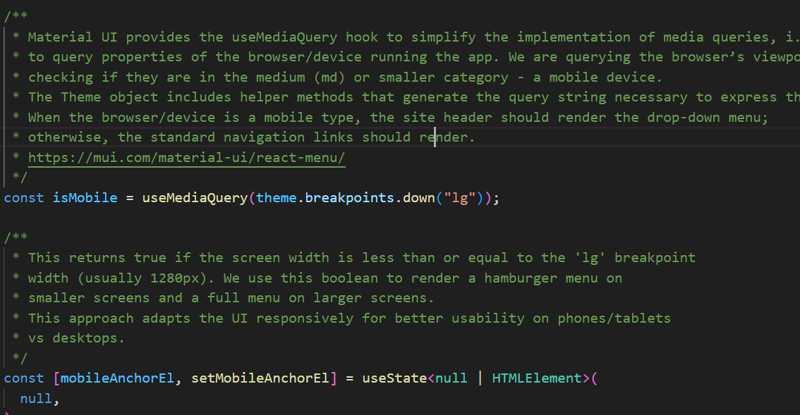
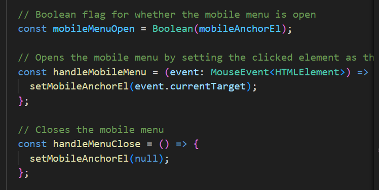

Then, it anchors to:

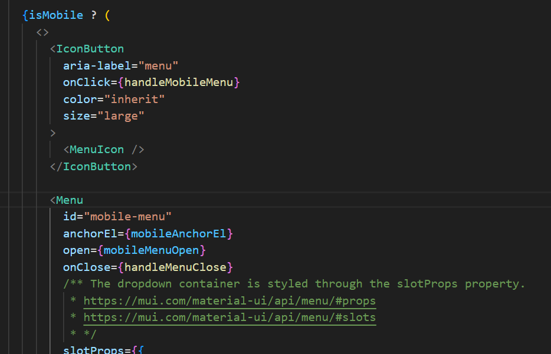

'isMobileMenuOpen' becomes true when the submenu should be displayed.

If the 'mobileAnchorEl' is set to 'null', then, the hamburger dropdown menu will be closed:

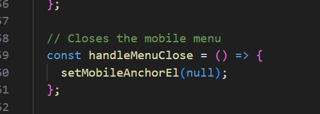

Furthermore, we have plugged in a profile drawer \*\*components/userProfileDrawer/userProfileDrawer.tsx that will open when the user clicks on the 'Welcome User' link on the top right of the menu. To acheieve this, we created the below boolean state set to 'false' for convenience (the drawer should always be closed unless prompted to open):

```

  /**
   * 'drawerOpen' state has been set for the logged in user state. The reason behind that is
   * that to manage the open/close state of the UserProfileDrawer,
   * a side panel (also known as a drawer) that slides in from the edge of the screen, a boolean
   * state variable that tracks whether the drawer is currently visible (true) or hidden (false)
   * was needed
   */
  const [drawerOpen, setDrawerOpen] = useState(false);

```

At that point, when a Supabase user authentication 'token' exists, hence the user is authenticated and loggedin, and the user clicks on the Welcome User menu link, the drawerOpen is set to 'true' and the userProfileDrawer component will slide in:

```
  {token ? (
                  <MenuItem
                    onClick={() => {
                      setDrawerOpen(true);
                      handleMenuClose();
                    }}
                  >
                    Welcome {userName}!
                  </MenuItem>
                ) : (
                  <MenuItem onClick={() => navigate("/login")}>
                    Login <LoginIcon sx={{ ml: 1 }} />
                  </MenuItem>
                )}
              </Menu>

```

We, of course, wouldn't have been able to achieve such a behaviour hadn't we first set up a **useContext.tsx** hook to read values from our **AuthContext.tsx** hook. If we get a token, then, the user is authenticated via 'Supabase'. The 'user' contains the firstName that we will name 'userName' here, which will be used to set up the below local state:

```
  // Created a useState for userName so that we can set it as a user logs in
  const [userName, setUserName] = useState("User");

  const { token, user } = useContext(AuthContext) || {};

  useEffect(
    () => {
      // You can remove this or set it from somewhere else if needed
      setUserName(user?.first_name ?? "User");
    }, // Run this effect every time `token` changes ensuring the 'userFirstName' is up-to-date
    [token, user],
  );

```

This is shown in the UI (like “Welcome, User!”) until it gets updated with real data when 'userName' gets updated and a token changes through the useEffect() hook.

This useEffect runs when the component mounts, and any time a user or a token changes and it updates userName to user.firstName, or falls back to "User" if that’s not available.

### Source attributions

- https://css-tricks.com/css-link-hover-effects/
- https://mui.com/material-ui/customization/how-to-customize/#pseudo-classes
- https://developer.mozilla.org/en-US/docs/Web/JavaScript/Reference/Global_Objects/String/startsWith
- https://api.reactrouter.com/v7/functions/react_router.useNavigate.html
- https://reactnavigation.org/docs/use-theme/
- https://mui.com/material-ui/react-menu/
- https://css-tricks.com/css-link-hover-effects/
- https://mui.com/material-ui/customization/how-to-customize/#pseudo-classes
- https://developer.mozilla.org/en-US/docs/Web/JavaScript/Reference/Global_Objects/String/- startsWith
- https://api.reactrouter.com/v7/functions/react_router.useNavigate.html
- https://reactnavigation.org/docs/use-theme/
- https://mui.com/material-ui/api/menu/#props
- https://mui.com/material-ui/api/menu/#slots

## User Profile Drawer

This UserProfileDrawer/index.tsx component implements a slide-in panel that displays the current user's profile information. It accepts two props from the parent component:

- 'open', which is a 'boolean' that controls whether the drawer is visible
- 'onClose', which is a function that closes the drawer.

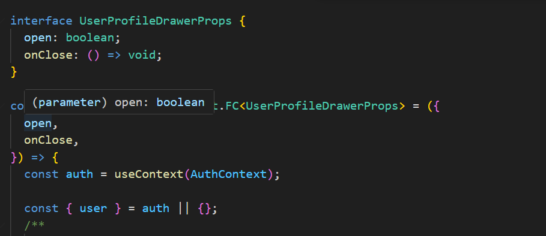

Inside the component, React's **useContext** is used to access the authenticated user object and, hence, data from the **AuthContext.tsx** component, but, also, to handle the signout(). However, we, then, fetch the user first name, last name and other data we need to populate the drawer from the Supabase 'profiles' table. The profiles rows contained in this table https://supabase.com/dashboard/project/xxxxxxxxxxxx/editor/35435?schema=public are user data perfectly in sync with the user data found in the Supabase authentication section in https://supabase.com/dashboard/project/xxxxxxxxxxxxxxxxx/auth/users.

As a matter of fact, Supabase recommends creating a 'profiles' table to fetch user data ('For security, the Auth schema is not exposed in the auto-generated API. If you want to access users data via the API, you can create your own user tables in the public schema. https://supabase.com/docs/guides/auth/managing-user-data?queryGroups=language&language=js').

Once the profiles table was created (we will return on the Supabase query used to create the 'profiles' table later), we decided to use React Query to cache in the profile data, and make use of an API hook created ad hoc to fetch the profiles data from supabase:

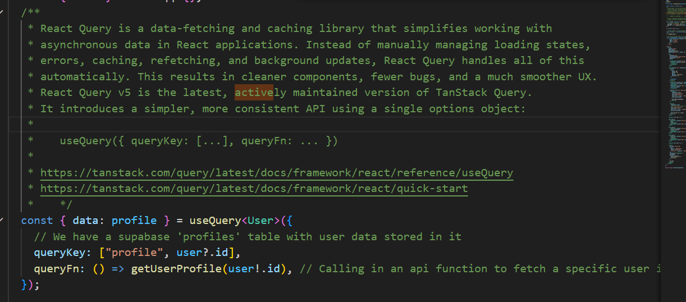

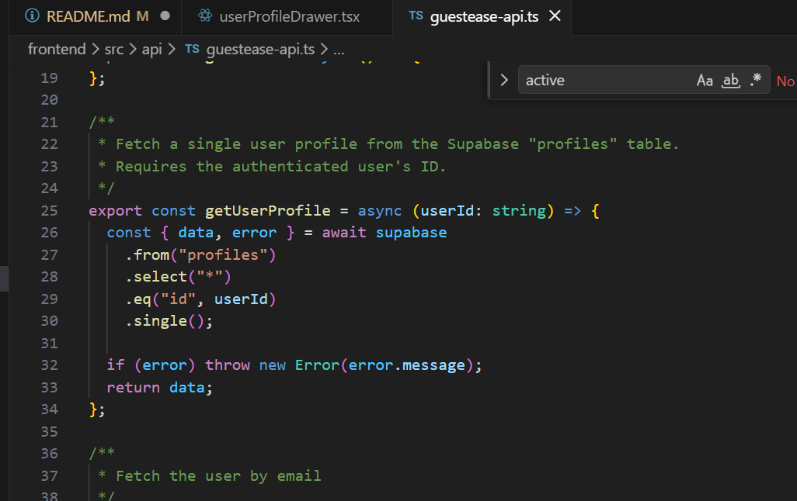

At that point, we were able to populate the below drawer:

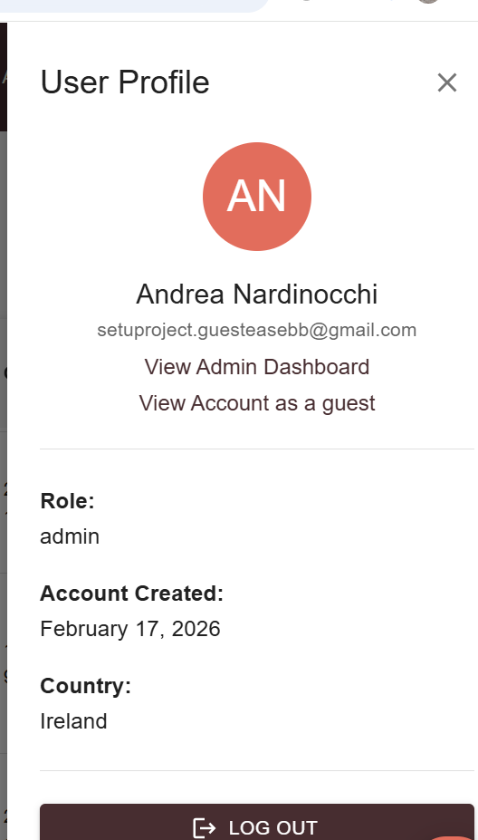

### Source attributions

- https://mui.com/material-ui/react-drawer/
- https://mui.com/material-ui/react-divider/
- https://www.codingeasypeasy.com/blog/mastering-material-ui-drawer-a-comprehensive-guide-with-examples
- https://tanstack.com/query/latest/docs/framework/react/reference/useQuery
- https://tanstack.com/query/latest/docs/framework/react/quick-start

## Auth Context Provider

The AuthContext.tsx component sets up a centralized authentication state for the entire app using React Context, and Supabase. The most important function of this context file is to provide token, user, authenticate, and signout to any component that needs access to auth information.

The useState hook initializes the token and user state:

```
  const [token, setToken] = useState<string | null>(null);
  const [user, setUser] = useState<User | null>(null);

```

The authenticate function, wrapped with useCallback to avoid unnecessary re-creation (as prompted by Typescript), fetches the metadata from a Supabase authenticated user, and updates the app’s state. In addition to that, it redirects users back to the page they originally intended to visit after login:

```
const authenticate = useCallback(
    async (supabaseData: { user: SupaUser; session: Session }) => {
      const { user, session } = supabaseData;

      if (!user || !session) {
        // Session not ready yet
        return;
      }

      /**
       * Extract user metadata from Supabase. If no metadata exists,
       * fall back to an empty object to avoid undefined errors.
       */
      const metadata = user.user_metadata || {};

      // Create a clean user object for our app.
      const newUser: User = {
        id: user.id,
        first_name: metadata.first_name || "User",
        last_name: metadata.last_name || "User",
        email: user.email || "user@example.com",
        role: metadata.role || "guest",
        created_at: user.created_at || new Date().toISOString(),
        country: metadata.country || "Unknown",
        zip_code: metadata.zip_code || "Unknown",
      };

      // Updating the user state with the current logged‑in user.
      setUser(newUser);
      setToken(session.access_token || null);

      // Get the page the user originally wanted to visit before being redirected.
      // If it exists, we'll send them back there after they log in.
      const origin = location.state?.intent?.pathname;

      if (origin) {
        navigate(origin);
      }
      // The loading should stop after authentication is finished
      setLoading(false);
    },
    [location, navigate],
  );
```

On component mount, the useEffect hook runs the fetchSession() to check if a user session already exists, and if it does, it re-authenticates it (this usually happens when refreshing the browser):

```

useEffect(() => {
  /**
   * This async function tries to restore an existing user session on page load or refresh.
   * If a valid session is found, it will `authenticate()` to set user state and token again
   * The session data will be fetched from the localStorage and the session will be resumed.
   */
  async function fetchSession() {
    setLoading(true);
    // https://supabase.com/docs/reference/javascript/auth-getsession
    // https://github.com/orgs/supabase/discussions/32783
    const { data, error } = await supabase.auth.getSession();

    if (error) {
      console.error("Failed to restore session");
      return;
    }

    console.log("getSession(): ", data.session, error);

    // We create a const variable called 'session'
    const session = data.session;

    // If the session and user of that session exist, then, we will authenticate them again and
    // the session will be restored (authenticate() takes the 2 values as per 'const { user, session } = supabaseData;')
    if (session && session.user) {
      await authenticate({ user: session.user, session });
    }
    // Marks loading as finished
    setLoading(false);
  }

  fetchSession();

  /**
     * Add listener for auth state changes (login, logout, token refresh)
     * This ensures the user state and token stay updated automatically, keeping
     *  the auth context in sync with Supabase
     * https://supabase.com/docs/reference/javascript/auth-onauthstatechange
     */
    const { data: subscription } = supabase.auth.onAuthStateChange(
      (event, session) => {
        if (session?.user) {
          authenticate({ user: session.user, session });
        } else {
          setUser(null);
          setToken(null);
        }
      },
    );
    // Clean up the listener when the component unmounts
    return () => subscription?.subscription.unsubscribe();
  }, [authenticate]);

```

The signout function, instead, handles logging out the user via Supabase, clearing the token, and navigating them back to the home page:

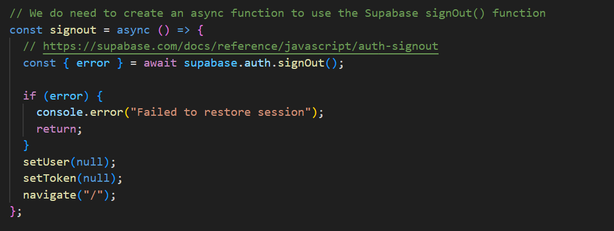

While, tha above functions were mainly inherited from a project I worked on in the past https://github.com/AndreaNardinocchi/MoviesApp/blob/main/src/contexts/authContext.tsx, the below function has been introduced in this project to give users the chance to reset their passwords if needed:

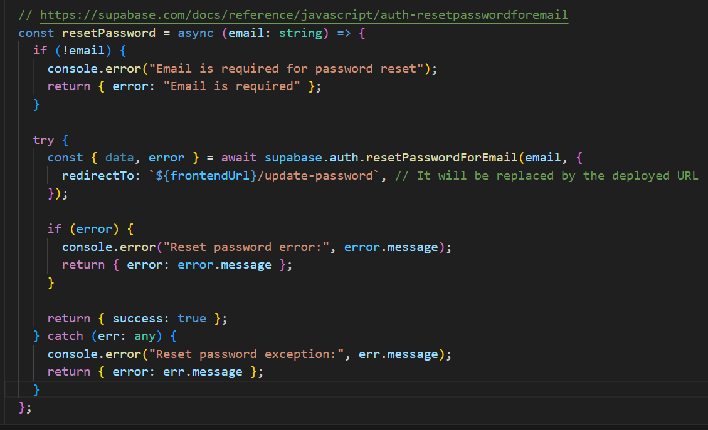

Finally, the provider wraps all children components, making the authentication data and methods available throughout the app:

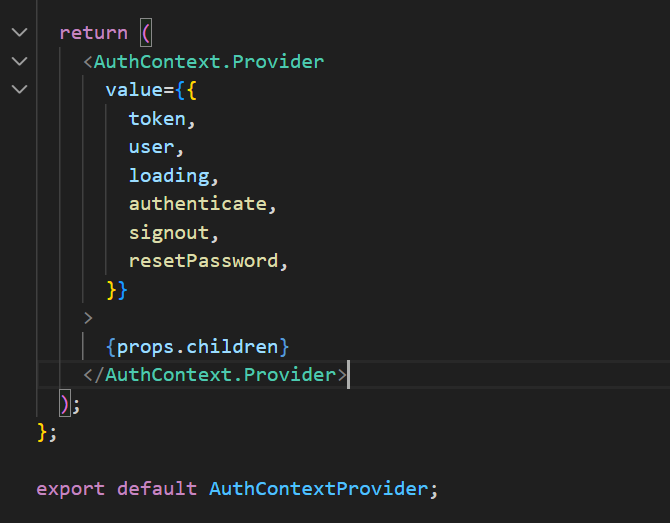

This architecture ensures secure, consistent user session management, and exercises a pivotal role for the back-end user data persistence, which will be further discussed down this document.

### Source attribution

- https://github.com/AndreaNardinocchi/MoviesApp/blob/main/src/contexts/authContext.tsx
- https://react.dev/reference/react/useCallback
- https://supabase.com/docs/reference/javascript/auth-getsession
- https://github.com/orgs/supabase/discussions/32783
- https://supabase.com/docs/reference/javascript/auth-onauthstatechange
- https://supabase.com/docs/reference/javascript/auth-signout
- https://supabase.com/docs/reference/javascript/auth-resetpasswordforemail

## SignUp page

The signUpPage.tsx file creates a user registration page leveraging Supabase for the backend authentication, as already mentioned in the AuthContext.tsx section above.

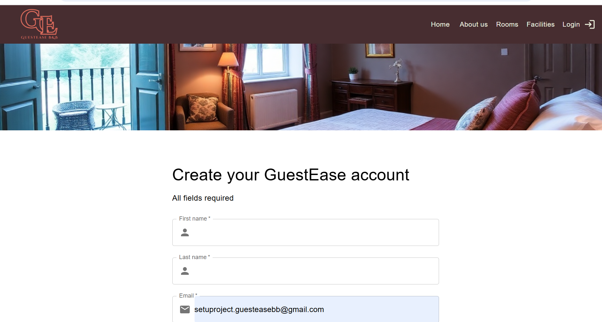

It first initializes state with useState to track values for first name, last name, email, and password, as well as boolean state such as nameError, and passwordError to manage validation:

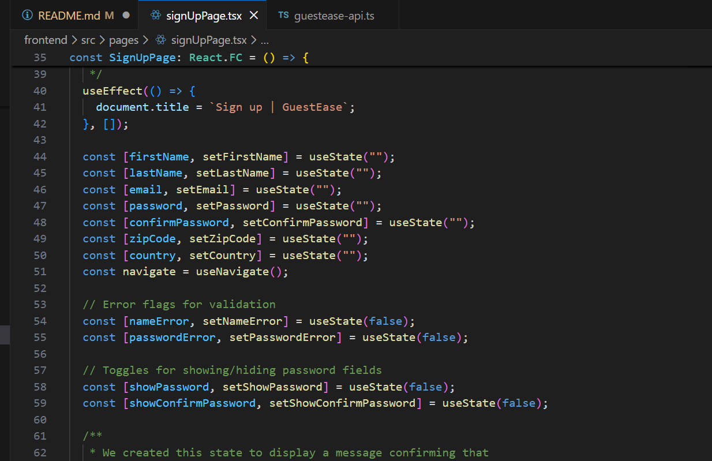

Other useStates were created to handle states for various purposes. However, the ones worth spending a few words about are the 'confirmationMessage' and the 'rejectionMessage'. Through them, we created a conditional UI block with ternary operator so that if the user is successfully created, we will be able to show a green strip with the confirmation message, whereas a red one with the rejection message will be sown in case the account is already created:

```
// We will set a confirmation message
      // https://stackoverflow.com/questions/73802604/how-to-check-if-user-already-exists-in-supabase
      if (data.user && !data.user.email_confirmed_at) {
        setConfirmationMessage(
          "Account created! Please check your email to confirm your account.",
        );

        /**
         * This will create a Stripe Customer id for the new user and will
         * allow him to book
         */
        createStripeCustomerApi({
          userId: data.user.id,
          email: data.user.email ?? "",
        });
        // Redirect after a short delay
        setTimeout(() => {
          navigate("/login");
        }, 3500);
        return;
      }
      // Fetch the session to confirm
      const sessionRes = await supabase.auth.getSession();
      console.log("Current session after signup:", sessionRes);

      navigate("/login");
    } catch (err) {
      console.error("Unexpected error during signup:", err);
      alert("An unexpected error occurred. Check the console for details.");
    }
  };

    ..........................

        {confirmationMessage ? (
            <Box
              sx={{
                mb: 4,
                display: "flex",
                flexDirection: "column",
                alignItems: "center",
                textAlign: "center",
              }}
            >
              <Alert
                severity="success"
                // variant="filled"
                sx={{ fontSize: "1.25rem", py: 2, px: 3, maxWidth: "500px" }}
              >
                {confirmationMessage}
              </Alert>
              <CircularProgress size={90} thickness={4} sx={{ mt: 3 }} />
            </Box>
          ) : rejectionMessage ? (
            <Box
              sx={{
                mb: 4,
                display: "flex",
                flexDirection: "column",
                alignItems: "center",
                textAlign: "center",
              }}
            >
              <Alert
                severity="warning"
                // variant="filled"
                sx={{ fontSize: "1.25rem", py: 2, px: 3, maxWidth: "500px" }}
              >
                {rejectionMessage}
              </Alert>
            </Box>
          ) : null}

```

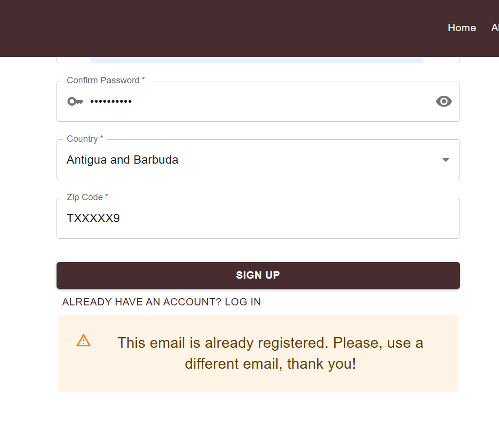

<video controls src="20260225-1912-12.1312315.mp4" title="Title"></video>

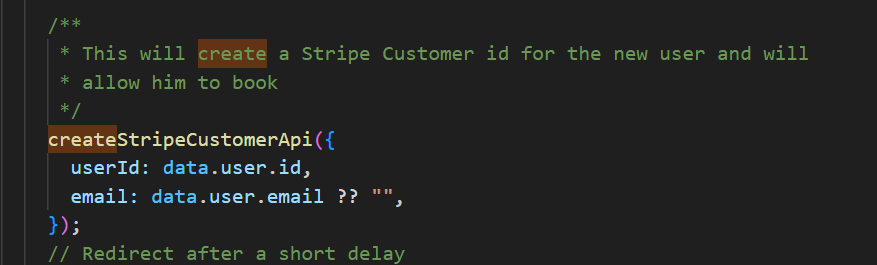

In the above code, we also call in the 'createStripeCustomerApi' function to create a Stripe customer, as per https://docs.stripe.com/api/customers/create, and fill the 'stripe_customer_id' column in the Supabase 'profiles' table:

```
/**
 * Creates a Stripe customer for the user if they don't already have one.
 * https://docs.stripe.com/api/customers/create
 */
export const createStripeCustomerApi = async (params: {
  email: string;
  userId: string;
}) => {
  const res = await fetch(`${backendUrl}/create-stripe-customer`, {
    method: "POST",
    headers: { "Content-Type": "application/json" },
    body: JSON.stringify(params),
  });

  const data = await res.json();

  if (!res.ok) {
    throw new Error(data.error || "Failed to create Stripe customer");
  }

  // Expected: { customerId: "cus_123" }
  return data;
};
```

```
[{"idx":3,"id":"2874431a-c034-406a-8d6f-dc9fb3c59c48","email":"setuproject.guesteasebb@gmail.com","first_name":"Andrea","last_name":"Nardinocchi","country":"Ireland","zip_code":"T12Y2NE","role":"admin","created_at":"2026-02-17 18:33:39.07747+00","stripe_customer_id":"cus_U0K9ZaYZ3ENM0e"}]

```

This is essential, then, for the user to be able to access and fill out the Stripe checkout to complete or update a booking.

Last but not least, we introduce a Supbase PostgreSQL function called 'check_email_exists' to ensure that no duplicate is added, which will also constitute the base from which the rejection message will lie on:

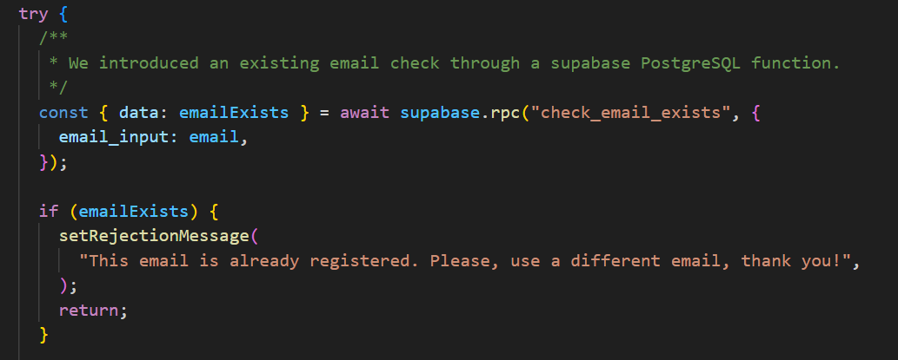

```
-- This function checks whether an email already exists in Supabase's
-- authentication table 'auth.users'.
-- This is connected to the SignUpPage.tsx

create or replace function check_email_exists(email_input text)
-- This boolean will return true or false based on the outcome of
--     select 1 from auth.users where email = email_input
-- https://www.postgresql.org/docs/current/sql-createfunction.html#SQL-CREATEFUNCTION-SECURITY
returns boolean
language sql
-- security definer allows this function to access 'auth.users'
security definer
as $$
-- This checks whether the email inputted by the user on the SignUpPage
-- already 'exists' in the auth.users
-- https://www.postgresql.org/docs/current/functions-subquery.html#FUNCTIONS-SUBQUERY-EXISTS
  select exists (
    select 1 from auth.users where email = email_input
  );
$$;
```

### Source attribution

- https://stackoverflow.com/questions/46160461/how-do-you-set-the-document-title-in-react
- https://muhimasri.com/blogs/mui-validation
- https://supabase.com/docs/reference/javascript/auth-signup
- https://supabase.com/docs/guides/auth/managing-user-data
- https://supabase.com/docs/guides/storage
- https://stackoverflow.com/questions/73802604/how-to-check-if-user-already-exists-in-supabase
- https://developer.mozilla.org/en-US/docs/Web/API/HTMLFormElement/noValidate
- https://www.geeksforgeeks.org/reactjs/how-to-use-textfield-component-in-material-ui/
- https://stackoverflow.com/questions/69554151/how-to-change-material-ui-textfield-inputadornment-background-color
- https://stackoverflow.com/questions/63047684/material-ui-select-menu-with-end-adornment#66245441
- https://materialui.co/icon/visibility-off
- https://www.postgresql.org/docs/current/sql-createfunction.html#SQL-CREATEFUNCTION-SECURITY
- https://www.postgresql.org/docs/current/functions-subquery.html#FUNCTIONS-SUBQUERY-EXISTS

## Protected Routes

The **routes/protectedRoutes.tsx** file is used to guard routes that require authentication. It uses useContext to access the AuthContext, which provides the current user's authentication token.

```
 const authContext = useContext(AuthContext);
  const { token, loading } = authContext || {};
```

The useLocation hook captures the current route so that after login, the user can be redirected back to their intended destination.

The Navigate component handles the redirect to /login. If the token exists, the user is allowed to access the protected content.

```
if (!token) {
    return (
      <Navigate
        to="/login"
        replace
        // https://stackoverflow.com/questions/16376438/get-path-and-query-string-from-url-using-javascript#16376491
        state={{ intent: location.pathname + location.search }}
      />
    );
  }

  return props.children;
};
```

The component, finally, returns its children, which represent the protected route content. This ensures only authenticated users can access certain parts of the app.

### Source attribution

- https://github.com/AndreaNardinocchi/MoviesApp/blob/main/src/components/routes/protectedRoutes.tsx
- https://stackoverflow.com/questions/16376438/get-path-and-query-string-from-url-using-javascript#16376491

## Log in page

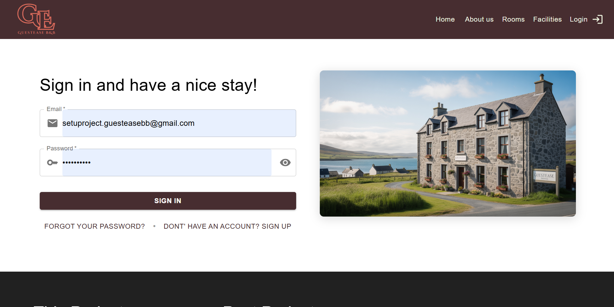

The **loginPage.tsx** uses useState hook to manage form inputs such as email, password, and error states:

```
  /**
   * Access the authentication context, giving the component
   * access to user data, token, and auth-related functions.
   */
  const auth = useContext(AuthContext);

  // useSate() hooks for storing user input from the login form.
  const [email, setEmail] = useState("");
  const [password, setPassword] = useState("");

  const navigate = useNavigate();

  /**
   * As we would like to handle empty field errors, we will set an error and
   * handle it in the handleSignUp function below.
   * https://muhimasri.com/blogs/mui-validation/
   */
  const [emailError, setEmailError] = useState(false);
  const [passwordError, setPasswordError] = useState(false);

```

The rationale behind creating separate errors was to trigger a targeted response to handle empty field errors, so that if the email text filed was empty, it would trigger the 'emailError' only, and vice versa.

The useState() hook for:

```
 /**
   * As we would like to handle incorrect data inputted by the user,
   * we will set an error and handle it in the handleSignUp function below.
   */
  const [loginError, setLoginError] = useState("");
```

would be triggered to handle incorrect data inputted by the user.

When the user clicks the login button, the login function validates email and password fields, marking errors if empty. If errors exist ('hasError'), it sets a login error message and exits early. To do that, we first created a 'hasError' boolean variable which would be 'true' or 'false' based upon whether the text fileds are empty (to ensure a sanitized input we use the trim() which removes any whitespac). In the end, if 'hasError' turns out 'true', the loginError kicks in:

```
 /**
   * Handles login logic when the user submits the form.
   * If an 'authenticate' function is available (from context),
   * it is called with the current email and password values.
   * This triggers authentication logging and checking credentials
   */
  const login = async () => {
    // Create a boolean variable which indicates whether the error exists or not
    let hasError = false;
    // The email field can't be empty
    if (email.trim() === "") {
      setEmailError(true);
      hasError = true;
    } else {
      setEmailError(false);
    }

    // The password field can't be empty
    if (password.trim() === "") {
      setPasswordError(true);
      hasError = true;
    } else {
      setPasswordError(false);
    }

    // Error message
    if (hasError) {
      setLoginError("Incorrect Credentials");
    }
```

if no error is detected, the credentials are pushed to Supabase using signInWithPassword(), after the 'onChange listener detects the useState hook state change and grabs the new email and password values in the text field tags:

```
Ex.

    {/* Email Field
        https://muhimasri.com/blogs/mui-validation/*/}
              <TextField
                fullWidth
                required
                id="outlined-required"
                label="Email"
                type="email"
                margin="normal"
                value={email}
                onChange={(e) => setEmail(e.target.value)}
                error={emailError}
                helperText={emailError ? "Please enter your email" : ""}
                InputProps={{
                  startAdornment: (
                    <InputAdornment position="start">
                      <EmailIcon />
                    </InputAdornment>
                  ),
                }}
              />
```

If Supabase returns an error, it logs and displays it, but if the login is successful, it clears errors and calls the authenticate function from context:

```
 // The below async function sends a request to Supabase using the user credentials
    // https://supabase.com/docs/reference/javascript/auth-signinwithpassword
    const { data, error } = await supabase.auth.signInWithPassword({
      email,
      password,
    });

    // If error, an error message will be shown
    if (error) {
      console.error("Login error:", error.message);
      setLoginError("Incorrect Credentials");
      return setLoginError;
    }

    console.log("Login successful:", data);
    setLoginError("");

    /**
     *
     * After a user logs in successfully, we want to redirect them back to the page
     * they originally tried to visit (before being redirected to the login page).
     * When a user hits a protected page without being authenticated, we store the intended
     * destination inside `location.state.intent`. Once they log in, we extract that original
     * route and redirect them to it.
     * https://www.robinwieruch.de/react-router-authentication/?
     * https://www.reddit.com/r/reactjs/comments/uwx8h0/need_help_how_to_access_user_requested_route/
     */
    const redirectPath = location.state?.intent || "/";
    // console.log("LOGIN PAGE — location.state:", location.state);

    navigate(redirectPath, {
      replace: true,
      state: { path: location.pathname },
    });
  };

```

This updates the global auth state with the user and session. Finally, it redirects the user to the page they intended to land to before logging in.

Of course, the very first step was to actually extract the 'authenticate' function from the AuthContext using React's 'useContext' hook. If 'useContext(AuthContext)' returns 'null' or 'undefined', it safely falls back to an empty object '({})', which averts an error during destructuring:

```
/**
   * Access the authentication context, giving the component
   * access to user data, token, and auth-related functions.
   */
  const auth = useContext(AuthContext);

```

The form is responsive and accessible, and the navigate hook redirects users after login or to the signup page. However, the form also features a reset password link which will triggered a password reset email from Supabase:

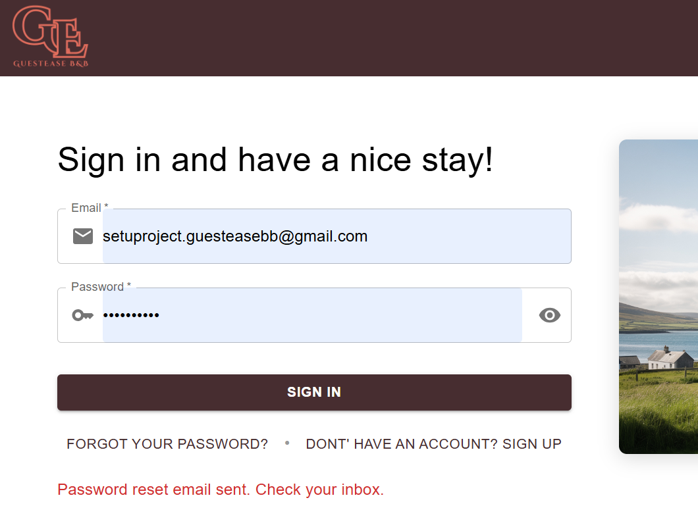

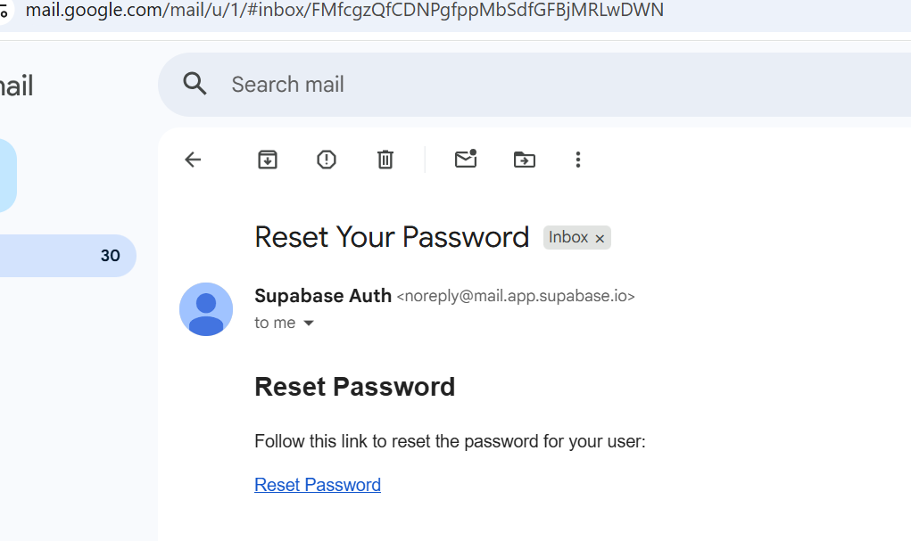

This is achieved by calling the below function resetPassword() from the **AuthContext.tsx** file, which, in turn, calls the Supabase function 'resetPasswordForEmail()':

```
   <Button
                  /**
                   * If no email has been entered by the user,
                   * throw an error, and stop the reset process
                   */
                  onClick={async () => {
                    if (!email) {
                      setEmailError(true);
                      return;
                    }
                    // https://supabase.com/docs/reference/javascript/auth-resetpasswordforemail
                    const result = await auth?.resetPassword(email);
                    /**
                     * If the email is not in supabase, throw an error
                     */
                    if (result?.error) {
                      setLoginError(result.error);
                    } else {
                      /**
                       * Otherwise, show the below message, and send the reset
                       * password email.
                       */
                      setLoginError(
                        "Password reset email sent. Check your inbox.",
                      );
                    }
                  }}
                  sx={{ color: "#472d30", textTransform: "uppercase" }}
                >
                  Forgot your password?
                </Button>

```

from **AuthContext.tsx**:

```
const resetPassword = async (email: string) => {
    if (!email) {
      console.error("Email is required for password reset");
      return { error: "Email is required" };
    }

    try {
      const { data, error } = await supabase.auth.resetPasswordForEmail(email, {
        redirectTo: `${frontendUrl}/update-password`, // It will be replaced by the deployed URL
      });

      if (error) {
        console.error("Reset password error:", error.message);
        return { error: error.message };
      }

      return { success: true };
    } catch (err: any) {
      console.error("Reset password exception:", err.message);
      return { error: err.message };
    }
  };

```

### Source attribution

- https://v5-0-6.mui.com/components/text-fields/
- https://www.php.cn/faq/1796604601.html
- https://v5-0-6.mui.com/components/text-fields/
- https://github.com/AndreaNardinocchi/MoviesApp/blob/main/src/pages/loginPage.tsx
- https://supabase.com/dashboard/project/xxxxxxxxxx/auth/users
- https://stackoverflow.com/questions/46160461/how-do-you-set-the-document-title-in-react
- https://muhimasri.com/blogs/mui-validation/
- https://supabase.com/docs/reference/javascript/auth-signinwithpassword
- https://www.robinwieruch.de/react-router-authentication/
- https://www.reddit.com/r/reactjs/comments/uwx8h0/need_help_how_to_access_user_requested_route/
- https://muhimasri.com/blogs/mui-validation/
- https://supabase.com/docs/reference/javascript/auth-resetpasswordforemail

## Update Password page

The **updatePassword.tsx** page is a helper page to enable the user to entry their new password after receiving a 'tokenized' link from a Supabase email:

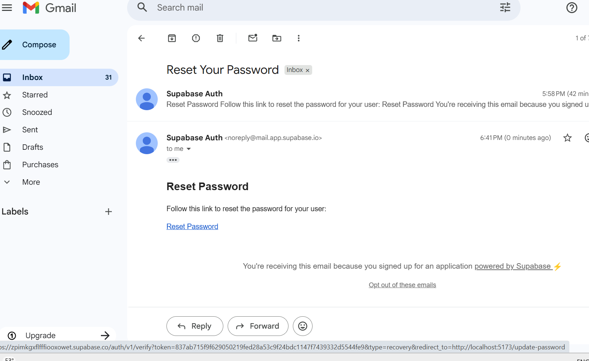

The code explanation in the below comment is pretty straightforward

```
  /**
   * Handles Supabase's password‑reset flow.
   * When the user opens the reset link, Supabase sends a temporary
   * recovery access_token in the URL and triggers a "PASSWORD_RECOVERY" event.
   * Listening for this event ensures the recovery session is active before
   * calling updateUser({ password }), preventing the "Auth session missing!" error.
   * https://supabase.com/docs/reference/javascript/auth-onauthstatechange
   */
  useEffect(() => {
    const { data: listener } = supabase.auth.onAuthStateChange(
      async (event, session) => {
        if (event === "PASSWORD_RECOVERY") {
          console.log("Recovery session loaded:", session);
        }
      },
    );

    return () => listener.subscription.unsubscribe();
  }, []);

```

To be added that it runs inside a useEffect() hook so the auth-state listener is created only once and doesn’t re‑subscribe on every render. The cleanup function inside the effect removes the listener when the component unmounts to prevent memory leaks.

At this point, when the user clicks on the update password 'tokenized' link received by email, they will land on the Updated Password page (in logged in status because of the temporary token crreated by the Supabase function) to enable them to set a new password:

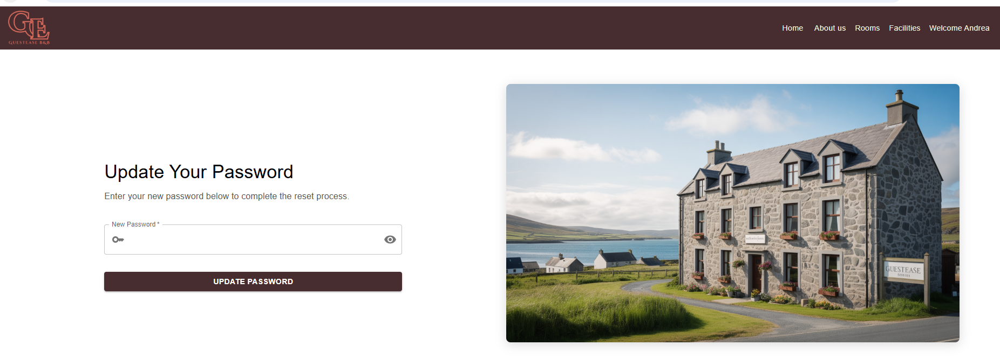

### Source attribution

- https://supabase.com/docs/reference/javascript/auth-onauthstatechange
- https://supabase.com/docs/reference/javascript/auth-resetpasswordforemail

## supabaseClient file

This file basically installs and sets up the Supabase TypeScript client in the MoviesApp project. The @supabase/supabase-js package is first installed using npm.

```
npm install @supabase/supabase-js
```

Then, 'createClient' is imported to initialize a Supabase client with a URL and an API key. These credentials are securely loaded from environment variables using 'import.meta.env'.

Finally, the configured Supabase client is exported for use throughout the app.

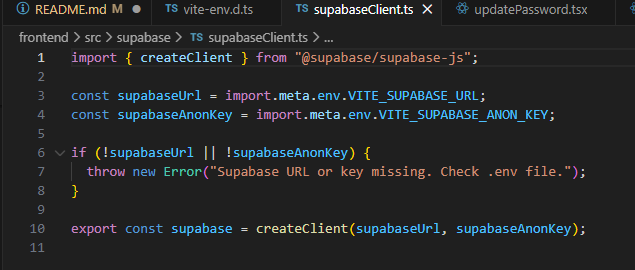

### Source attributions

- https://supabase.com/dashboard/project/xxxxxxxxxxxxxxxxxxxxxx
- https://supabase.com/dashboard/project/xxxxxxxxxxxxxxxx/settings/api-keys

## searchRoomsContext

The **context/searchRoomsContext.tsx** defines a dedicated React context for handling the room search functionality across the application.

It begins by importing React’s createContext, the Supabase‑backed 'searchAvailableRooms' service, and the 'SearchRoomContextType' from the **interface.tsx** that enforces the structure of the context value.

```
export type SearchRoomContextType = {
  /**
   * availableRoomsSearchObjectType is a function that queries available rooms based on:
   * checkIn, checkOut, and guests number.
   * It returns a Promise resolving to an object
   * This function is implemented in the 'SearchRoomContext.ts' which wraps
   * the Supabase RPC call in searchAvailableRooms.ts.
   * https://react.dev/reference/react/use
   */
  availableRoomsSearchObjectType: (
    checkIn: string,
    checkOut: string,
    guests: number,
  ) => Promise<{
    success: boolean; // Indicates whether the search was successful
    rooms: any[]; // Array of available rooms returned from the database
    message?: string; // Optional message for errors or additional info
  }>;
};


```

The SearchProvider component wraps the application and exposes a single asynchronous function 'availableRoomsSearchObjectType' responsible for performing the room search. This accepts the check‑in date, check‑out date, and number of guests and forwards them to the 'searchAvailableRooms.ts' service.

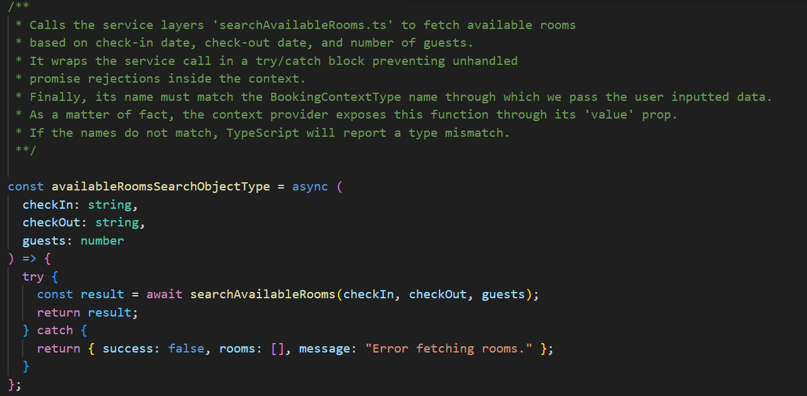

That service is the part of the application that actually queries Supabase and returns a list of rooms that match the criteria.

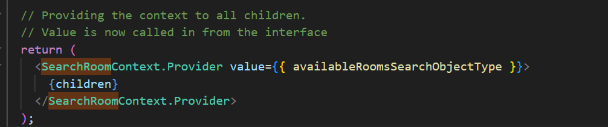

The provider then exposes this function through the context’s value prop. Any component inside the provider’s tree can call this function through useContext(SearchRoomContext) and trigger a real room‑availability search without needing to import or know anything about the underlying Supabase logic.

### Source attributions

- https://github.com/AndreaNardinocchi/MoviesApp/blob/main/src/contexts/moviesContext.tsx
- https://react.dev/reference/react/createContext

## availableRooms

The **supabase/availableRooms.tsx** calls the Supabase Postgres function 'get_available_rooms' (created in https://supabase.com/dashboard/project/xxxxxxxxxxxxxxx/sql/xxxxxxxxx?schema=public ) via RPC and returns a normalized result object.

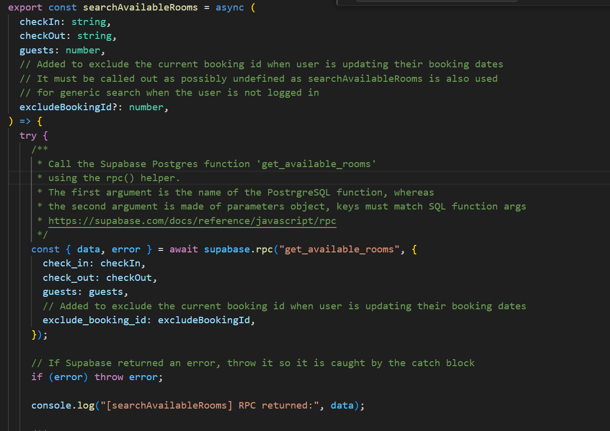

It is basically a plain async service function which calls Supabase RPC and returns { success, rooms, message }.
It does not manage loading, caching, or refetching and it is meant to be used inside a context or inside React Query.

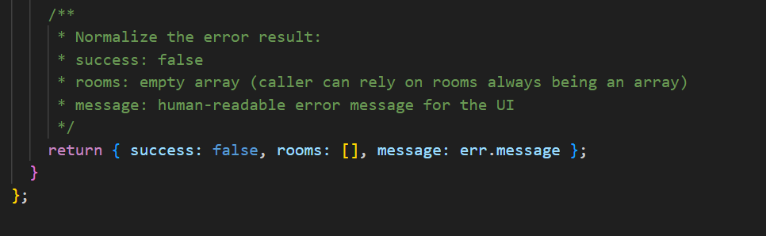

One issue we had to cope with when testing the app was on the user booking update functionality flow, which kept blocking any updates displaying a room availability error. That was occuring because the Supabase 'get_available_rooms' function was counting in the current booking id in the search results, hence, the new updated check-in and check-out dates were always showing as booked already.

We resolved this issue by simply excluding the current booking id by adding the argument 'exclude_booking_id':

```
const { data, error } = await supabase.rpc("get_available_rooms", {
      check_in: checkIn,
      check_out: checkOut,
      guests: guests,
      // Added to exclude the current booking id when user is updating their booking dates
      exclude_booking_id: excludeBookingId,
    });

```

### Source attributions

- https://supabase.com/dashboard/project/xxxxxxxxxxxxxxx/sql/xxxxxxxxx?schema=public
- https://supabase.com/docs/reference/javascript/rpc
- https://developer.mozilla.org/en-US/docs/Web/API/console/error

## Supabase function 'get_available_rooms'

This Supabase PostgeSQL function 'get_available_rooms' defines an async service function that asks Supabase to check which rooms are available for certain dates and a specific number of guests. It passes the check-in date, check-out date, number of guests, and an optional booking ID to exclude when updating an existing reservation.

The function normalizes the response into a consistent { success, rooms, message } shape so the UI can rely on predictable data. If there is an error, we catch it and return a clean message instead of breaking the app

```
...

CREATE OR REPLACE FUNCTION public.get_available_rooms(
  check_in date,
  check_out date,
  guests int,
  -- This is added to exclude the current booking id when user is updating their booking dates
  exclude_booking_id uuid
)
RETURNS TABLE (
  id uuid,
  name text,
  description text,
  capacity int,
  price numeric,
  amenities jsonb,
  images jsonb,
  created_at timestamptz
)

...

```

One of the requirements we had set out to impose on the function was that of unallowing booking overlaps so that users can be sure that the room they book is reserved for them indeed. We resolved this issue by using the 'btree_gist' extension and by adding the below constraint:

```
ALTER TABLE bookings
ADD CONSTRAINT no_overlapping_bookings
EXCLUDE USING gist (
  room_id WITH =,
  period WITH &&
);

```

The function, then, will 'select' the room with the below condition:

```
WHERE
  -- Ensure room can accommodate the requested number of guests
  r.capacity >= guests
  -- Exclude rooms that overlap with an existing booking
  -- The "&&" operator checks whether two ranges overlap.
  -- PostgreSQL docs: Table 9.58 (range operators) https://www.postgresql.org/docs/current/functions-range.html
  AND NOT EXISTS (
    SELECT 1
    FROM public.bookings AS b
    WHERE b.room_id::uuid = r.id
    AND (exclude_booking_id IS NULL OR b.id != exclude_booking_id)

      -- Compare the booking's stored daterange (b.period)
      -- with the requested range created by daterange($1, $2, '[)')
      --
      -- '[)' means:
      --   inclusive lower bound (check_in)
      --   exclusive upper bound (check_out) so that when a check out exists a check in can exists too for the same date
      AND b.period && daterange($1, $2, '[)')
  );

```

If we did not provide any booking ID to exclude, the condition is automatically true (exclude_booking_id IS NULL) and nothing special is filtered out. Otherwise, we will include all bookings tha do not match the the booking id to exclude so that the user 'update booking' functionality will work with no issues (the booking id to exclude is the one the user is updating).

### Source attributions

- https://dev.to/jhonoryza/sql-index-types-b-tree-hash-gist-gist-brin-and-gin-44g0
- https://www.postgresql.org/docs/current/btree-gist.html
- https://neon.com/blog/btree_gist
- https://www.postgresql.org/docs/current/sql-createextension.html
- https://stackoverflow.com/questions/61501301/partial-constraint-exclude-using-gist#61503531
- https://www.postgresql.org/docs/current/sql-createtable.html#SQL-CREATETABLE-EXCLUDE
- https://supabase.com/docs/guides/database/functions
- https://www.postgresql.org/docs/current/functions-range.html

## Homepage

The **homePage.tsx** file defines the GuestEase homepage from which the user can get their first glance of the app and general information about the B&B and its surroundings.

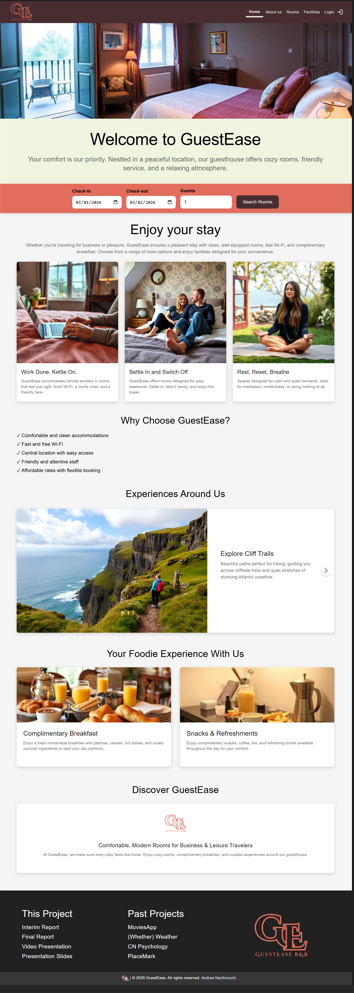

Right underneath the hero image, there is just a simple banner with a welcoming message for the user. However, the user won't certainly miss the search form built out in **searchRoomsForm.tsx** because of its stickyness (if the user keeps scrolling down, the search form will stick to the top of the page, and will acoompany the user navigation throughout the page):

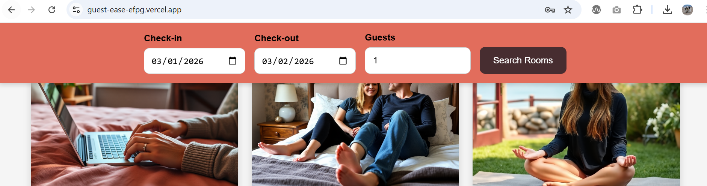

This effect was achieved by wrapping the above-mentioned component with the **stickyHeaderComp.tsx** one, wich is, in turn, a reusable wrapper that creates a sticky navigation container using the Material‑UI's Box component:

```
const StickyHeaderComp: React.FC<StickyNavigationBarProps> = ({ children }) => {
  return (
    <Box
      sx={{
        position: "sticky",
        top: 0,
        width: "100%",
        zIndex: 1200,
        backgroundColor: "#e26d5c",
        // boxShadow: "0px 2px 6px rgba(0,0,0,0.06)",
        boxShadow: "0px 4px 8px rgba(0,0,0,0.15)",
      }}
    >

```

Alas, at this point, though, we also noticed that the search form was taking up way to much space on the mobile view, which was offering a very poor UI experience.
We resolved that by creating the **responsiveSearchFormWrapper.tsx** component, which 'collapses' its children (StickyHeaderComp, and SearchRoomForm) into a toggleable panel on mobile (width < 768px), but shows them normally on desktop.


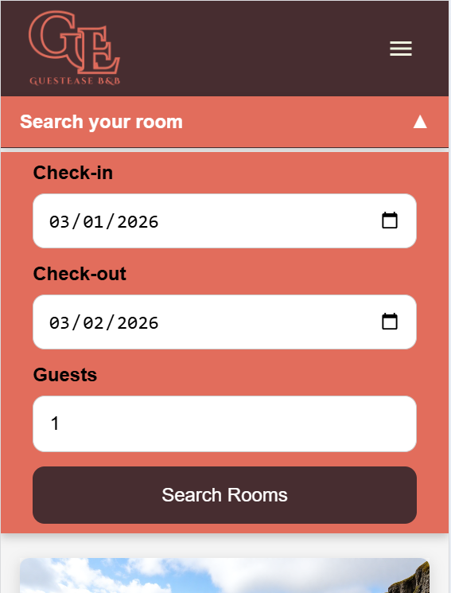

In essence, what this wrapper component does is to detect whether the screen width is less than 768px and treats that as a mobile view. It listens for window resize events to keep the 'isMobile' state updated:

```
/**
   * Track whether the viewport is mobile-sized.
   * window.innerWidth is safe here because this component is client-side only.
   * https://developer.mozilla.org/en-US/docs/Web/API/Window/innerWidth
   */
  const [isMobile, setIsMobile] = useState(window.innerWidth < 768);

  // Controls whether the mobile dropdown is open
  const [open, setOpen] = useState(false);

  /**
   * Listen for window resize events and update isMobile.
   * Cleanup removes the listener when the component unmounts.
   * https://react.dev/learn/synchronizing-with-effects#step-3-add-cleanup-if-needed
   * https://stackoverflow.com/questions/39435395/reactjs-how-to-determine-if-the-application-is-being-viewed-on-mobile-or-deskto
   * https://dev.to/saiful7778/detecting-mobile-devices-in-react-with-a-custom-hook-4gil
   */
  useEffect(() => {
    const resize = () => setIsMobile(window.innerWidth < 768);
    window.addEventListener("resize", resize);
    return () => window.removeEventListener("resize", resize);
  }, []);


  // On desktop, simply render children without the mobile wrapper.
  if (!isMobile) return <>{children}</>;

```

and cleans up the event listener when the component unmounts.
On desktop, it simply renders its children normally.

On mobile, it wraps the children in a sticky header with a clickable bar labeled 'Search your room'that toggles a dropdown, showing or hiding the children content.

```
 {/* Mobile header bar that toggles the dropdown */}
       <div
         onClick={() => setOpen(!open)}
         style={{
           display: "flex",
           justifyContent: "space-between",
           alignItems: "center",
           padding: "0.75rem 1rem",
           background: "#e26d5c",
           color: "white",
           fontWeight: 600,
           cursor: "pointer",
           boxShadow: "0px 4px 8px rgba(0,0,0,0.15)", // stronger bottom shadow
         }}
       >
         <span>Search your room</span>
         <span>{open ? "▲" : "▼"}</span>
       </div>

       {/* Dropdown content (only visible when open) */}
       {open && (
         <div
           style={{
             borderTop: "1px solid #472d30",
             paddingTop: "0.2rem",
           }}
         >
           {/* Children are the StickyHeaderComp and the SearchRoomsForm  */}
           {children}
         </div>
       )}
```

Another interesting section in the homepage is the **homepageExpCarousel.tsx**, which renders a carousel made of 4 cards defined in the **homepageExpCardHorizontal.tsx**.

In essence, the cards get populated by leveraging the 'export const experiences: Experience[]' array in the **interfaces.ts** file:

```
...
import HomepageExpCardHorizontal from "../homepageExpCardHorizontal/homepageExpCardHorizontal";
import type { Experience } from "../../types/interfaces";

const HomepageExpCarousel = ({
  experiences,
}: {
  experiences: Experience[];
}) => {
...

```

The component, then, uses a 'useRef', a React hook, to directly control the scrollable container.

```
 const scrollRef = useRef<HTMLDivElement>(null);
```

It keeps track of the currently visible slide with 'currentIndex' state and updates it when the user clicks the next or previous arrows.

```
  const [currentIndex, setCurrentIndex] = useState(0);
```

The 'goTo' function adjusts the index within bounds and smoothly scrolls the container to the correct position based on its width.

```
 const goTo = (direction: "next" | "prev") => {
    let newIndex = currentIndex;

    if (direction === "next" && currentIndex < experiences.length - 1) {
      newIndex = currentIndex + 1;
    }

    if (direction === "prev" && currentIndex > 0) {
      newIndex = currentIndex - 1;
    }

    setCurrentIndex(newIndex);

    // Scroll 'smoothly' to the new slide
    if (scrollRef.current) {
      scrollRef.current.scrollTo({
        left: scrollRef.current.clientWidth * newIndex,
        behavior: "smooth",
      });
    }
  };

```

Slides are rendered side by side using flexbox, each taking full width and preventing shrink, while navigation arrows are conditionally displayed depending on whether the user is at the first or last slide.

```
 {/* Right arrow: only shown when not on the last slide */}
      {currentIndex < experiences.length - 1 && (
        <IconButton
          onClick={() => goTo("next")}
          sx={{
            position: "absolute",
            top: "50%",
            right: 10,
            transform: "translateY(-50%)",
            zIndex: 10,
            bgcolor: "white",
            boxShadow: 2,
            "&:hover": { bgcolor: "white" },
            "&:active": { bgcolor: "white" },
            "&:focus": { bgcolor: "white" },
            "&:focusVisible": { bgcolor: "white" },
            "-webkit-tap-highlight-color": "transparent",
          }}
        >
          <ArrowForwardIosIcon />
        </IconButton>
      )}
```

### Source attributions

- https://mui.com/material-ui/all-components/
- https://mui.com/material-ui/api/typography/#typography-classes-MuiTypography-gutterBottom
- https://stackoverflow.com/questions/53183721/material-ui-gutterbottom-vs-paragraph-difference
- https://mui.com/system/grid/#css-grid-layout
- https://developer.mozilla.org/en-US/docs/Web/CSS/grid-template-columns
- https://mui.com/system/spacing/
- https://developer.mozilla.org/en-US/docs/Web/CSS/justify-content
- https://developer.mozilla.org/en-US/docs/Web/CSS/-webkit-line-clamp
- https://developer.mozilla.org/en-US/docs/Web/CSS/overflow
- https://developer.mozilla.org/en-US/docs/Web/CSS/box-orient
- https://mui.com/material-ui/customization/breakpoints/
- https://developer.mozilla.org/en-US/docs/Web/CSS/object-fit
- https://developer.mozilla.org/en-US/docs/Web/CSS/-webkit-line-clamp
- https://developer.mozilla.org/en-US/docs/Web/CSS/overflow
- https://developer.mozilla.org/en-US/docs/Web/CSS/box-orient
- https://atomizedobjects.com/blog/react/how-to-use-useref-in-react/
- https://medium.com/@juvitasaini/useref-understand-with-scroll-example-75ad7139557b
- https://tj.ie/scrollable-container-controls-with-react-hooks/
- https://react.dev/reference/react/useRef
- https://github.com/AndreaNardinocchi/MoviesApp/blob/main/src/pages/homePage.tsx
- https://react.dev/reference/react/useState
- https://developer.mozilla.org/en-US/docs/Web/API/Element/scrollTo
- https://react.dev/learn/conditional-rendering
- https://developer.mozilla.org/en-US/docs/Web/CSS/Reference/Properties/-webkit-tap-highlight-color
- https://developer.mozilla.org/en-US/docs/Web/CSS/flex-direction
- https://developer.mozilla.org/en-US/docs/Web/CSS/overflow
- https://react.dev/learn/rendering-lists
- https://developer.mozilla.org/en-US/docs/Web/CSS/Reference/Properties/flex-shrink

## Search Rooms Form

The **searchRoomsForm.tsx** component renders a responsive room search form that allows users to select a check-in date, check-out date, and number of guests, then search for available rooms.

It initializes default dates (today and tomorrow) and stores all form values in state.

```
  /** Extract the searchAvailableRooms function from the **useRoomsSearching.ts** hook.
   * This abstracts away Supabase logic from the UI.
   */
  const { availableRoomsSearchObjectType } = useRoomsSearching();

  /**
   * Today's date in YYYY-MM-DD format.
   * Used to prevent selecting past dates, and we use it inside the date inputs.
   * https://www.geeksforgeeks.org/javascript/javascript-date-toisostring-method/
   * https://stackoverflow.com/questions/47066555/remove-time-after-converting-date-toisostring#55231024
   */
  const today = new Date().toISOString().split("T")[0];

  const tomorrow = new Date();
  tomorrow.setDate(tomorrow.getDate() + 1);
  const tomorrowStr = tomorrow.toISOString().split("T")[0];

  const navigate = useNavigate();

  // Form state for check-in, check-out, and guest count
  const [formData, setFormData] = useState<SearchFormData>({
    checkIn: today,
    checkOut: tomorrowStr,
    guests: 1,
  });

```

The 'handleChange' function, then, updates the correct field dynamically, converting the guests value to a number.

```
const handleChange = (e: React.ChangeEvent<HTMLInputElement>) => {
    // Extract the input's name and value from the event.
    const { name, value } = e.target;
    // Update the formData state by keeping all previous fields (...prev)
    // https://www.geeksforgeeks.org/reactjs/how-to-get-previous-state-in-reactjs-functional-component/
    setFormData((prev) => ({
      ...prev,
      // Convert "guests" to a number (because input values are strings)
      [name]: name === "guests" ? Number(value) : value,
    }));
  };
```

When the user clicks **Search Rooms**, the form does not reload the page because 'handleSubmit' stops the default browser behavior. Instead, it calls the 'availableRoomsSearchObjectType', which is a function from the custom hook ('useRoomsSearching.ts') that provides access to the **searchRoomsContext.ts**, which, ultimately, fetches the available rooms from the 'get_available_rooms' function in Supabase through the **availableRooms.ts** function. The latter is the function checks the database (via Supabase) for available rooms based on the selected dates and number of guests.

When the user clicks Search Rooms, the form does not reload the page because handleSubmit prevents the browser’s default behavior. Instead, it calls the 'availableRoomsSearchObjectType' function, which comes from the custom hook 'useRoomsSearching.ts'. That hook works with the logic provided by 'searchRoomsContext.ts', and the context is what ultimately triggers the request to fetch available rooms. The actual database query happens inside 'availableRooms.ts', which calls the 'get_available_rooms' RPC in Supabase. That RPC checks the database for rooms that match the selected dates and number of guests and returns the available options.

```
const handleSubmit = async (e: React.FormEvent) => {
  e.preventDefault();

  const result = await availableRoomsSearchObjectType(
    formData.checkIn,
    formData.checkOut,
    formData.guests,
  );

  if (!result.success) {
    alert(result.message);
    return;
  }

  navigate(
    `/search-results?checkIn=${formData.checkIn}&checkOut=${formData.checkOut}&guests=${formData.guests}`,
  );
};

```

If no rooms are found or something goes wrong, an alert shows the error message. If the search is successful, the user is redirected to the '/search-results' page, and the chosen check-in date, check-out date, and guest count are included in the URL so the results page knows what to display.

### Source attributions

- https://www.geeksforgeeks.org/javascript/javascript-date-toisostring-method/
- https://stackoverflow.com/questions/47066555/remove-time-after-converting-date-toisostring#55231024
- https://dev.to/saiful7778/detecting-mobile-devices-in-react-with-a-custom-hook-4gil
- https://developer.mozilla.org/en-US/docs/Web/API/EventTarget/addEventListener
- https://react.dev/reference/react/useEffect#subscribing-to-events
- https://jsdev.space/react-form-events-guide/
- https://supabase.com/docs/reference/javascript/rpc
- https://developer.mozilla.org/en-US/docs/Web/API/Window/alert
- https://www.geeksforgeeks.org/reactjs/how-to-get-previous-state-in-reactjs-functional-component/
- https://jsdev.space/react-form-events-guide/
- https://supabase.com/docs/reference/javascript/rpc
- https://developer.mozilla.org/en-US/docs/Web/API/Window/alert
- https://docs.scala-lang.org/toolkit/http-client-uris.html
- https://developer.mozilla.org/en-US/docs/Web/URI/Reference/Query
- https://developer.mozilla.org/en-US/docs/Web/CSS/CSS_flexible_box_layout
- https://react.dev/learn#adding-styles
- https://developer.mozilla.org/en-US/docs/Learn/CSS/CSS_layout/Responsive_Design
- https://developer.mozilla.org/en-US/docs/Web/HTML/Element/label
- https://developer.mozilla.org/en-US/docs/Web/HTML/Element/input/date#min
- https://developer.mozilla.org/en-US/docs/Web/HTML/Element/input/date
- https://developer.mozilla.org/en-US/docs/Web/HTML/Element/input/number#min
- https://developer.mozilla.org/en-US/docs/Web/HTML/Element/button
- https://www.w3schools.com/jsref/event_onmousedown.asp
- https://www.w3schools.com/jsref/event_currenttarget.asp

## Search Results Page

The 'SearchResultsPage' component is a React functional component that displays the list of available rooms based on the search parameters ('checkIn', 'checkOut', and 'guests').
It uses the 'useLocation' hook from React Router to extract the URL search parameters and pass them to the custom hook, **useAvailableRooms.ts**, which fetches the room data from Supabase.

```

  /**
   * Extract URL parameters using URLSearchParams
   * https://developer.mozilla.org/en-US/docs/Web/API/URLSearchParams
   */
  const params = new URLSearchParams(location.search);
  const checkIn = params.get("checkIn") || "";
  const checkOut = params.get("checkOut") || "";
  const guests = Number(params.get("guests")) || 1;

  /**
   * Fetch rooms using React Query hook.
   *  https://tanstack.com/query/v4/docs/framework/react/reference/useQuery
   */
  const {
    data: rooms,
    isLoading,
    error,
  } = useAvailableRooms(checkIn, checkOut, guests);


```

It is woth now taking a step back an going over the above mentioned custome hook:

```
import { useQuery } from "@tanstack/react-query";
import { searchAvailableRooms } from "../supabase/availableRooms";

export function useAvailableRooms(
  checkIn: string,
  checkOut: string,
  guests: number,
  excludeBookingId?: number,
) {
  return useQuery({
    queryKey: ["availableRooms", checkIn, checkOut, guests, excludeBookingId],
    queryFn: async () => {
      const result = await searchAvailableRooms(
        checkIn,
        checkOut,
        guests,
        excludeBookingId,
      );

      if (!result.success) {
        throw new Error(result.message || "Failed to fetch rooms");
      }
      return result.rooms;
    },
    refetchOnMount: "always",
    staleTime: 0,
    enabled: Boolean(checkIn && checkOut && guests),
  });
}
```

As can be observed above, we use React Query to fetch and cache data from the function **availableRooms.ts**, which leverages the Supabase RPC function 'get_available_room`.

The component also allows users to filter rooms by amenities, which are stored in the 'selectedAmenities' state and applied to filter the rooms.

```
 /**
   * Filter rooms based on selected amenities.
   * If no amenities are selected, show all rooms.
   */
  const filteredRooms =
    selectedAmenities.length === 0
      ? (rooms ?? [])
      : (rooms ?? []).filter((room: Room) =>
          /**
           * A room must contain all the amenities the user selected.
           * We use the every() method because it returns true only if
           * every selected amenity is found inside the room’s amenities list.
           * If even one selected amenity is missing, every() returns false,
           * and the room is excluded from the filtered results.
           * https://developer.mozilla.org/en-US/docs/Web/JavaScript/Reference/Global_Objects/Array/every
           */
          selectedAmenities.every((amenity) =>
            room.amenities?.includes(amenity),
          ),
        );


        ...
       <AmenitiesFilter
          selectedAmenities={selectedAmenities}
          setSelectedAmenities={setSelectedAmenities}
          allAmenities={allAmenities}
        />

        <Box
          sx={{ display: "grid", gridTemplateColumns: "1fr", rowGap: 4, mt: 3 }}
        >
          {/* * Here we are creating an array to show a number of room cards with dummy data.
          We established a length of 8 cards, which we then 'map'.
          This will be replaced byt real data from supabase.
          If rooms is null or undefined, use [] instead is needed to prevent any crash.
          https://developer.mozilla.org/en-US/docs/Web/JavaScript/Reference/Global_Objects/Array/from
          */}
          {(filteredRooms ?? []).map((room: Room) => (
            <RoomHorizontalCard
              /**
               * 'key' is needed to avoid the below error:
               * 'searchResultsPage.tsx:123 Each child in a list should have a unique "key"'
               * https://stackoverflow.com/questions/59161825/react-material-ui-list-should-have-a-unique-key-prop
               */
              key={room.id}
              id={room.id}
              name={room.name}
              // Using .split(".")[0] effectively retrieves the part of the string before the first period
              // https://www.w3schools.com/python/ref_string_split.asp
              description={room.description?.split(".")[0] + "."}
              price={room.price}
              // Fetching the first image of the array
              // images={[getPublicUrl(`/rooms/${room.id}/${room.images[0]}`)]}
              // We are now fetching all images shown through the roomHorizontalCardCarousel
              images={room.images.map(
                (img) =>
                  /**
                   * The uploaded image path is like 'rooms/a77ddc44-0a5e-4585-b4e7-5b61cb2865d3/1770573915402-DruidsRest2.jpg',
                   * as per 'const filePath = `rooms/${roomId}/${Date.now()}-${safeName}`;' in the adminRoomsPage.tsx file.
                   * Hence, we are saying below, that if 'img' does include 'rooms/' in its path, that mean it has been uploaded by
                   * the admin and will show the uploaded path. Otherwise, it will enable the old image path display, whose
                   * image was originally manually uploaded straight into supabase
                   */
                  img.includes("rooms/")
                    ? getPublicUrl(img) // New uploaded images path
                    : getPublicUrl(`rooms/${room.id}/${img}`), // old seeded image
              )}
              amenities={room?.amenities}
              checkIn={checkIn}
              checkOut={checkOut}
              guests={guests}
              capacity={Number(room.capacity)}
            />
          ))}
        </Box>
        ...
```

If no amenities are selected, all rooms are shown.

The rooms are displayed in a grid format using 'RoomHorizontalCard' components, where each card contains dynamic data like room name, description, price, and images.

The images are fetched using the 'getPublicUrl' function from the **utils/supabaseAssetsStorage.ts** file,

```
export function getPublicUrl(path: string) {
  /**
   * supabase.storage.from("assets") selects the bucket named 'assets'
   * getPublicUrl(path) returns an object containing { data: { publicUrl } }
   */
  return supabase.storage.from("assets").getPublicUrl(path).data.publicUrl;
}
```

which handles different image paths depending on whether the image is newly uploaded by the admin via the **adminRoomsPage.js** backend or manually updated to Supabase by the writer.

```
images={room.images.map(
               (img) =>
                 /**
                  * The uploaded image path is like 'rooms/a77ddc44-0a5e-4585-b4e7-5b61cb2865d3/1770573915402-DruidsRest2.jpg',
                  * as per 'const filePath = `rooms/${roomId}/${Date.now()}-${safeName}`;' in the adminRoomsPage.tsx file.
                  * Hence, we are saying below, that if 'img' does include 'rooms/' in its path, that mean it has been uploaded by
                  * the admin and will show the uploaded path. Otherwise, it will enable the old image path display, whose
                  * image was originally manually uploaded straight into supabase
                  */
                 img.includes("rooms/")
                   ? getPublicUrl(img) // New uploaded images path
                   : getPublicUrl(`rooms/${room.id}/${img}`), // old seeded image
             )}

```

The page also incorporates the **editSearchRoomsForm.tsx** component which is basically a clone of the **searchRoomsForm.tsx** file which we are taking a close look at in the next chapter.

### Source attributions

- https://mui.com/material-ui/material-icons/
- https://developer.mozilla.org/en-US/docs/Web/API/URLSearchParams
- https://tanstack.com/query/v4/docs/framework/react/reference/useQuery
- https://developer.mozilla.org/en-US/docs/Web/JavaScript/Reference/Global_Objects/Array/every
- https://developer.mozilla.org/en-US/docs/Web/JavaScript/Reference/Global_Objects/Array/from
- https://stackoverflow.com/questions/59161825/react-material-ui-list-should-have-a-unique-key-prop
- https://www.w3schools.com/python/ref_string_split.asp

## Search Results page Filters

The filter flow in the Search Results page starts with reading the search parameters from the URL. When the user performs a search, the application navigates to the results page with query parameters such as 'checkIn', 'checkOut', and 'guests.

These parameters are extracted using 'useLocation() together with 'URLSearchParams'.

```ts
const location = useLocation();
const params = new URLSearchParams(location.search);

const checkIn = params.get("checkIn") || "";
const checkOut = params.get("checkOut") || "";
const guests = Number(params.get("guests")) || 1;
```

At this point the page knows the search criteria that the user selected. These values are then passed to a custom React Query hook responsible for retrieving the rooms that are available for those dates and guest capacity.

```ts
const {
  data: rooms,
  isLoading,
  error,
} = useAvailableRooms(checkIn, checkOut, guests);
```

The 'useAvailableRooms' hook in **hooks/useAvailableRooms.ts** queries the backend Supabase via **supabase/availableRooms.ts**.

```ts
import { supabase } from "./supabaseClient";

/**
 * 'searchAvailableRooms' calls the Supabase Postgres function 'get_available_rooms'
 * (created in https://supabase.com/dashboard/project/xxxxxxxxxxxxxxx/sql/xxxxxxxxx?schema=public )
 * via RPC and returns a normalized result object.
 * It is basically a plain async service function which calls Supabase RPC and returns
 * { success, rooms, message }.
 * It does not manage loading, caching, or refetching and it is meant to be used inside
 * a context or inside React Query.
 */
export const searchAvailableRooms = async (
  checkIn: string,
  checkOut: string,
  guests: number,
  // Added to exclude the current booking id when user is updating their booking dates
  // It must be called out as possibly undefined as searchAvailableRooms is also used
  // for generic search when the user is not logged in
  excludeBookingId?: number,
) => {
  try {
    /**
     * Call the Supabase Postgres function 'get_available_rooms'
     * using the rpc() helper.
     * The first argument is the name of the PostrgreSQL function, whereas
     * the second argument is made of parameters object, keys must match SQL function args
     * https://supabase.com/docs/reference/javascript/rpc
     */
    const { data, error } = await supabase.rpc("get_available_rooms", {
      check_in: checkIn,
      check_out: checkOut,
      guests: guests,
      // Added to exclude the current booking id when user is updating their booking dates
      exclude_booking_id: excludeBookingId,
    });

    // If Supabase returned an error, throw it so it is caught by the catch block
    if (error) throw error;

    console.log("[searchAvailableRooms] RPC returned:", data);

    /**
     * On success: true and rooms: data returned from the RPC (array of rooms or similar)
     */
    return { success: true, rooms: data };
  } catch (err: any) {
    /**
     * console.error is standard here:
     * https://developer.mozilla.org/en-US/docs/Web/API/console/error
     */
    console.error("Error fetching rooms:", err);

    /**
     * Normalize the error result:
     * success: false
     * rooms: empty array (caller can rely on rooms always being an array)
     * message: human-readable error message for the UI
     */
    return { success: false, rooms: [], message: err.message };
  }
};
```

The following Supabase function will be ultimately responsible for displaying the available rooms based on the argument/parameters entried by the guest:

```sql
-- ============================================================
-- 1. Enable required extension for exclusion constraints
-- btree_gist teaches PostgreSQL how to compare normal values inside a GiST index.
-- GiST is the toolbox that lets PostgreSQL index almost anything — including ranges,
-- geometric shapes, text search, and custom data types
-- https://dev.to/jhonoryza/sql-index-types-b-tree-hash-gist-gist-brin-and-gin-44g0
-- https://www.postgresql.org/docs/current/btree-gist.html
-- https://neon.com/blog/btree_gist
-- https://www.postgresql.org/docs/current/sql-createextension.html
-- ============================================================

CREATE EXTENSION IF NOT EXISTS btree_gist;

-- ============================================================
-- 2. Add exclusion constraint to prevent overlapping bookings
-- ============================================================
-- This ensures that a room cannot have two bookings whose date ranges overlap.
-- Even if two inserts happen at the same time, PostgreSQL will reject the second one.
-- https://stackoverflow.com/questions/61501301/partial-constraint-exclude-using-gist#61503531
-- https://www.postgresql.org/docs/current/sql-createtable.html#SQL-CREATETABLE-EXCLUDE

ALTER TABLE bookings
DROP CONSTRAINT IF EXISTS no_overlapping_bookings;

ALTER TABLE bookings
ADD CONSTRAINT no_overlapping_bookings
EXCLUDE USING gist (
  room_id WITH =,
  period WITH &&
);

-- ============================================================
-- 3. Create or replace the availability function
-- ============================================================

-- Drop the old version first so we can remove the default argument
DROP FUNCTION IF EXISTS public.get_available_rooms(date, date, integer, uuid);

CREATE OR REPLACE FUNCTION public.get_available_rooms(
  check_in date,
  check_out date,
  guests int,
  -- This is added to exclude the current booking id when user is updating their booking dates
  exclude_booking_id uuid
)
RETURNS TABLE (
  id uuid,
  name text,
  description text,
  capacity int,
  price numeric,
  amenities jsonb,
  images jsonb,
  created_at timestamptz
)

LANGUAGE sql
SECURITY DEFINER
SET search_path = public
AS $$
-- This function is executed with SECURITY DEFINER,
-- meaning it runs with the privileges of the function owner rather than the caller.
-- This pattern is recommended for RPC functions that need controlled access
-- to tables protected by Row Level Security (RLS).
-- https://supabase.com/docs/guides/database/functions

SELECT
  r.id,
  r.name,
  r.description,
  r.capacity,
  r.price,
  r.amenities,
  r.images,
  r.created_at
FROM public.rooms AS r
WHERE
  -- Ensure room can accommodate the requested number of guests
  r.capacity >= guests
  -- Exclude rooms that overlap with an existing booking
  -- The "&&" operator checks whether two ranges overlap.
  -- PostgreSQL docs: Table 9.58 (range operators) https://www.postgresql.org/docs/current/functions-range.html
  AND NOT EXISTS (
    SELECT 1
    FROM public.bookings AS b
    WHERE b.room_id::uuid = r.id
    AND (exclude_booking_id IS NULL OR b.id != exclude_booking_id)

      -- Compare the booking's stored daterange (b.period)
      -- with the requested range created by daterange($1, $2, '[)')
      --
      -- '[)' means:
      --   inclusive lower bound (check_in)
      --   exclusive upper bound (check_out) so that when a check out exists a check in can exists too for the same date
      AND b.period && daterange($1, $2, '[)')
  );

$$;

```

and returns a list of rooms that are not booked for the selected date range and that can accommodate the number of guests requested. The returned data becomes the base dataset used by the page.

Once the available rooms are loaded, the page introduces a second filtering layer based on amenities. A piece of local React state keeps track of the amenities selected by the user.

```ts
// State to store selected amenities from the filter component
const [selectedAmenities, setSelectedAmenities] = useState<string[]>([]);
```

This state is controlled by the **amenitiesFilter.tsx** component. When the user selects or deselects an amenity, the component updates the 'selectedAmenities' state in the parent page.

```ts
<AmenitiesFilter
  selectedAmenities={selectedAmenities}
  setSelectedAmenities={setSelectedAmenities}
  allAmenities={allAmenities}
/>
```

Every time 'selectedAmenities' changes, the page recalculates which rooms should remain visible. The filtering logic checks whether the user selected any amenities. If no filters are selected, all available rooms are shown.

```ts
/**
 * Filter rooms based on selected amenities.
 * If no amenities are selected, show all rooms.
 */
const filteredRooms =
  selectedAmenities.length === 0
    ? (rooms ?? [])
    : (rooms ?? []).filter((room: Room) =>
        /**
         * A room must contain all the amenities the user selected.
         * We use the every() method because it returns true only if
         * every selected amenity is found inside the room’s amenities list.
         * If even one selected amenity is missing, every() returns false,
         * and the room is excluded from the filtered results.
         * https://developer.mozilla.org/en-US/docs/Web/JavaScript/Reference/Global_Objects/Array/every
         */
        selectedAmenities.every((amenity) => room.amenities?.includes(amenity)),
      );
```

If the user has selected one or more amenities, the page filters the room list using 'Array.filter()' together with 'Array.every()'. The 'every()' method ensures that a room contains all amenities selected by the user.

This means that a room will only remain in the results if its 'amenities' array includes every item present in 'selectedAmenities'.

After the filtering step is completed, the resulting array is rendered on the page. Each room in the 'filteredRooms' array is mapped to a 'RoomHorizontalCard' component that displays the room details.

```tsx
{
  (filteredRooms ?? []).map((room: Room) => (
    <RoomHorizontalCard
      /**
       * 'key' is needed to avoid the below error:
       * 'searchResultsPage.tsx:123 Each child in a list should have a unique "key"'
       * https://stackoverflow.com/questions/59161825/react-material-ui-list-should-have-a-unique-key-prop
       */
      key={room.id}
      id={room.id}
      name={room.name}
      // Using .split(".")[0] effectively retrieves the part of the string before the first period
      // https://www.w3schools.com/python/ref_string_split.asp
      description={room.description?.split(".")[0] + "."}
      price={room.price}
      // Fetching the first image of the array
      // images={[getPublicUrl(`/rooms/${room.id}/${room.images[0]}`)]}
      // We are now fetching all images shown through the roomHorizontalCardCarousel
      images={room.images.map(
        (img) =>
          /**
           * The uploaded image path is like 'rooms/a77ddc44-0a5e-4585-b4e7-5b61cb2865d3/1770573915402-DruidsRest2.jpg',
           * as per 'const filePath = `rooms/${roomId}/${Date.now()}-${safeName}`;' in the adminRoomsPage.tsx file.
           * Hence, we are saying below, that if 'img' does include 'rooms/' in its path, that mean it has been uploaded by
           * the admin and will show the uploaded path. Otherwise, it will enable the old image path display, whose
           * image was originally manually uploaded straight into supabase
           */
          img.includes("rooms/")
            ? getPublicUrl(img) // New uploaded images path
            : getPublicUrl(`rooms/${room.id}/${img}`), // old seeded image
      )}
      amenities={room?.amenities}
      checkIn={checkIn}
      checkOut={checkOut}
      guests={guests}
      capacity={Number(room.capacity)}
    />
  ));
}
```

The complete flow therefore starts with URL parameters defining the search criteria, continues with a Supabase backend query that returns rooms available for those dates and guest capacity, and finishes with a client-side filter that narrows the results based on the amenities selected by the user. The final filtered dataset is then rendered as a list of room cards on the page.

## Amenities Filters List

The 'AmenitiesFilter' component is responsible for displaying a list of amenities in the Search Results Page and allowing the user to select or deselect them. It does not manage the filter state itself. Instead, it receives the current state and the state updater function from its parent component, which in this case is the search results page.

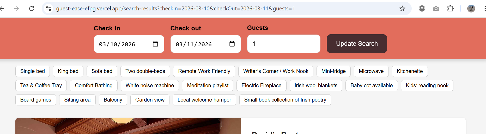

The component receives three props defined by the 'AmenitiesFilterProps' in the **type/interface.ts**: 'allAmenities', 'selectedAmenities', and 'setSelectedAmenities':

```ts
/**
 * React state setter for updating the selected amenities.
 * https://react.dev/learn/state-as-a-snapshot
 */
export interface AmenitiesFilterProps {
  allAmenities: string[];
  selectedAmenities: string[];
  /**
   * State setter used to update the list of amenities to filter.
   * Passed down from the parent so the filter can modify the state.
   * http://stackoverflow.com/questions/65823778/ddg#65824149
   * https://www.xjavascript.com/blog/how-can-i-define-type-for-setstate-when-react-dispatch-react-setstateaction-string-not-accepted/
   */
  setSelectedAmenities: React.Dispatch<React.SetStateAction<string[]>>;
}
```

They are then passed into the component

```ts
const AmenitiesFilter: React.FC<AmenitiesFilterProps> = {
  allAmenities,
  selectedAmenities,
  setSelectedAmenities,
};
```

'allAmenities' contains the complete list of amenities that can be filtered.
'selectedAmenities' represents the amenities currently selected by the user.
'setSelectedAmenities' is the React state setter function used to update that list.

The component’s main logic lives inside the 'toggle' function. This function runs whenever the user clicks on an amenity button.

```ts
 const toggle = (amenity: string) => {
    // Setting the state of the selected Amenity passing in the previous list array
    setSelectedAmenities((previousList) => {
```

Instead of directly modifying the state, the function uses the functional form of the React state setter. This provides access to the previous state ('previousList') to ensure that updates are based on the most recent state value.

Inside the function, the code first checks whether the amenity is already selected.
This returns a boolean. If the amenity already exists in the list, the user is effectively unselecting it.

When the amenity is already selected, it must be removed from the list. The `filter()` method creates a new array that excludes that amenity.

```ts
    // Boolean variable which will be false or true depending on whether
      // the amenity was already clicked
      const isSelected = previousList.includes(amenity);

      // If it is selected, which means that the amenity had already been clicked
      // then we remove it from the list (it has been unclicked)
      if (isSelected) {
        // ...we create a new list which excludes the selected amenity
        const newList = previousList.filter((item) => item !== amenity);
        return newList;
      }

      // Add amenity to the previous list if isSelected is false, which means
      // that the amenity was not selected in the first but gets selected now
      const newList = [...previousList, amenity];
      return newList;
    });
  };


```

This produces a new array containing every item except the clicked amenity. Returning this array updates the parent state and removes the filter.

If the amenity is not already selected, it needs to be added to the list. A new array is created using the spread operator.

This copies all previously selected amenities and appends the newly selected one. Returning this new array updates the state and activates the filter.

After defining the toggle logic, the component renders the amenity buttons. The `map()` function loops through all amenities and generates one button for each.

```tsx
{allAmenities.map((amenity) => (
  <button
    key={amenity}
    onClick={() => toggle(amenity)}
```

Each button calls the 'toggle' function when clicked, passing the corresponding amenity.

The visual appearance of each button depends on whether that amenity is currently selected. This is controlled through conditional styling.

```ts
 // Change the background color based on whether that amenity is selected ornot
            background: selectedAmenities.includes(amenity)
              ? "#e26d5c"
              : "white",
            // The same applies for the color
            color: selectedAmenities.includes(amenity) ? "white" : "black",
            cursor: "pointer",
          }}
        >
          {amenity}
        </button>
      ))}
```

If the amenity exists in 'selectedAmenities', the button receives a highlighted background color and white text. If not, it keeps a neutral style. This provides visual feedback so the user can see which filters are active.

The overall flow works as follows. The parent page provides the list of all amenities and the current selected amenities. The 'AmenitiesFilter' component displays them as buttons. When the user clicks a button, the 'toggle' function either adds or removes that amenity from the selected list. React updates the state in the parent component, which triggers a re-render and updates both the button styling and the filtered room results.

## editSearchRoomsForm

Here we built a responsive component called 'EditSearchRoomsForm' that allows users to update their check-in date, check-out date, and number of guests on the Search Results page.

The component leverages the 'editSearchRoomsFormProps' from the 'interface.ts' file

```

const EditSearchRoomsForm: React.FC<editSearchRoomsFormProps> = ({
initialCheckIn,
initialCheckOut,
initialGuests,
}) => {

```

and manage the form values entried by the user through the below useState

```

const [checkIn, setCheckIn] = useState(initialCheckIn);
const [checkOut, setCheckOut] = useState(initialCheckOut);
const [guests, setGuests] = useState(initialGuests);

```

We added date validation logic to prevent selecting past dates and to ensure check-out is always at least one day after check-in by dynamically setting the 'min' attribute on the date inputs.

```

/\*\*

- Compute the minimum allowed check-out date.
- If check-in is selected next day after check-in is
- the minimum allowed date possible.
- If not, then, 'tomorrow'
- \*/
  const nextDayAfterCheckIn = checkIn
  ? new Date(new Date(checkIn).setDate(new Date(checkIn).getDate() + 1))
  .toISOString()
  .split("T")[0]
  : null;

...

<label style={{ marginBottom: "0.5rem", fontWeight: "bold" }}>
Check‑out
</label>
<input
type="date"
value={checkOut}
onChange={(e) => setCheckOut(e.target.value)}
required
/\*\*
_ Ensures check-out cannot be before check-in, nor can it be the same day.
_ https://developer.mozilla.org/en-US/docs/Web/HTML/Element/input/date
\*/
min={nextDayAfterCheckIn || tomorrowStr}
style={{
            padding: "0.75rem",
            fontSize: "1rem",
            borderRadius: "10px",
            border: "1px solid #ccc",
            width: "100%",
            boxSizing: "border-box",
          }}
/>
...

```

When the form is submitted, we validate the dates again and then redirect the user to '/search-results' with updated query parameters in the URL.

```

/\*\*

- updateSearch validates date order, prevents invalid submissions, and
- redirects to /search-results with updated query params
- https://developer.mozilla.org/en-US/docs/Web/JavaScript/Reference/Global_Objects/encodeURIComponent
- https://developer.mozilla.org/en-US/docs/Web/API/URLSearchParams
- \*/
  const updateSearch = () => {
  if (!checkIn || !checkOut) return alert("Please select valid dates");
  if (new Date(checkOut) <= new Date(checkIn))
  return alert("Check‑out must be after check‑in.");
  window.location.href = `/search-results?checkIn=${encodeURIComponent(checkIn)}&checkOut=${encodeURIComponent(checkOut)}&guests=${guests}`;
  };

```

Overall, the component combines state management, validation, responsive design, and controlled inputs to create a user-friendly and adaptive search update form.

### Source attributions

- https://www.geeksforgeeks.org/javascript/javascript-date-toisostring-method/
- https://stackoverflow.com/questions/47066555/remove-time-after-converting-date-toisostring#55231024
- https://dev.to/saiful7778/detecting-mobile-devices-in-react-with-a-custom-hook-4gil
- https://developer.mozilla.org/en-US/docs/Web/API/EventTarget/addEventListener
- https://react.dev/reference/react/useEffect#subscribing-to-events
- https://developer.mozilla.org/en-US/docs/Web/JavaScript/Reference/Global_Objects/encodeURIComponent
- https://developer.mozilla.org/en-US/docs/Web/API/URLSearchParams
- https://developer.mozilla.org/en-US/docs/Web/CSS/flex
- https://developer.mozilla.org/en-US/docs/Web/CSS/CSS_flexible_box_layout
- https://developer.mozilla.org/en-US/docs/Web/CSS/overflow-x
- https://developer.mozilla.org/en-US/docs/Web/HTML/Element/label
- https://developer.mozilla.org/en-US/docs/Web/HTML/Element/input/date#min
- https://developer.mozilla.org/en-US/docs/Web/HTML/Element/input/date
- https://developer.mozilla.org/en-US/docs/Web/HTML/Element/input/number#min
- https://developer.mozilla.org/en-US/docs/Web/HTML/Element/button
- https://www.w3schools.com/jsref/event_onmousedown.asp
- https://www.w3schools.com/jsref/event_currenttarget.asp

## Room Details page

Here we built the **RoomDetailsPage**, which is the main booking page where a user can view a room’s full details, images, reviews, availability, and complete a reservation.

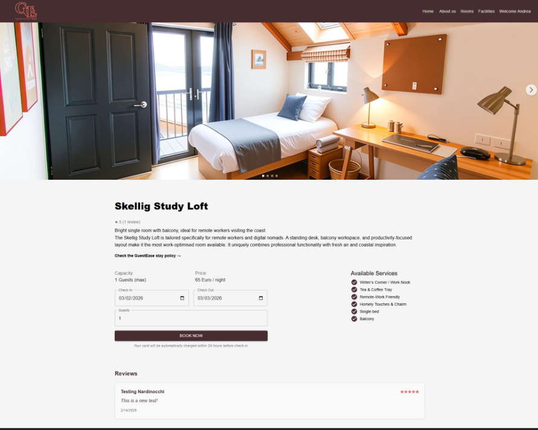

The page reads the 'roomId' from the URL using React Router,

```

/\*\*

- Extract roomId from the URL.
- React Router useParams:
- https://reactrouter.com/en/main/hooks/use-params
  \*/
  const { roomId } = useParams<{ roomId: string }>();

```

then fetches the room data with React Query ('getRoomById')

```

/\*

- React Query fetches Room Details cached by roomId
  \*/
  const {
  data: room,
  isLoading: roomLoading,
  error: roomError,
  } = useQuery({
  queryKey: ["room", roomId],
  /\*\*
  - React Router’s useParams() always returns 'string | undefined',
  - because the URL might not contain the param.
  - React Query’s queryFn expects a definite string, hence, we add 'as string'.
  - '...treat the value as a string type, even if it might not originally be one.'
  - https://www.webdevtutor.net/blog/typescript-as-string-vs-tostring
    \*/
    queryFn: async () => getRoomById(roomId as string),
    enabled: !!roomId, // Prevents running until roomId is defined
    });

```

which is an API async function stored in the **guestease-api.ts** file which fetches the room data from the Supabase 'rooms' table

```

/\*\*

- This is a helper to fetch room data by its id to populate
- the Booking Confirmation page
  _/
  export const getRoomById = async (roomId: string) => {
  const { data, error } = await supabase
  .from("rooms")
  .select("_")
  .eq("id", roomId)
  .single();

if (error) {
throw new Error(`Unable to fetch room: ${error.message}`);
}

return data;
};

```

At that points, we check the room availability through the custom hook **hooks/useAvailableRooms.ts** that calls Supabase.

```ts
...
 const params = new URLSearchParams(location.search);
  const paramCheckIn = params.get("checkIn") || "";
  const paramCheckOut = params.get("checkOut") || "";
  const paramGuests = Number(params.get("guests")) || 1;

  // Local state for date + guest selection
  const [checkIn, setCheckIn] = useState<string>(paramCheckIn);
  const [checkOut, setCheckOut] = useState<string>(paramCheckOut);
  const [guests, setGuests] = useState<number>(paramGuests);
...
...ts
/*
   * Fetching Availability
   * Uses the custom hook useAvailableRooms which calls the Supabase RPC function.
   * https://supabase.com/docs/guides/database/functions
   */
  const { data: availability, error: availabilityError } = useAvailableRooms(
    checkIn,
    checkOut,
    guests,
  );

...

```

When a user clicks the 'Book' CTA, we validate the dates and availability,

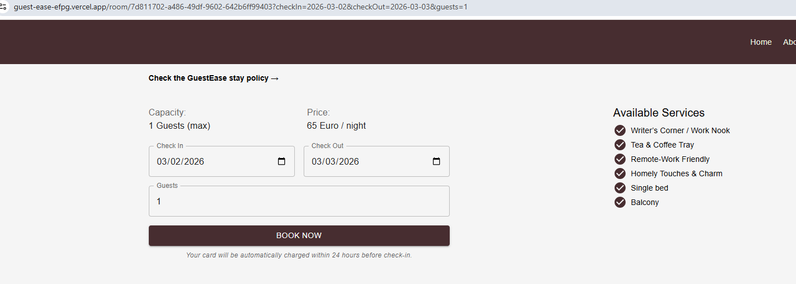

```ts
/**
 *'The some() method of Array instances returns true if it finds one element in the array
 * that satisfies the provided testing function. Otherwise, it returns false.'
 * In this case, we are expecting to find the room 'id'.
 * https://developer.mozilla.org/en-US/docs/Web/JavaScript/Reference/Global_Objects/Array/some
 * */
const isAvailable = availability?.some((r: any) => r.id === room.id);
if (!isAvailable) {
  setError("This room is not available for the selected dates.");
  return;
}
```

confirm the user is logged in via Supabase authentication,

```ts
/**
 * To be able to book, a user must be logged in, therefore, we need
 * to retrieve the user from supabase.
 * https://supabase.com/docs/reference/javascript/auth-getuser
 * */
const { data } = await supabase.auth.getUser();
const userId = data.user?.id;
```

and ensure a Stripe customer exists.

```ts
/**
 * We ensure the Stripe customer exists before opening the payment dialog.
 * Checks if the user already has a Stripe customer, and  creates one if they don’t,
 * and finally returns the Stripe customer ID
 * */
await createStripeCustomerApi({ email: data.user?.email!, userId });
// Open the Stripe payment dialog so the user can enter their card details.
setStripeCheckOutModalOpen(true);
```

The above async function is stored in the **user-booking-api.ts** file

```ts
/**
 * Creates a Stripe customer for the user if they don't already have one.
 * https://docs.stripe.com/api/customers/create
 */
export const createStripeCustomerApi = async (params: {
  email: string;
  userId: string;
}) => {
  const res = await fetch(`${backendUrl}/create-stripe-customer`, {
    method: "POST",
    headers: { "Content-Type": "application/json" },
    body: JSON.stringify(params),
  });

  const data = await res.json();

  if (!res.ok) {
    throw new Error(data.error || "Failed to create Stripe customer");
  }

  // Expected: { customerId: "cus_123" }
  return data;
};
```

and calls the backend Express route **createStripeCustomer.js**, which handles the creating/retrieving logic of the Stripe customer for a logged-in user before they make a booking.

```ts
/**
     * We check if the user already has a Stripe customer ID.
     * If yes, we are not creating a new customer.
     */
    const { data: profile, error: profileErr } = await supabase
      .from("profiles")
      .select("stripe_customer_id")
      .eq("id", userId)
      .single();

      ....

        /**
     * If we reach here, the user does not have a Stripe customer yet.
     * Create Stripe customer
     *  https://docs.stripe.com/api/customers/create
     */
    const customer = await stripe.customers.create({
      email,
      metadata: { userId },
    });

    // We then save the new customer ID in Supabase
    await supabase
      .from("profiles")
      .update({ stripe_customer_id: customer.id })
      .eq("id", userId);

    ....
```

Goig back to the **roomDetailsPage.tsx**, we, temporarily store the booking details, open the Stripe payment dialog,

```ts
// We store the booking data temporarily until the payment flow completes.
      setPendingBookingData({
        room_id: room.id,
        check_in: checkIn,
        check_out: checkOut,
        guests,
        userId,
      });

      ...

       // Open the Stripe payment dialog so the user can enter their card details.
      setStripeCheckOutModalOpen(true);

      ...
```

and only after a successful payment method setup do we create the booking through the backend API.

```ts
/**
 * This callback is called after the user successfully completes
 * the Stripe payment flow and the payment method has been saved.
 * At this point we can safely create the booking in our backend.
 * */
const handlePaymentSuccessSoBookNow = async (_paymentMethodId: string) => {
  try {
    if (!pendingBookingData) return;

    /**
     * We then create the booking object to be sent to the user-booking-api,
     * which in turn will post it to the userCreateBooking.js in the backend.
     * The userCreateBooking.js file in the backend will create the booking server-side
     * and send it to supabase
     * */
    const booking = await createBookingApi(pendingBookingData);
    // Close the payment dialog and clear the pending booking data.
    setStripeCheckOutModalOpen(false);
    setPendingBookingData(null);
    // Redirect to the confirmation page
    navigate(`/booking-confirmation/${booking.booking.id}`);
  } catch (err: any) {
    setError(err.message);
    setStripeCheckOutModalOpen(false);
  }
};
```

Finally, we redirect the user to the booking confirmation page.

Another feature of this page is that it retrieves guest reviews of their stay experince about the room and calculates the average rating to display alongside the room details.

```ts
/**
   * We fetch the reviews through the useRoomReviews hook
   */
  const { data: reviews = [] } = useRoomReviews(roomId as string);

...
 <RoomReviews roomId={roomId as string} />
...

```

The above object retrieving an array of reviews leverages the **hooks/useRoomReviews.ts** hook

```ts
import { getRoomReviews } from "../api/reviews-api";

export const useRoomReviews = (roomId: string | undefined) => {
  return useQuery({
    queryKey: ["roomReviews", roomId],
    queryFn: () => getRoomReviews(roomId as string),
    // Prevents running when roomId is undefined
    enabled: !!roomId,
  });
};
```

which, in its React Query call, makes use of the 'getRoomReviews()' function in the **api/reviews-api.ts** file

```ts
/**
 * This is a helper to get all reviews of a specific room, which also
 * create a 'join' with the profiles table through 'profile as a foreign key
 * constraint.
 * https://supabase.com/docs/guides/database/joins-and-nesting?queryGroups=language&language=js
 */
export const getRoomReviews = async (roomId: string) => {
  const { data, error } = await supabase
    .from("reviews")
    .select(
      `
      *,
      profile:profiles (
        first_name,
        last_name
      )
    `,
    )
    .eq("room_id", roomId)
    .order("created_at", { ascending: false });

  if (error) throw new Error(error.message);
  if (!data) return [];

  /**
   * We then 'return' a 'map' of 'guestname' which is nothing but
   * the combination of the first and last name's guest
   */
  return data.map((review: any) => {
    const first = review.profile?.first_name || "";
    const last = review.profile?.last_name || "";

    const guestName = (first + " " + last).trim() || "Guest";
    // We then, return, the review object through the stread operator and add the new field 'guestName'
    return { ...review, guestName };
  });
};
```

This function fetches all reviews for a specific room from the 'reviews' table using Supabase. It also joins the related user data from the 'profiles' table (via a foreign key) to get the reviewer’s first and last name, and orders the results by newest first.

Finally, it maps over the reviews to create a 'guestName' by merging the user’s first and last name and returns each review with this new 'guestName' field added.

The average rating, instead, is calculated through the below function calculateAverageRating() in **utils/calculateAverageRating.ts**, which is called in by the below variable:

```ts
// Using the below function to get the average review rating
const avgRating = calculateAverageRating(reviews);
```

```ts
import type { Review } from "../types/interfaces";

/**
 * The avgRating is the average rating for the room calculated through
 * the reduce() function, whose function is 'iterate and “reduce” an array's values into one value.'
 * Hence, we extrapolate each of the ratings and we 'sum' them (r.rating, while '0' is the initial number)
 * https://www.freecodecamp.org/news/how-to-use-javascript-array-reduce-method/
 * https://forum.freecodecamp.org/t/how-to-compute-the-average-rating-use-the-reduce-method-to-analyze-data-solved/198305
 */

export function calculateAverageRating(reviews: Review[] = []): number {
  const total = reviews.reduce((sum, r) => sum + r.rating, 0);
  return Number((total / reviews.length).toFixed(1));
}
```

Overall, this component ties together routing, data fetching, authentication, availability validation, Stripe payment handling, and final booking creation into one complete reservation flow.

### Source attributions

- https://reactrouter.com/en/main/hooks/use-params
- https://developer.mozilla.org/en-US/docs/Web/API/URLSearchParams
- https://www.webdevtutor.net/blog/typescript-as-string-vs-tostring
- https://supabase.com/docs/guides/database/functions
- https://react.dev/reference/react/useEffect
- https://developer.mozilla.org/en-US/docs/Web/JavaScript/Reference/Global_Objects/Array/some
- https://supabase.com/docs/reference/javascript/auth-getuser
- https://stackoverflow.com/questions/16376438/get-path-and-query-string-from-url-using-javascript#16376491

## roomDetailsCard

This component displays all the main details of a room on the Room Details page and handles the booking inputs.

It receives its data and handlers through props in the **type/iterfaces.ts**

```
/**
 * Props definition for RoomDetailsCard which describes all the data,
 * and callback functions that the RoomDetailsCard component needs to render.
 * The parent component (RoomDetailsPage) controls the booking state,
 * while RoomDetailsCard focuses purely on displaying the UI and sending out
 * the user actions.
 */
export interface RoomDetailsCardProps {
  room: {
    name: string;
    description: string;
    amenities: string[];
    price: number;
    capacity: number;
  };
  // These values will be passed by the RoomDetailsPage
  // State values
  guests: number;
  checkIn: string;
  checkOut: string;
  // State setters
  // https://www.typescriptlang.org/docs/handbook/2/functions.html
  setGuests: (n: number) => void;
  setCheckIn: (date: string) => void;
  setCheckOut: (date: string) => void;
  // Action callback
  onBook: () => void;
  // Adding the below 2 fields to show on the roomDetailsPage
  reviews?: Review[];
  avgRating: number;
}

```

It shows the room name, description, capacity, price, average rating, and number of reviews. Fuerthermore, it does provide date pickers for check-in and check-out, ensuring the check-in cannot be before today and the check-out is at least one day after check-in:

```
/**
 * Here we pass through the RoomDetailsCardProps from the interface.ts
 */
const RoomDetailsCard: React.FC<RoomDetailsCardProps> = ({
  room,
  guests,
  checkIn,
  checkOut,
  setGuests,
  setCheckIn,
  setCheckOut,
  onBook,
  reviews,
  avgRating,
}) => {
  /**
   * Generate today's date in YYYY-MM-DD format
   * Date.toISOString():
   * https://developer.mozilla.org/en-US/docs/Web/JavaScript/Reference/Global_Objects/Date/toISOString
   */
  const today = new Date().toISOString().split("T")[0];

  /**
   * Compute the minimum allowed check-out date.
   * If check-in is selected next day after check-in is
   * the minimum allowed date possible.
   * If not, then, 'tomorrow'
   * */
  const nextDayAfterCheckIn = checkIn
    ? new Date(new Date(checkIn).setDate(new Date(checkIn).getDate() + 1))
        .toISOString()
        .split("T")[0]
    : null;


```

The guest input prevents selecting more guests than the room’s maximum capacity.

```
  {/* Guests + Book button */}
          <Box sx={{ mt: 2 }}>
            <TextField
              label="Guests"
              type="number"
              value={guests}
              onChange={(e) => {
                const value = Number(e.target.value);
                // We avoid the user selecting more than the room's capacity
                if (value <= room.capacity) {
                  setGuests(value);
                }
              }}
              fullWidth
              sx={{ mb: 2 }}
              slotProps={{
                input: {
                  inputProps: { min: 1 },
                },
              }}
            />

```

When the user clicks 'Book Now' it triggers the onBook function passed from the parent component.

On the right side, it lists all available amenities that we fetched from the Suapabase 'rooms' table and 'mapped. through the below unordered list:

```
 <Box sx={{ width: "100%", pl: { md: 35 }, boxSizing: "border-box" }}>
          <Typography
            variant="h6"
            gutterBottom
            sx={{ mt: 0, mb: 1, lineHeight: 1.2 }}
          >
            Available Services
          </Typography>

          <ul style={{ paddingLeft: 0, margin: 0, listStyle: "none" }}>
            {room.amenities.map((service: string, idx: number) => (
              <li
                key={idx}
                style={{
                  display: "flex",
                  alignItems: "center",
                  marginBottom: 2,
                }}
              >
                <CheckCircleIcon sx={{ mr: 1, color: "#472d30" }} />
                <Typography variant="body2">{service}</Typography>
              </li>
            ))}
          </ul>
        </Box>

```

Finally. It includes a clickable text that opens a stay policy modal, controlled by local state.

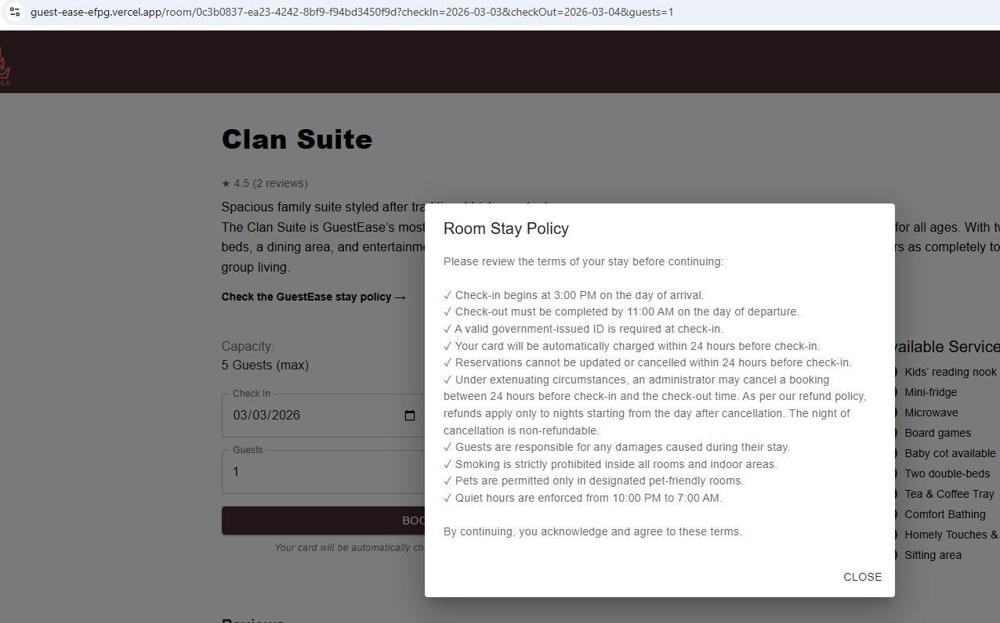

It gets managed by the below boolean useState() and callbacks

```
// useState to manage the roomStayPolicyModal
  const [policyOpen, setPolicyOpen] = useState(false);

  /**
   * The are the callbacks to handle the opening and closing of the modal
   * https://stackoverflow.com/questions/73752294/react-usestate-boolean-issue-functional-component
   */
  const handleOpenPolicy = () => setPolicyOpen(true);
  const handleClosePolicy = () => setPolicyOpen(false);
```

which is opened when the link is clicked

```
  <Typography
        variant="body1"
        gutterBottom
        sx={{
          mb: 5,
          cursor: "pointer",
          fontSize: "0.85rem",
          fontWeight: 550,
          "&:hover": { color: "#e26d5c" },
        }}
        onClick={handleOpenPolicy}
      >
        Check the GuestEase stay policy →
      </Typography>
```

and closed through the 'handleClosePolicy' callback once the user clicks on 'CLOSE'.

```
      <AlertDialogSlide open={policyOpen} onClose={handleClosePolicy} />

```

The policy modal is created by the components **roomStayPolicyModal.tsx**.

### Source attributions

-https://developer.mozilla.org/en-US/docs/Web/JavaScript/Reference/Global_Objects/Date/toISOString

- https://stackoverflow.com/questions/73752294/react-usestate-boolean-issue-functional-component
- https://developer.mozilla.org/en-US/docs/Web/CSS/Reference/Properties/white-space
- https://mui.com/material-ui/api/menu/#props
- https://mui.com/material-ui/api/menu/#slots

## stripeCheckOutModal

This component displays a Material UI dialog that handles saving a user’s card details using Stripe.

When the dialog opens and the user has a Stripe customer ID,

```
interface PaymentDialogProps {
  open: boolean;
  onClose: () => void;
  /**
   * Called when Stripe successfully returns a paymentMethodId.
   * This is passed up to RoomDetailsPage, where it is handled
   * inside handlePaymentSuccessSoBookNow() to finish the booking flow.
   */
  onSuccess: (paymentMethodId: string) => void;
}

/**
 * This component creates a pop up / modal showing the Stripe Checkout
 * which will enable the card payment or card data saving.
 * We are still in the provess of making a final decision on the
 * payment flow.
 * https://mui.com/material-ui/react-dialog/
 */
const PaymentDialog: React.FC<PaymentDialogProps> = ({
  open,
  onClose,
  onSuccess,
}) => {

```

it calls the backend to create a Stripe SetupIntent and retrieves a client secret, which is required to securely render the Stripe payment form.

```
 // Defines an async function that will request a new SetupIntent from the backend.
    const loadSetupIntent = async () => {
      try {
        // Calls the backend stripeSetupIntentPayments.js to create a new SetupIntent
        // for this customerId
        // https://docs.stripe.com/api/setup_intents/create
        const dataSetupIntent = await createSetupIntentApi(
          profile.stripe_customer_id,
        );
        console.log("SetupIntent loaded:", dataSetupIntent);

        // Stores the client secret returned by Stripe.
        // The client secret is required by Stripe.js  to confirm the SetupIntent on the frontend.
        // https://www.w3tutorials.net/blog/how-can-i-fetch-the-client-secret-in-stripe-reactjs-and-why-can-t-i-render-a-payment-form-without-it/
        setClientSecret(dataSetupIntent.clientSecret);
      } catch (err) {
        console.error("Failed to load setup intent:", err);
        setError("Failed to initialize payment. Please try again.");
      }
    };

```

Once the user submits their card details, Stripe returns a paymentMethodId, which is then saved to the backend and linked to the user’s profile.

```
{/**
        * Render the StripeCheckOut component only after we have received a valid clientSecret from the backend.
        * The clientSecret is required by Stripe.js to securely confirm the SetupIntent.
        * When the user successfully submits their card details, Stripe returns a paymentMethodId.
        * The onSuccess callback then saves this payment method to our backend/Supabase by calling
        * the savePaymentMethodApi() in the user-booking-api.ts file, associating the card with the current user.
        */}
       <StripeCheckOut
         clientSecret={clientSecret}
         onSuccess={async (paymentMethodId) => {
           setLoading(true);
           setError(null);

           try {
             /**
              * Wrap backend call in try/catch so Stripe ownership errors
              * do NOT crash the modal.
              */
             await savePaymentMethodApi({
               userId: profile?.id,
               paymentMethodId,
             });

             // Notify the parent component that payment succeeded so it can create the booking now
             onSuccess(paymentMethodId);
             // console.log("NEW PAYMENT METHOD:", paymentMethodId);
           } catch (err: any) {
             const msg =
               err?.response?.data?.error ||
               err?.message ||
               "Something went wrong while saving your card.";

             /**
              * Handle Stripe's ownership conflict error
              */
             if (msg.includes("belongs to a different customer")) {
               setError(
                 "This card is already associated with another account. Please add a new card.",
               );
               setLoading(false);
               return;
             }

             setError(msg);
             setLoading(false);
             return;
           }

           setLoading(false);
         }}
       />

```

The 'setupIntent' is created through the 'createSetupIntentApi()' function in the **user-booking-api.ts**,

```
/**
 * Create the SetupIntent API
 * This is a helper which sends a POST request to the backend to create a setup intent payment.
 * A SetupIntent is used when securely collecting and storing a customer’s payment method for future use, without
 * charging them immediately. The backend is responsible for calling Stripe’s API and returning the
 * 'client secret' needed by the frontend to complete the setup flow using
 * stripe.confirmCardSetup().
 * https://docs.stripe.com/api/setup_intents/create
 */
export const createSetupIntentApi = async (customerId: string) => {
  const res = await fetch(`${backendUrl}/create-setup-intent`, {
    method: "POST",
    headers: { "Content-Type": "application/json" },
    /**
     * Convert the update object into JSON before sending.
     * Express.json() on the backend will parse this automatically.
     */
    body: JSON.stringify({ customerId }),
  });

  /**
   * Parse the JSON response from the backend.
   */
  const data = await res.json();

  /**
   * If the HTTP status is not in the 200–299 range,
   * throw an error so the frontend can handle it.
   */
  if (!res.ok) {
    throw new Error(data.error || "Failed to create SetupIntent");
  }

  // Expected: { clientSecret: "seti_123_secret_abc" }
  return data;
};

```

which in turn will call in the backen route **stripeSetupIntentPayments.js**

```
// https://docs.stripe.com/payments/save-and-reuse#web-create-setup-intent
router.post("/create-setup-intent", async (req, res) => {
  try {
    // Create a customer when the user sign up
    const { customerId } = req.body;
    if (!customerId) {
      return res.status(400).json({ error: "Missing customerId" });
    }
    const setupIntent = await stripe.setupIntents.create({
      customer: customerId,
      payment_method_types: ["card"],
    });
    // Send the client_secret back to the client
    res.json({
      clientSecret: setupIntent.client_secret,
      setupIntentId: setupIntent.id,
    });
  } catch (error) {
    res.status(500).json({ error: error.message });
  }
});

```

Whereas, the guest payment method is saved via the use of the 'savePaymentMethodApi()' function in **user-booking-api.ts**

```
/**
 * This helper sends the paymentMethodId + userId to the backend so it can be stored
 * in the user_payment_methods table.
 * https://docs.stripe.com/payments/save-and-reuse
 */
export const savePaymentMethodApi = async (params: {
  userId: string;
  paymentMethodId: string;
}) => {
  const res = await fetch(`${backendUrl}/save-payment-method`, {
    method: "POST",
    headers: { "Content-Type": "application/json" },
    /**
     * Convert the object into JSON before sending.
     * Express.json() on the backend will parse this automatically.
     */
    body: JSON.stringify(params),
  });

  /**
   * Parse the JSON response from the backend.
   */
  const data = await res.json();

  /**
   * If the HTTP status is not in the 200–299 range,
   * throw an error so the frontend can handle it.
   */
  if (!res.ok) {
    throw new Error(data.error || "Failed to save payment method");
  }
  // Expected: { success: true }
  return data;
};

```

which, in turn, calls the backend Express route **stripeSavePaymentMethod.js**.

This route receives the 'userId' and 'paymentMethodId'

```
 // Fetch the userId and payment method id
    const { userId, paymentMethodId } = req.body;
```

and retrieves the full payment method details from Stripe to ensure it’s a valid card.

```

    // Retrieve full card details from Stripe
    const paymentMethod = await stripe.paymentMethods.retrieve(paymentMethodId);

     const card = paymentMethod.card;

```

It then fetches the user’s 'stripe_customer_id' from Supabase and checks whether the payment method already belongs to a different Stripe customer, stopping if there’s a conflict.

```
/**
    * Fetch the user's Stripe customer ID
    */
   const { data: profile, error: profileErr } = await supabase
     .from("profiles")
     .select("stripe_customer_id")
     .eq("id", userId)
     .single();

   if (profileErr || !profile?.stripe_customer_id) {
     return res.status(400).json({ error: "User has no Stripe customer ID" });
   }

   const stripeCustomerId = profile.stripe_customer_id;

   /**
    * If the payment method is already attached to a DIFFERENT customer,
    * we must stop immediately. Stripe will not allow re-attaching it.
    * https://docs.stripe.com/api/payment_methods/attach
    */
   if (paymentMethod.customer && paymentMethod.customer !== stripeCustomerId) {
     return res.status(400).json({
       error:
         "This payment method belongs to a different customer. Please add a new card.",
     });
   }

```

If the card isn’t attached yet, it attaches it to the correct Stripe customer and sets it as the default payment method for invoicing.

```
/**
     * Only attach the payment method if it is NOT already attached.
     * If paymentMethod.customer === stripeCustomerId, skip attaching.
     * https://docs.stripe.com/api/payment_methods/attach?lang=node
     */
    if (!paymentMethod.customer) {
      await stripe.paymentMethods.attach(paymentMethodId, {
        customer: stripeCustomerId,
      });
    }

    /**
     * Always set as default, even if already attached
     * https://docs.stripe.com/api/customers/update
     */
    await stripe.customers.update(stripeCustomerId, {
      invoice_settings: {
        default_payment_method: paymentMethodId,
      },
    });
```

The code then removes any previously stored default payment methods for that user in the 'user_payment_methods' table and inserts the new card details (brand, last 4 digits, expiration, etc.) into Supabase.

```
 /**
     *  Clear previous default payment methods for this user
     * https://docs.stripe.com/api/customers/delete
     */
    await supabase.from("user_payment_methods").delete().eq("user_id", userId);

    /**
     * Creating/inserting the payment method in supabase
     */
    const { data: insertedPaymentMethods, error: insertError } = await supabase
      .from("user_payment_methods")
      .insert([
        {
          user_id: userId,
          payment_method_id: paymentMethodId,
          brand: card.brand,
          last4: card.last4,
          exp_month: card.exp_month,
          exp_year: card.exp_year,
          is_default: true,
        },
      ])
      // We need supabase to return the card payment details to avoid backend errors
      .select();
```

Once this whole payment flow has been successfully completed, it notifies the parent component to continue the booking process, while also handling loading states and potential errors such as card ownership conflicts.

### Source attributions

- https://mui.com/material-ui/react-dialog/
- https://mui.com/material-ui/react-dialog/#transitions
- https://docs.stripe.com/api/setup_intents/create
- https://docs.stripe.com/payments/save-and-reuse
- https://docs.stripe.com/api/payment_methods
- https://docs.stripe.com/api/payment_methods/attach
- https://docs.stripe.com/api/customers/update
- https://stripe.com/docs/js
- https://expressjs.com/en/guide/routing.html
- https://supabase.com/docs/reference/javascript

## Stripe Checkout

This file in **components/stripeheckOut.tsx** renders a secure payment form using Stripe Elements.

It receives a 'clientSecret' from the backend, which is created when a Stripe SetupIntent is generated, and uses it to securely confirm the card setup

```
interface StripeCheckoutProps {
  // The client secret returned from your backend when creating a SetupIntent.
  clientSecret: string | null;
  // Receives the ID of the confirmed payment method.
  onSuccess?: (paymentMethodId: string) => void;
}

/**
 * This component will hosts the Stripe payment form.
 * https://stripe.com/docs/payments/accept-a-payment?platform=web&ui=elements
 * https://mui.com/material-ui/react-card/
 */
const StripeCheckOut: React.FC<StripeCheckoutProps> = ({
  clientSecret,
  onSuccess,
}) => {
  if (!clientSecret) return null;

```

When the component renders, it initializes Stripe using the 'useStripe' and 'useElements' hooks so it can interact with Stripe.js.

```
 /**
   * 'The useStripe hook returns a reference to the Stripe instance passed to the Elements provider.'
   * https://docs.stripe.com/sdks/stripejs-react?ui=elements#usestripe-hook
   */
  const stripe = useStripe();
  /**
   * 'To safely pass the payment information collected by the Payment Element to the Stripe API,
   * access the Elements instance so that you can use it with stripe.confirmPayment.
   * If you use the React Hooks API, then useElements is the recommended way to access a mounted Element.
   * If you need to access an Element from a class component, use ElementsConsumer instead.'
   * https://docs.stripe.com/sdks/stripejs-react?ui=elements#useelements-hook
   */
  const elements = useElements();
```

It, then, displays a Stripe 'CardElement', which securely collects the user’s card number, expiration date, and CVC inside a Stripe-hosted iframe, ensuring sensitive card data never touches your server. A separate postal code field is collected and included as billing information.

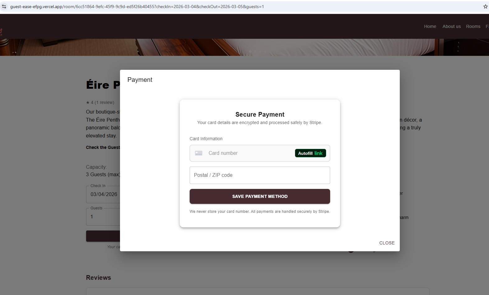

When the user submits the form, the component calls 'stripe.confirmCardSetup' with the client secret and card details.

```
const handleSubmit = async (e: React.FormEvent) => {
    e.preventDefault();
    setError(null);

    // https://docs.stripe.com/sdks/stripejs-react?ui=elements
    if (!stripe || !elements) return;

    setLoading(true);

    const card = elements.getElement(CardElement);

    if (!card) {
      setError("Card element not found");
      setLoading(false);
      return;
    }

    console.log("clientSecret:", clientSecret);

    /**
     * Confirms the SetupIntent using the card details and billing info.
     * This step securely exchanges card data with Stripe.
     * https://docs.stripe.com/js/setup_intents/confirm_card_setup#stripe_confirm_card_setup-options
     * */
    const { setupIntent, error } = await stripe.confirmCardSetup(clientSecret, {
      payment_method: {
        card,
        billing_details: { address: { postal_code: postalCode } },
      },
    });

    setLoading(false);
    // If Stripe returned an error during confirmation, surface it to the user.
    if (error) {
      setError(error.message || "Something went wrong");
      return;
    }
    /**
     * If the SetupIntent completed successfully and Stripe returned a payment method ID,
     * call onSuccess callback so the parent component can handle the next step which is
     * storing the payment method details
     */
    if (onSuccess && setupIntent.payment_method) {
      onSuccess(setupIntent.payment_method as string);
    }
  };
```

Stripe processes the card securely and returns either an error or a successful SetupIntent containing a 'payment_method' ID.

If successful, the component passes that payment method ID back to the parent component through the 'onSuccess' callback so it can be saved in the backend.

To recpa, when the user submits their card, 'StripeCheckOut' confirms the 'SetupIntent' with Stripe and returns the 'paymentMethodId' through the onSuccess callback. The parent (**stripeCheckOutModal.tsx**) receives that ID, saves it to the backend using **savePaymentMethodApi.js**, and then calls its own 'onSuccess' prop to notify the next-level parent component, **roomDetailsPage.tsx**, to continue the booking process:

```
roomDetailsPage.tsx excerpt

          {/* Stripe Payment Dialog opens after validation and before booking creation */}
          <PaymentDialog
            open={stripeCheckOutModalOpen}
            onClose={() => setStripeCheckOutModalOpen(false)}
            // customerId={profile?.stripe_customer_id || ""}
            onSuccess={handlePaymentSuccessSoBookNow}
          />

```

### Source attributions

- https://stripe.com/docs/payments/accept-a-payment?platform=web&ui=elements
- https://mui.com/material-ui/react-card/
- https://docs.stripe.com/sdks/stripejs-react?ui=elements#usestripe-hook
- https://docs.stripe.com/sdks/stripejs-react?ui=elements#useelements-hook
- https://docs.stripe.com/sdks/stripejs-react?ui=elements
- https://docs.stripe.com/js/setup_intents/confirm_card_setup#stripe_confirm_card_setup-options

## Room Reviews component

This file in **components/roomReviews/roomReviews.tsx** displays user reviews for a given room.

It starts by receiving the roomId as a prop to fetch the room reviews

```
/**
   * React Query is a data-fetching and caching library that simplifies working with
   * asynchronous data in React applications. Instead of manually managing loading states,
   * errors, caching, refetching, and background updates, React Query handles all of this
   * automatically. This results in cleaner components, fewer bugs, and a much smoother UX.
   * React Query v5 is the latest, actively maintained version of TanStack Query.
   * It introduces a simpler, more consistent API using a single options object:
   *
   *    useQuery({ queryKey: [...], queryFn: ... })
   *
   * https://tanstack.com/query/latest/docs/framework/react/reference/useQuery
   * https://tanstack.com/query/latest/docs/framework/react/quick-start
   * */
  const { data: reviews, isLoading, error } = useRoomReviews(roomId);

```

using the **hooks/useRoomReviews.ts** which uses React Query to fetch and cash the reviews data through the getRoomReviews() API in **review-api.ts**, as explained in the 'Room Details Page' paraghraph.

At this point, we create the useState() to manage how many reviews are displayed. By default, only the first two are shown, and showAll toggles whether to display all reviews.
This keeps the UI concise while allowing users to expand the list.

```
  // We create this useState to show more than 2 reviews on the roomDetailsPage
  const [showAll, setShowAll] = useState(false);
  // The visibleReviews will be 'sliced' to 2
  const visibleReviews = showAll ? reviews : reviews?.slice(0, 2);

```

The below loop will render each visible review, including the guest’s name, star rating, comment, and the date. This is where the fetched data is transformed into the visible UI elements.

```
   {visibleReviews?.map((review) => {
        // console.log("PROFILE:", review.profile, "USER_ID:", review.user_id);

        return (
          <Box
            key={review.id}
            sx={{
              mt: 2,
              p: 2.5,
              borderRadius: 2,
              border: "1px solid #e0e0e0",
              backgroundColor: "#fafafa",
              boxShadow: "0 1px 3px rgba(0,0,0,0.05)",
            }}
          >

```

The expression {"★".repeat(review.rating)}, then, generates a string of filled star characters equal to the review.rating number. For example, if review.rating is 3, it produces "★★★". This is used to visually represent the review score.

This line allows the user to toggle between showing just a few reviews or all reviews, updating the showAll state and re-rendering the list accordingly.

```
    {/* Star rating */}
              <Typography sx={{ color: "#e26d5c", fontWeight: 600 }}>
                {"★".repeat(review.rating)}
                {"☆".repeat(5 - review.rating)}
              </Typography>
```

The show more/less block appears only if there are more than two reviews and toggles 'showAll' when clicked, expanding or collapsing the visible reviews and updating the link text accordingly.

```
   {/* Show more / Show less
      This will determine whether the below links will show */}
      {(reviews?.length ?? 0) > 2 && (
        <Box mt={2}>
          <Typography
            onClick={() => setShowAll(!showAll)}
            sx={{
              cursor: "pointer",
              color: "#472d30",
              fontWeight: 600,
              "&:hover": { color: "#e26d5c" },
            }}
          >
            {showAll ? "Show less ↑" : "Show more reviews ↓"}{" "}
          </Typography>
        </Box>
      )}
```

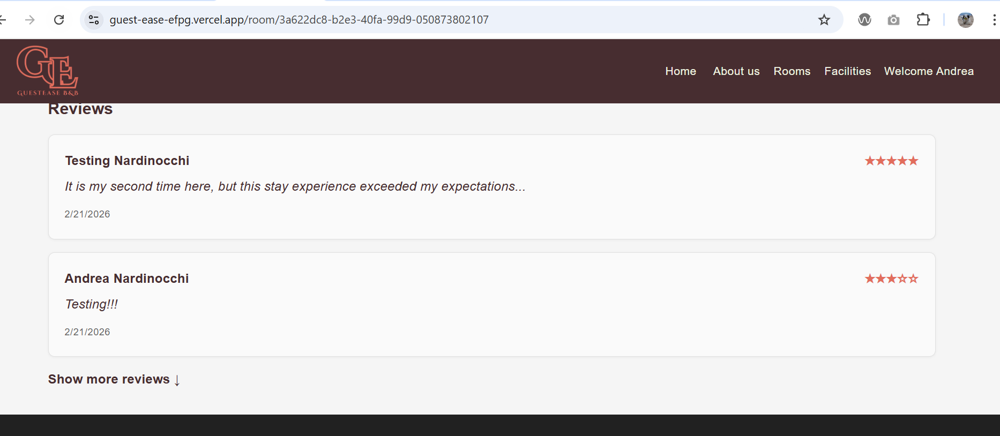

### Source attributions

- https://tanstack.com/query/latest/docs/framework/react/reference/useQuery
- https://tanstack.com/query/latest/docs/framework/react/quick-start
- https://developer.mozilla.org/en-US/docs/Web/JavaScript/Reference/Global_Objects/String/repeat
- https://react.dev/reference/react/useState
- https://react.dev/reference/react/useEffect
- https://developer.mozilla.org/en-US/docs/Web/JavaScript/Reference/Global_Objects/Date/toLocaleDateString
- https://mui.com/material-ui/react-box/
- https://mui.com/material-ui/react-typography/
- https://mui.com/material-ui/react-progress/
- https://mui.com/material-ui/react-container/

## Booking Confirmation page

The **bookingConfirmationPage.tsx** is the page whre the guest will land upon getting their Stripe setupIntent successully completed.

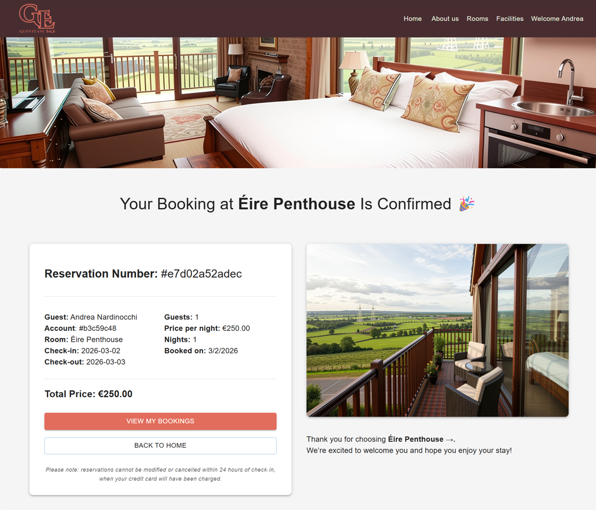

It starts by extracting the booking ID from the URL with 'useParams()' and gets the current logged-in user from 'AuthContext'. This is crucial because only the user who made the booking should see this page.

```
const BookingConfirmationPage: React.FC = () => {
  const { id } = useParams();
  const navigate = useNavigate();

  // Get current logged‑in user (
  const auth = useContext(AuthContext);
  const currentUser = auth?.user;
```

The component uses the 'useQuery' hooks from React Query to fetch the necessary data asynchronously.

First, 'bookingQuery' fetches the booking itself, then 'profileQuery' fetches the guest’s profile based on the booking, and 'roomQuery' fetches the room details. The queries are conditional ('enabled') to ensure that each depends on the data from the previous query, avoiding unnecessary requests.

```
/**
   * Once again we make use of the useQuery() function to catch data
   * from the 'bookings' table in Supabase through the 'getConfirmationBooking'
   * function in the 'guestease-api.tsx' file
   * https://tanstack.com/query/v4/docs/framework/react/reference/useQuery
   */
  const bookingQuery = useQuery({
    queryKey: ["booking", id],
    enabled: !!id,
    queryFn: () => getConfirmationBooking(id as string),
  });

  /**
   * We make use of the useQuery() function to catch data
   * from the 'profiles' table in Supabase through the 'getUserProfile'
   * function in the 'guestease-api.tsx' file
   * https://tanstack.com/query/v4/docs/framework/react/reference/useQuery
   */
  const profileQuery = useQuery({
    queryKey: ["profile", bookingQuery.data?.user_id],
    enabled: !!bookingQuery.data?.user_id,
    queryFn: () => getUserProfile(bookingQuery.data!.user_id),
  });

  /**
   * We make use of the useQuery() function to catch data
   * from the 'rooms' table in Supabase through the 'getRoomById'
   * function in the 'guestease-api.tsx' file
   * https://tanstack.com/query/v4/docs/framework/react/reference/useQuery
   */
  const roomQuery = useQuery({
    queryKey: ["room", bookingQuery.data?.room_id],
    enabled: !!bookingQuery.data?.room_id,
    queryFn: () => getRoomById(bookingQuery.data!.room_id),
  });


```

We leveraged the API functions in **guestease-api.ts** in the above mentioned useQuery() through we fetch the needed data from the Supabase tables:

```

/**
 * This is a helper to fetch the confirmation booking data to populate
 * the Booking Confirmation page
 */
export const getConfirmationBooking = async (bookingId: string) => {
  const { data, error } = await supabase
    .from("bookings")
    .select("*")
    .eq("id", bookingId)
    .single();

  if (error) {
    throw new Error(`Unable to fetch booking: ${error.message}`);
  }

  return data;
};

...

/**
 * Fetch a single user profile from the Supabase "profiles" table.
 * Requires the authenticated user's ID.
 */
export const getUserProfile = async (userId: string) => {
  const { data, error } = await supabase
    .from("profiles")
    .select("*")
    .eq("id", userId)
    .single();

  if (error) throw new Error(error.message);
  return data;
};

...

/**
 * This is a helper to fetch room data by its id to populate
 * the Booking Confirmation page
 */
export const getRoomById = async (roomId: string) => {
  const { data, error } = await supabase
    .from("rooms")
    .select("*")
    .eq("id", roomId)
    .single();

  if (error) {
    throw new Error(`Unable to fetch room: ${error.message}`);
  }

  return data;
};


```

As the booking confirmation card on the left shows the total number of nights, it is noteworthy to mention the **util/calculateNumberOfNights.tsx** utility that was used to be able to display the total price and nights of stay.

```
// We calculate the number of nights
  const totalNights = bookingQuery.data
    ? calculateNumberOfNights(
        bookingQuery.data.check_in,
        bookingQuery.data.check_out,
      )
    : 0;

```

In here, we are using the ternary operator so that if the bookingQuery data exists, we will calculate the number of nights through the below 'calculateNumberOfNights' function:

```
/**
 * This util will calculate the number of nights of each booking
 */
export function calculateNumberOfNights(checkIn: string, checkOut: string) {
  const start = new Date(checkIn).getTime();
  const end = new Date(checkOut).getTime();

  // https://developer.mozilla.org/en-US/docs/Web/JavaScript/Reference/Global_Objects/Math/max
  // https://stackoverflow.com/questions/51078140/calculation-of-countdown-timer
  // https://stackoverflow.com/questions/3224834/get-difference-between-2-dates-in-javascript
  const nights = Math.max(0, (end - start) / (1000 * 60 * 60 * 24));
  return nights;
}

```

Overall, this page ensures that users see all the relevant details of their booking in a secure, responsive, and visually appealing way, while handling asynchronous data, authorization, and edge cases like missing or incorrect data.

### Source attributions

- https://tanstack.com/query/v4/docs/framework/react/reference/useQuery
- https://tanstack.com/query/v4/docs/framework/react/quick-start

## Account My Trips page

This **accountMyTripsPage.tsx** renders the '/account/mytrips page of the application where a logged-in user can view and manage their reservations.

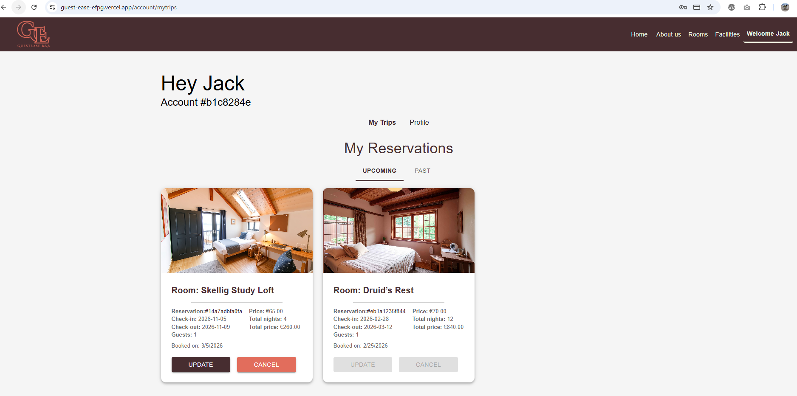

It gets the authenticated user from 'AuthContext', fetches the user’s bookings from the backend using React Query,

```

/**
 * The AccountMyTripsPage displays all upcoming and past reservations.
 */

const AccountMyTripsPage: React.FC = () => {
  // We retrieve the user auth.users from supabase
  const auth = useContext(AuthContext);
  const { user } = auth || {};
  // We then retrieve the 'profile' user from the 'profiles' table in supabase
  // since this is the one that has the stripe_customer_id column
  const { data: profile } = useUserProfile(user?.id);

```

and retrieves the user profile (which contains the Stripe customer ID).

React Query manages the asynchronous data fetching, caching, loading state, and automatic refetching when bookings are updated or cancelled.

```
const { data, error, isLoading } = useQuery<Booking[]>({
    queryKey: ["bookings", user?.id],
    // Only run this query when a user is logged in.
    // '!!user?.id' converts the value to a boolean:
    enabled: !!user?.id,
    queryFn: () => getUserBookings(user!.id),
    /**
     * Force refetch on navigation, as we set  staleTime: 5 * 60 * 1000
     * in the main.tsx file
     */
    staleTime: 0,
  });

```

Once the bookings are loaded, the component separates them into **upcoming** and **past** reservations by comparing each booking’s 'check_out' date with today’s date.

```
// Creating the useState for the tabs
  // https://mui.com/material-ui/react-tabs/
  const [tabValue, setTabValue] = useState(0);

  /**
   * As we set up upcoming and past bookings tabs, we need to be able to filter
   * the bookings based on their ceck out date to establish whether they are upcoming or
   * past ones.
   */
  const today = new Date();

  /**
   * We create an array of bookings which are upcoming ones
   * The check_out date must be bigger than today's date
   */
  const upcomingBookings = (data ?? []).filter((b) => {
    const checkout = new Date(b.check_out);
   // console.log("Upcoming: ", checkout >= today);
    return checkout >= today;
  });

  /**
   * We create an array of bookings which are past ones
   * The check_out date must be older than today's date
   */
  const pastBookings = (data ?? []).filter((b) => {
    const checkout = new Date(b.check_out);
   // console.log("Past: ", checkout < today);
    return checkout < today;
  });

```

These are displayed in two tabs using Material UI, and each booking is rendered as a 'BookedRoomCard' component.

```

  /**
   * This helper function renders a list of bookings for either the 'upcoming' or 'past' tab.
   * If the provided bookings array is empty, it displays a friendly message indicating that
   * there are no reservations for the selected category.
   */
  const renderBookings = (bookings: Booking[], type: "upcoming" | "past") => {
    if (!bookings.length) {
      return (
        <Typography align="center" sx={{ mt: 3, color: "#472d30" }}>
          No reservations
        </Typography>
      );
    }

    return (
      <Box maxWidth="1200px" mx="auto" px={2} sx={{ mb: 4 }}>
        <Box
          mt={2}
      ...

            <Tab label="Upcoming" />
          <Tab label="Past" />
        </Tabs>

        {/* When tabValue is 0, render upcoming bookings */}
        {/* Conditional rendering docs: https://react.dev/learn/conditional-rendering */}
        {tabValue === 0 && renderBookings(upcomingBookings, "upcoming")}
        {/* When tabValue is 1, render past bookings */}
        {tabValue === 1 && renderBookings(pastBookings, "past")}

        ...

```

The below code shows the 'bookedRoomCard' component which gets 'mapped' so that all 'bookings' will be rendered:

```
>
          {bookings.map((booking) => (
            <BookedRoomCard
              key={booking.id}
              booking={booking}
              room={booking.rooms}
              handleUpdate={handleUpdate}
              setDeleteOpen={handleDeleteOpen}
              handleReview={(id) => navigate(`/review/${id}`)}
              type={type}
            />
          ))}
        </Box>

```

As can be seen in the above component, the user can edit edit the booking:

```
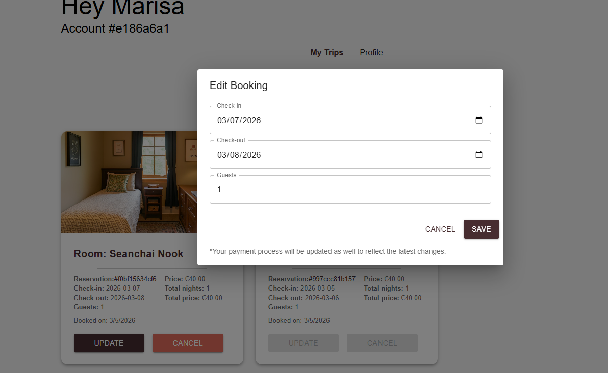


```

When the user clicks on the 'UPDATE' button on a booking card, the booking is stored in state and the edit dialog opens. This lets the user modify dates, guests, or room details.

```
const handleUpdate = (booking: any) => {
  setSelectedBooking(booking);
  setOpen(true);
};

...

  <EditBookingDialog
          open={open}
          booking={selectedBooking}
          room={selectedBooking?.rooms}
          onClose={() => setOpen(false)}
          // setBooking={setSelectedBooking}
          onSave={handleSave}
        />

...

```

When the user saves their changes in the dialog, the handleSave function runs. It compares the original total price with the new total price to see if the booking modification increased the cost.

```
const handleSave = (updatedBooking: {
  id: any;
  room_id: any;
  check_in: any;
  check_out: any;
  guests: any;
  total_price: number;
}) => {
  if (!selectedBooking) return;

  const originalToTalPrice = selectedBooking.total_price;
  const updatedTotalPrice = updatedBooking.total_price;
  const amountDifference = updatedTotalPrice - originalToTalPrice;

```

If the new booking is more expensive, the update cannot be completed immediately. Instead, the system stores the pending update and opens the Stripe checkout modal so the user can confirm payment for the difference.

```

if (amountDifference > 0) {
  setPendingUpdateData({
    ...updatedBooking,
    amountDifference,
  });
  setStripeCheckOutModalOpen(true);
  return;
}

```

If the price did not increase, the booking is updated immediately using a React Query mutation, which sends the update to the backend and refreshes cached booking data.

```

  // React Query mutation hook for updating a booking.
  // Encapsulates the API call and handles cache invalidation internally.
  const updateBookingMutation = useUserUpdateBooking();

....

updateBookingMutation.mutate({
  bookingId: updatedBooking.id,
  userId: user!.id,
  updates: {
    room_id: updatedBooking.room_id,
    check_in: updatedBooking.check_in,
    check_out: updatedBooking.check_out,
    guests: updatedBooking.guests,
  },
});

```

The 'updateBookingMutation' call in the below 'useUserUpdateBooking()' hook in **useUserUpdateBooking.ts**

```
import { useMutation, useQueryClient } from "@tanstack/react-query";
import { updateBookingApi } from "../api/user-booking-api";

export function useUserUpdateBooking() {
  /**
   * React Query’s useMutation updates the booking, then invalidates the
   * cached "bookings" query so fresh data is refetched.
   * Local form state mirrors the tables data, and useEffect keeps it synced
   * whenever the booking query returns new values from Supabase.
   * https://tanstack.com/query/v4/docs/framework/react/guides/mutations
   * https://tanstack.com/query/v4/docs/framework/react/guides/query-invalidation
   */
  const queryClient = useQueryClient();

  return useMutation({
    // 'Constructs a type with all properties of Type set to optional.'
    // This is perfect for update operations where we only send the fields that changed.
    // https://www.typescriptlang.org/docs/handbook/utility-types.html#partialtype
    mutationFn: updateBookingApi,

    onSuccess: (data) => {
      const updatedBookingId = data.booking.id;
      // Refresh all bookings after update
      queryClient.invalidateQueries({ queryKey: ["bookings"], exact: false });

      // Refresh the confirmation page
      queryClient.invalidateQueries({
        queryKey: ["booking", updatedBookingId],
      });
    },
  });
}

```

The hook mutates what returned by the updateBookingApi() function in the **user-booking-api.ts**

```
/**
 * Update Booking
 * This is a helper which sends a POST request to the backend to update an existing booking.
 */
export const updateBookingApi = async (updateData: {
  bookingId: string;
  userId: string;
  updates: {
    room_id: string;
    check_in: string;
    check_out: string;
    guests: number;
  };
}) => {
  // console.log("UPDATES SENT TO BACKEND:", updateData);
  /**
   * Send the updated booking data to the backend.
   * The backend route is defined in Express as:
   * POST /user/update-booking
   */
  const res = await fetch(`${backendUrl}/user/update-booking`, {
    method: "POST",
    headers: { "Content-Type": "application/json" },
    /**
     * Convert the update object into JSON before sending.
     * Express.json() on the backend will parse this automatically.
     */
    body: JSON.stringify(updateData),
  });

  /**
   * Parse the JSON response from the backend.
   */
  const data = await res.json();

  /**
   * If the HTTP status is not in the 200–299 range,
   * throw an error so the frontend can handle it.
   */
  if (!res.ok) {
    throw new Error(data.error || "Failed to update booking");
  }

  // Return the updated booking data to the caller.
  return data;
};

```

which, in turn, calls the backend route **userUpdateBookings.ts** to execute the update straight into Supabase

```
  /**
     * Updating the booking and
     * https://supabase.com/docs/reference/javascript/update
     */
    const { data: updatedBooking, error: updateErr } = await supabase
      .from("bookings")
      .update({
        ...updates,
        total_price: newTotal,
      })
      .eq("id", bookingId)
      .eq("user_id", userId)
      // We are selecting the booking but also join the related profile row that belongs to this booking
      .select("*, profiles!bookings_user_id_fkey(*)")
      .single();

```

At this points, once the booking has been succesfully implemented, an email is sent off to the user to notify them

```
 // Extrapolating the profile, and number of guests from the updatedBooking
    const { guests, profiles: profile } = updatedBooking;

    // Fetching the GuestEase logo from Supabase storage
    const logoUrl = getPublicUrl("assets", "GuestEaseLogo.png");

    // Generate email HTML and passing through all needed parameters
    const html = bookingUpdatedTemplate({
      profile,
      room,
      check_in: updates.check_in,
      check_out: updates.check_out,
      total_price: newTotal,
      logoUrl,
      guests,
      booking_id: bookingId,
      total_nights,
    });

    // Send email vua emailUtil.js
    await fetch(`${backendUrl}/send_email`, {
      method: "POST",
      headers: { "Content-Type": "application/json" },
      body: JSON.stringify({
        email: profile.email,
        subject: `Your Booking Update for ${room.name} at GuestEase`,
        body: html,
      }),
    });

    return res.json({ success: true, booking: updatedBooking, newTotal });

```

Email template have been stored in the backens util **emailTemplate.js**, which are triggered through the route **emailUtil.js** (We will later dive into it).

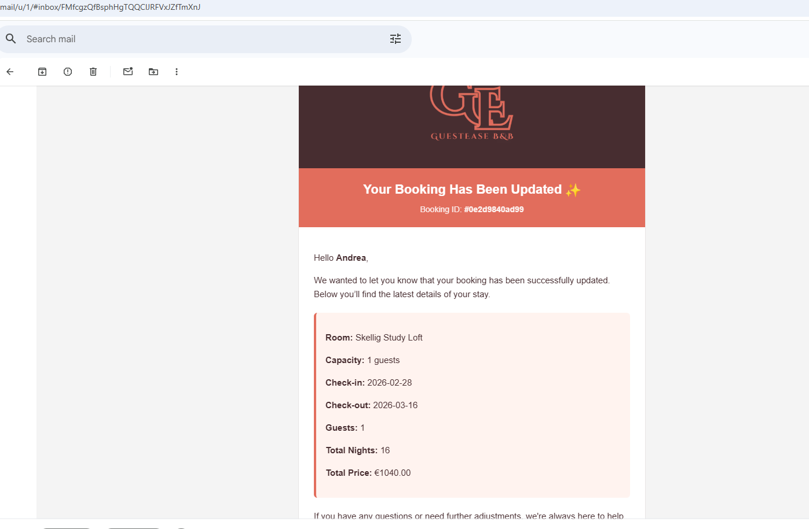

If a payment was required, the Stripe modal completes first.

After Stripe confirms the payment method, the handlePaymentSuccessSoUpdateNow() function is triggered. This builds the final payload and performs the booking update.

```

  // This useState will enable us to manage the StripeCheckoutModal
  const [stripeCheckOutModalOpen, setStripeCheckOutModalOpen] = useState(false);
  /**
   * Holds booking changes that require an additional Stripe payment.
   * When the user edits a booking and the new total price is higher,
   * we store the updated booking data here and open the Stripe modal.
   * After successful payment, this data is sent to the update mutation.
   */
  const [pendingUpdateData, setPendingUpdateData] = useState<any>(null);

....

  /**
   * This callback is called after the user successfully update
   * the Stripe payment flow and the payment method has been saved.
   * At this point we can safely create the booking in our backend.
   * */
  const handlePaymentSuccessSoUpdateNow = async (_paymentMethodId: string) => {
    try {
      if (!pendingUpdateData) return;
      /**
       * Build the final update payload after Stripe payment succeeds.
       * We include only the fields the backend expects: the booking ID,
       * the user ID, and the updated booking values.
       */
      const cleanUpdates = {
        bookingId: pendingUpdateData.id,
        userId: user!.id,
        updates: {
          room_id: pendingUpdateData.room_id,
          check_in: pendingUpdateData.check_in,
          check_out: pendingUpdateData.check_out,
          guests: pendingUpdateData.guests,
        },
      };

      /**
       * This above payload is then passed into our React Query mutation,
       * which updates the booking in Supabase via the API call in user-booking-api
       * (posting to the backend), and automatically invalidates
       * cached queries so the UI refreshes with the latest data.
       * const updateBookingMutation = useUserUpdateBooking();
       * */
      updateBookingMutation.mutate(cleanUpdates, {
        onSuccess: (data) => {
          setStripeCheckOutModalOpen(false);
          setPendingUpdateData(null);
          navigate(`/booking-confirmation/${data.booking.id}`);
        },
        onError: (err: any) => {
          setErrorMessage(err.message);
          setStripeCheckOutModalOpen(false);
        },
      });
    } catch (err: any) {
      setErrorMessage(err.message);
      setStripeCheckOutModalOpen(false);
    }
  };


```

In summary, the update flow works like this: the user edits a booking → the system checks if the price increased → if not, the booking is updated directly → if the price increased, Stripe payment is required first → after successful payment, the booking update is sent to the backend and the UI refreshes.

As far as the booking cancellation flow, the process starts when the user clicks the cancel button on a booking card. At that point the selected booking is stored in state and a confirmation dialog is opened.

```

// This useState is used to open and close the modal
  const [deleteOpen, setDeleteOpen] = useState(false);

  const handleDeleteOpen = (booking: any) => {
    setSelectedBooking(booking);
    setDeleteOpen(true);
  };

```

This function is passed to each BookedRoomCard, so when the user clicks cancel, the booking becomes the selectedBooking and the confirmation modal appears.

```
<BookedRoomCard
  key={booking.id}
  booking={booking}
  room={booking.rooms}
  handleUpdate={handleUpdate}
  setDeleteOpen={handleDeleteOpen}
  handleReview={(id) => navigate(`/review/${id}`)}
  type={type}
/>

```

Before deleting the booking, the application asks the user to confirm the action using a dialog component. This prevents accidental cancellations.

```
<AlertDialogSlide
  open={deleteOpen}
  onClose={() => setDeleteOpen(false)}
  onConfirm={async () => {
    try {
      await cancelBookingMutation.mutateAsync(selectedBooking.id);
      setDeleteOpen(false);
    } catch (err) {
      console.error(err);
    }
  }}
/>
```

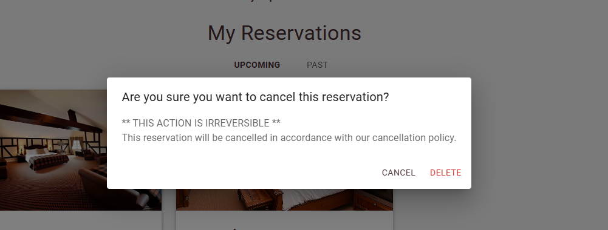

When the user confirms, the code calls a React Query mutation

```
const cancelBookingMutation = useUserCancelBooking(user?.id);
```

using the useUserCancelBooking() hook in **useUserCancelBooking.ts**.

```
import { useMutation, useQueryClient } from "@tanstack/react-query";
import { cancelBookingApi } from "../api/user-booking-api";

export function useUserCancelBooking(userId: string | undefined) {
  /**
   * React Query’s useMutation cancels the booking, then invalidates the
   * cached "bookings" query so fresh data is refetched.
   * Local form state mirrors the tables data, and useEffect keeps it synced
   * whenever the booking query returns new values from Supabase.
   * https://tanstack.com/query/v4/docs/framework/react/guides/mutations
   * https://tanstack.com/query/v4/docs/framework/react/guides/query-invalidation
   */
  const queryClient = useQueryClient();

  return useMutation({
    // 'Constructs a type with all properties of Type set to optional.'
    // This is perfect for deleting operations where we only send the field relevant for deletion
    // https://www.typescriptlang.org/docs/handbook/utility-types.html#partialtype
    mutationFn: (bookingId: string) => cancelBookingApi(bookingId),

    onSuccess: () => {
      // Refresh bookings after cancellation
      queryClient.invalidateQueries({ queryKey: ["bookings", userId] });
    },
  });
}

```

This sends the booking ID to the backend API via the cancelBookingApi() function in the **user-booking-api.ts** to delete or cancel the reservation:

```
/**
 * Cancel Booking
 * This is a helper which sends a POST request to the backend to cancel an existing booking.
 */
export const cancelBookingApi = async (bookingId: string) => {
  // We first fecth the bookingId
  const { error } = await supabase
    .from("bookings")
    .select("*")
    .eq("id", bookingId)
    .single();

  if (error) throw new Error(error.message);
  /**
   * Send the request to cancel the booking data to the backend.
   * The backend route is defined in Express as:
   * POST /user/cancel-booking
   */
  const res = await fetch(`${backendUrl}/user/cancel-booking`, {
    method: "POST",
    headers: { "Content-Type": "application/json" },
    /**
     * Convert the update object into JSON before sending.
     * Express.json() on the backend will parse this automatically.
     */
    body: JSON.stringify({ bookingId }),
  });

```

The backend route **userCancelBooking.js** will first extrapolate the 'bookingId' to delete from the request body.

```
router.post("/user/cancel-booking", async (req, res) => {
  const { bookingId } = req.body;

```

Then, we create the date variables needed to calculate the 'cutoff' time (within 24h from the check_in) when the booking cancellation isno longer allowed per stay policy.

```
  /**
   * We add the same logic applied in the bookedRoomCard for security purposes
   */
  const now = new Date();
  const checkIn = new Date(booking.check_in);
  const cutoff = new Date(checkIn.getTime() - 24 * 60 * 60 * 1000);

   /**
   * We are preventing the user from being able to cancel a reservation
   * after the 24h before check-in cutoff period.
   */
  if (now >= cutoff) {
    return res.status(400).json({
      error: "This reservation can no longer be cancelled.",
    });
  }

```

Finally, the backend operates the booking cancellation in Supabase

```
try {
    // Cancel booking https://supabase.com/docs/reference/javascript/delete
    const { error: bookingError } = await supabase
      .from("bookings")
      .delete()
      .eq("id", bookingId);

    if (bookingError) {
      return res.status(400).json({ error: bookingError.message });
    }

    /**
```

The mutation 'cancelBookingMutation()' performs the cancellation in the backend and invalidates the cached bookings query, which automatically triggers React Query to refetch the updated list of bookings.

This ensures the UI immediately reflects the change and the cancelled reservation disappears from the page.

In summary, the cancellation flow works as follows: the user clicks cancel on a booking → the booking is stored as the selected booking → a confirmation dialog appears → if the user confirms, a React Query mutation sends the cancellation request to the backend → the bookings cache is invalidated and the page refreshes with the updated reservations list.

Just like for the booking update flow, the cancellation booking flow will end with an email notification sent off to the user to notify them that the cancellation is successfull:

```
 const profile = booking.profiles;

    // Fetching the GuestEase logo from Supabase storage
    const logoUrl = getPublicUrl("assets", "GuestEaseLogo.png");

    // Generate email HTML and passing through all needed parameters
    const html = bookingCancelledTemplate({
      profile,
      room,
      check_in: booking.check_in,
      check_out: booking.check_out,
      logoUrl,
      booking_id: bookingId,
      total_nights,
      total_price,
    });

    // Send email vua emailUtil.js
    await fetch(`${backendUrl}/send_email`, {
      method: "POST",
      headers: { "Content-Type": "application/json" },
      body: JSON.stringify({
        email: profile.email,
        subject: `Your Booking for ${room.name} at GuestEase has been cancelled 😔`,
        body: html,
      }),
    });

    res.json({
      status: "success",
      message: `Booking ${bookingId} cancelled successfully!`,
    });

```

### Source attributions

- https://react.dev/learn/conditional-rendering
- https://tanstack.com/query/latest/docs/framework/react/quick-start
- https://tanstack.com/query/latest/docs/framework/react/reference/useQuery
- https://tanstack.com/query/latest/docs/framework/react/guides/mutations
- https://mui.com/material-ui/react-tabs/

## User Profile page

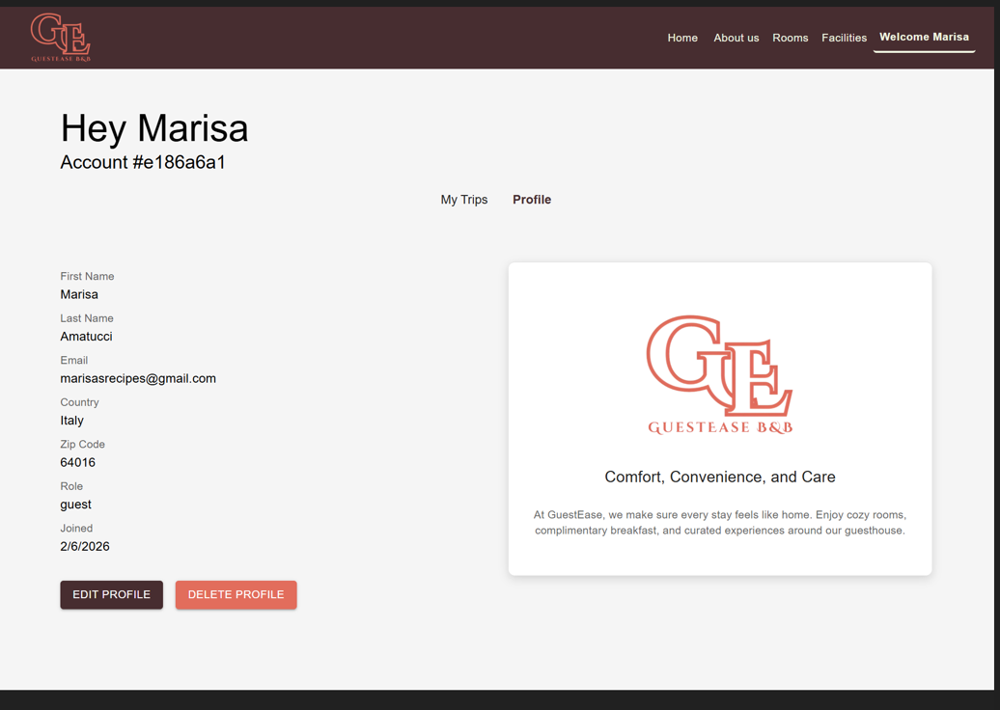

The 'UserProfilePage' displays and manages the logged-in user’s profile information in the GuestEase application. It retrieves authentication data from AuthContext, which provides the current user and a loading state while authentication initializes.

```
const UserProfilePage: React.FC = () => {
  /**
   * Access authentication state from AuthContext.
   * 'auth' may be null before the provider initializes, so we safely
   * destructure 'user' and 'loading' with a fallback to an empty object.
   */
  const auth = useContext(AuthContext);
  const { user, loading } = auth || {};
```

Once the user is available, the component uses React Query’s useQuery hook to fetch the user’s profile from the backend. The query is keyed with ["profile", user?.id] so the data is cached and automatically refetched if the user ID changes.

```
const { data: profile } = useQuery<User>({
  // We have a supabase 'profiles' table with user data stored in it
  queryKey: ["profile", user?.id],
  queryFn: () => getUserProfile(user!.id), // Calling in an api function to fetch a specific user in 'guestease-api'
});

```

The useQuery() function calls in the API function getUserProfile() in the file **guestease-api.ts**

```
/**
 * Fetch a single user profile from the Supabase "profiles" table.
 * Requires the authenticated user's ID.
 */
export const getUserProfile = async (userId: string) => {
  const { data, error } = await supabase
    .from("profiles")
    .select("*")
    .eq("id", userId)
    .single();

  if (error) throw new Error(error.message);
  return data;
};

```

The fetched profile data is then synchronized with local state (formData) using useEffect. This allows the form fields in the edit dialog to always reflect the latest profile values.

```
 /**
   * When the profile data is fetched or updated, we sync it into local form state.
   * The actual database sync between 'profiles' and 'auth.users' is handled by a
   * PostgreSQL trigger 'on_profile_updated'.
   * This effect keeps the form fields up to date with the latest profile values.
   */
  useEffect(() => {
    if (profile) {
      setFormData({
        first_name: profile.first_name,
        last_name: profile.last_name,
        country: profile.country,
        zip_code: profile.zip_code,
      });
    }
  }, [profile]);

```

To update the profile, the component uses a custom hook that wraps React Query’s useMutation, allowing the app to send updated user data to the backend and handle server-side changes.

```
/**
   * We create a 'updateProfileMutation' function with useMutation.
   * 'mutations are typically used to create/update/delete data
   * or perform server side-effects. For this purpose,
   * TanStack Query exports a useMutation hook.'
   * It wraps our the 'deleteUserApi' function in 'guestease-api.ts'
   * https://tanstack.com/query/v4/docs/framework/react/guides/mutations
   */
  const updateProfileMutation = useUserUpdateProfile(user?.id);

```

This leverages the useUserUpdateProfile() hook **hooks/useUserUpdateProfile.ts**

```
import { useMutation, useQueryClient } from "@tanstack/react-query";
import { updateUserProfile } from "../api/guestease-api";
import { User } from "../types/interfaces"; // adjust path

/**
 * React Query’s useMutation updates the user profile, then invalidates the
 * cached "profile" query so fresh data is refetched.
 * Local form state mirrors the profile data, and useEffect keeps it synced
 * whenever the profile query returns new values from Supabase.
 * https://tanstack.com/query/v4/docs/framework/react/guides/mutations
 * https://tanstack.com/query/v4/docs/framework/react/guides/query-invalidation
 */
export function useUserUpdateProfile(userId: string | undefined) {
  const queryClient = useQueryClient();

  return useMutation({
    // 'Constructs a type with all properties of Type set to optional.'
    // This is perfect for update operations where we only send the fields that changed.
    // https://www.typescriptlang.org/docs/handbook/utility-types.html#partialtype
    mutationFn: (updates: Partial<User>) => updateUserProfile(userId!, updates),

    onSuccess: () => {
      // Refresh the profile query after update
      queryClient.invalidateQueries({ queryKey: ["profile", userId] });
    },
  });
}

```

which in turn mutates the profile data via the updateUserProfile() function in the **guestease-api.tsx**

```
/**
 * This API function will allow us to get user data updated
 */
export async function updateUserProfile(
  userId: string,
  updates: Partial<User>,
) {
  const { data, error } = await supabase
    .from("profiles")
    .update(updates)
    .eq("id", userId)
    .select()
    .single();

  if (error) throw error;
  return data;
}

```

The UI displays profile details such as name, email, country, and join date using Material UI components, and provides buttons for editing or deleting the profile. When editing, an EditProfileDialog modal opens and saves the changes by triggering the mutation:

```
 {/* This is the pop up where we edit the user data */}
        <EditProfileDialog
          open={open}
          formData={formData}
          setFormData={setFormData}
          onClose={() => setOpen(false)}
          onSave={() => {
            updateProfileMutation.mutate(formData);
            setOpen(false);
          }}
        />
```

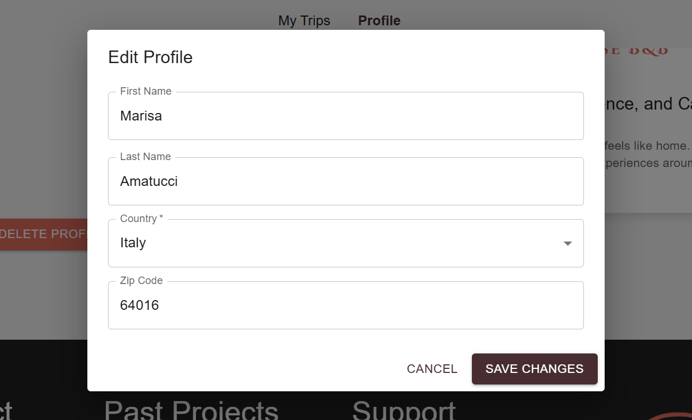

For account deletion, we will still use React useMutation.

```
 /**
   * We create a 'deleteUser' function with useMutation.
   * 'mutations are typically used to create/update/delete data
   * or perform server side-effects. For this purpose,
   * TanStack Query exports a useMutation hook.'
   * It wraps our the 'deleteUserApi' function in 'guestease-api.ts'
   * https://tanstack.com/query/v4/docs/framework/react/guides/mutations
   */
  const deleteUser = useMutation({
    mutationFn: deleteUserApi,
  });
```

However, the component first checks the Supabase bookings table to ensure the user has no active bookings (where check_out is in the future). If active bookings exist, the deletion is blocked to protect booking integrity.

```
 <AlertDialogSlide
          open={deleteOpen}
          onClose={() => setDeleteOpen(false)}
          onConfirm={async () => {
            try {
              const now = new Date().toISOString();
              /**
               * To ensure that 'past/inactive' bookings won't prevent a user from being
               * able to delete their profile, we select from the bookings table in supabase
               * those bookings whose check_out date is bigger than today's date...
               */
              const { data: bookings, error: bookingErr } = await supabase
                .from("bookings")
                .select("*")
                .eq("user_id", user.id)
                .gt("check_out", now);

              // console.log("Date:", now);

              if (bookingErr) {
                return console.error(bookingErr);
              }
              /**
               * ...and if we find those bookings, the user won't be able to delete their profile up until
               * those bookings are either deleted or get past today's date
               */
              if (bookings && bookings.length > 0) {
                alert(
                  "You currently have active bookings. Please cancel or complete them before deleting your account.",
                );

                return;
              }
              // Using a promise to delete, waiting for the backend
              // https://tanstack.com/query/v4/docs/framework/react/guides/mutations#promises
              await deleteUser.mutateAsync(user.id);
              // Sign out
              await supabase.auth.signOut();
              // Close modal
              setDeleteOpen(false);
              // Redirect
              navigate("/login");
            } catch (err) {
              console.error(err);
            }
          }}
        />

```

If no active bookings are found, the deleteUser mutation removes the account, signs the user out via Supabase authentication, closes the dialog, and redirects them to the login page.

To do so, though, it uses the deleteUserApi() function in the **guestease-api.ts** function,

```
/**
 * This API function will first find tha uthorized user, and will then 'post'
 * a request to the backend userDeleteAccount.js
 */
export const deleteUserApi = async (userId: string) => {
  const { error } = await supabase
    .from("profiles")
    .select("*")
    .eq("id", userId)
    .single();

  if (error) throw new Error(error.message);
  const res = await fetch(`${backendUrl}/user/delete-account`, {
    method: "POST",
    headers: { "Content-Type": "application/json" },
    /**
     * Convert the booking object into JSON before sending.
     * Express.json() on the backend will parse this automatically.
     * https://developer.mozilla.org/en-US/docs/Web/JavaScript/Reference/Global_Objects/JSON/stringify
     */
    body: JSON.stringify({ userId }),
  });

  /**
   * Parse the JSON response from the backend.
   * If the backend returns an error, it will be included here.
   */
  const result = await res.json();

  /**
   * If the HTTP status is not in the 200–299 range,
   * throw an error so the frontend can handle it.
   * https://developer.mozilla.org/en-US/docs/Web/API/Response/ok
   */
  if (!res.ok) {
    throw new Error(result.error || "Failed to create booking");
  }

  // Return the booking data to the caller.
  return result;
};


```

which relies on the backend route **userDeleteAccount.js**, as advised in the Supabase documentation

```
 try {
    // Delete profile row
    // This will fail automatically if bookings still exist (ON DELETE RESTRICT)
    const { error: profileError } = await supabase
      .from("profiles")
      .delete()
      .eq("id", userId);

    if (profileError) {
      return res.status(400).json({ error: profileError.message });
    }


    // 'This fucntion should only be called on a server. Never expose your
    // service_role key in the browser.' deleteUser()
    // https://supabase.com/docs/reference/javascript/auth-admin-deleteuser
    const { error: authError } = await supabase.auth.admin.deleteUser(userId);

    if (authError) {
      return res.status(400).json({ error: authError.message });
    }

```

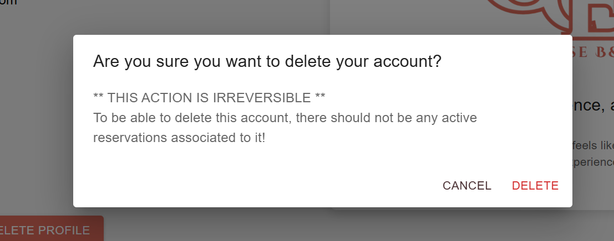

Overall, this component integrates React Context for authentication, React Query for data fetching and mutations, and Supabase for database and auth management to provide a full profile management interface including viewing, editing, and safely deleting user accounts.

### Source attributions

- https://tanstack.com/query/latest/docs/framework/react/reference/useQuery
- https://tanstack.com/query/latest/docs/framework/react/quick-start
- https://tanstack.com/query/v4/docs/framework/react/guides/mutations
- https://tanstack.com/query/v4/docs/framework/react/guides/mutations#promises
- https://www.geeksforgeeks.org/css/css-align-items-property/

## Review page

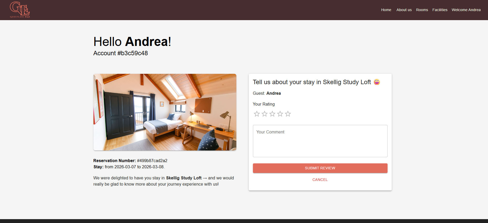

This page is a guest-facing page that allows guests to submit a review for a room they booked. Here’s a clear explanation of what’s happening in the code:

The page first extracts the booking ID from the URL using 'useParams():

```ts
const ReviewPage: React.FC = () => {
  // Extracting the id
  // https://reactrouter.com/api/hooks/useParams
  const { id } = useParams();

```

The 'user context' is retrieved from 'AuthContext':

```ts
// We retrieve the user auth.users from supabase
const auth = useContext(AuthContext);
const { user } = auth || {};
```

Data fetching is then handled via custom hooks built on React Query:

```ts
/**
 * Fetch the booking details using React Query.
 * This provides booking.check_in, booking.check_out, booking.room_id, etc.
 */
const { data: booking, isLoading, error } = useUserFetchBooking(id);
// We fetch the room id
const { data: room } = useUserFetchRoom(booking?.room_id);
// Here we fetch the user who made the booking
const { data: profile } = useUserProfile(booking?.user_id);
```

**useUserFetchingBookings.ts**

```ts
import { useQuery } from "@tanstack/react-query";
import { getBookingById } from "../api/guestease-api";

export const useUserFetchBooking = (bookingId?: string | undefined) => {
  return useQuery({
    queryKey: ["bookings", bookingId],
    queryFn: () => getBookingById(bookingId!),
    enabled: !!bookingId, // only run when roomId exists
  });
};
```

**useUserFetchingRooms.ts**

```ts
import { useQuery } from "@tanstack/react-query";
import { getRoomById } from "../api/guestease-api";

export const useUserFetchRoom = (roomId?: string | undefined) => {
  return useQuery({
    queryKey: ["rooms", roomId],
    queryFn: () => getRoomById(roomId!),
    enabled: !!roomId, // only run when roomId exists
  });
};
```

**useFetchingUserProfile.ts**

```ts
import { useQuery } from "@tanstack/react-query";
import { getUserProfile } from "../api/guestease-api";

export const useUserProfile = (userId?: string | undefined) => {
  return useQuery({
    queryKey: ["profile", userId],
    queryFn: () => getUserProfile(userId!),
    enabled: !!userId, // only run when userId exists
  });
};
```

These hooks leverage the below API functions 'getBookingById()', 'getRoomById()', 'getUserProfile()' in the **api/guestease-api.ts** file:

```ts
/**
 * This is a helper to fetch booking data by its id
 */
export const getBookingById = async (bookingId: string) => {
  const { data, error } = await supabase
    .from("bookings")
    .select("*")
    .eq("id", bookingId)
    .single();

  if (error) {
    throw new Error(`Unable to fetch room: ${error.message}`);
  }

  return data;
};

.....

/**
 * This is a helper to fetch room data by its id to populate
 * the Booking Confirmation page
 */
export const getRoomById = async (roomId: string) => {
  const { data, error } = await supabase
    .from("rooms")
    .select("*")
    .eq("id", roomId)
    .single();

  if (error) {
    throw new Error(`Unable to fetch room: ${error.message}`);
  }

  return data;
};

...

/**
 * Fetch a single user profile from the Supabase "profiles" table.
 * Requires the authenticated user's ID.
 */
export const getUserProfile = async (userId: string) => {
  const { data, error } = await supabase
    .from("profiles")
    .select("*")
    .eq("id", userId)
    .single();

  if (error) throw new Error(error.message);
  return data;
};
```

This way we are fetching the below data

- The booking details ('check_in', 'check_out', 'room_id', etc.)
- The room data for that booking
- The profile of the user who made the booking

Local UI state is managed using 'useState':

```ts
/**
 * Local UI state for the review form.
 * Rating defaults to 0, comment to an empty string.
 */
const [rating, setRating] = useState(0);
const [comment, setComment] = useState("");

// Controls visibility of the success snackbar
const [snackbarOpen, setSnackbarOpen] = useState(false);

// Stores the text that will appear inside the Snackbar
const [snackbarMessage, setSnackbarMessage] = useState("");

// Spinner before redirect
const [redirectLoading, setRedirectLoading] = useState(false);
```

The review submission, then, is handled using a React Query mutation:

```ts
/**
 * React Query mutation hook for submitting a review.
 * On success, it invalidates ["reviews"] so any review lists refresh.
 */
const submitReviewMutation = useSubmitReview();
const queryClient = useQueryClient();
```

**hooks/useSubmitReview.ts**

```ts
import { useMutation, useQueryClient } from "@tanstack/react-query";
import { submitReview } from "../api/reviews-api";

/**
 * React Query’s useMutation submits the review, then invalidates the
 * cached "reviews" query so fresh data is refetched.
 * https://tanstack.com/query/v4/docs/framework/react/guides/mutations
 * https://tanstack.com/query/v4/docs/framework/react/guides/query-invalidation
 */
export const useSubmitReview = () => {
  const queryClient = useQueryClient();

  return useMutation({
    mutationFn: submitReview,
    onSuccess: (_data, variables) => {
      // Refresh list
      queryClient.invalidateQueries({ queryKey: ["reviews"] });
      // Refresh the specific room page
      queryClient.invalidateQueries({ queryKey: ["rooms", variables.room_id] });
      // Refresh the reviews associated with that room page
      queryClient.invalidateQueries({
        queryKey: ["roomReviews", variables.room_id],
      });
    },
  });
};
```

The above hook submits the review via the 'submitReview()' API function in the **review-api.ts** file in which we create a review payload, which will thwn be used to insert the newly created 'review' into the Supabase table 'reviews'. The rest of the variables are created to populate the email notification that will be sent off to the admin email, so that the admin is informed.

```ts
/**
 * This is a function to submit a review.
 * We create a payload with all fields in the supabase 'revies' table and insert
 * it.
 * https://supabase.com/docs/reference/javascript/insert
 */
export const submitReview = async (payload: {
  booking_id: string;
  room_id: string;
  user_id: string;
  rating: number;
  comment: string;
}) => {
  const { booking_id, rating, comment } = payload;
  const { error } = await supabase.from("reviews").insert({
    ...payload,
    created_at: new Date(),
  });
  if (error) throw new Error(error.message);

  // Retrieving all objects needed for the email parameters
  const room = await getRoomById(payload.room_id);
  const booking = await getBookingById(payload.booking_id);
  const user = await getUserProfile(payload.user_id);

  // Fetching the GuestEase logo from the Supabase storage
  const logoUrl = getPublicUrl("GuestEaseLogo.png");
  const adminEmail = import.meta.env.VITE_RESEND_ADMIN_EMAIL;

  // Generate the full HTML for the booking confirmation email using the template
  // and pass the below values
  const html = reviewEmailTemplate({
    booking_id,
    check_in: booking.check_in,
    check_out: booking.check_out,
    rating,
    room_name: room?.name ?? "Unknown Room",
    user_name: user?.first_name ?? "Guest",
    comment,
    logoUrl,
    adminDashboardUrl: `${frontendUrl}/admin/reviews`,
  });

  const res = await fetch(`${backendUrl}/send_email`, {
    method: "POST",
    headers: { "Content-Type": "application/json" },
    body: JSON.stringify({
      email: adminEmail,
      subject: "New Review Submitted",
      body: html,
    }),
  });

  return true;
};
```

The 'handleSubmit()' function will submit the review to initiate the mutation:

```ts
const submitReviewMutation = useSubmitReview();
const queryClient = useQueryClient();

.....

const handleSubmit = () => {
    if (!booking || !room || !user) return;
    if (!rating || !comment.trim()) {
      setSnackbarMessage("Please provide both rating and comment.");
      setSnackbarOpen(true);
      return;
    }

    submitReviewMutation.mutate(
      {
        booking_id: booking.id,
        room_id: room.id,
        user_id: user.id,
        rating,
        comment,
      },
      {
        onSuccess: () => {
          queryClient.invalidateQueries({ queryKey: ["rooms", room.id] });
          setSnackbarMessage("Review submitted!");
          setSnackbarOpen(true);
          // It holds up the snackbar for 1.5 secs
          setTimeout(() => {
            // Then it spins for 1.2 secs before redirecting
            setRedirectLoading(true);
            setTimeout(() => {
              navigate(`/room/${room.id}`);
            }, 1200);
          }, 1500);
        },
        onError: (err: any) => {
          if (
            err.message.includes("duplicate") ||
            err.message.includes("unique")
          ) {
            setSnackbarMessage(
              "You have already submitted a review for this stay.",
            );
          } else {
            setSnackbarMessage(
              "Something went wrong while submitting your review.",
            );
          }
          setSnackbarOpen(true);
        },
      },
    );
  };

```

In essence what we are doing here is:

- Checking that a booking, room, and user exist
- Ensuring both a rating and comment are provided
- Submitting the review via 'useSubmitReview' mutation
- Showing success or error feedback using a Snackbar
- Invalidating the room query to refresh the data
- Redirecting the user to the room page after a short delay

The email notofication sent out to the Admin is the last step of the flow:

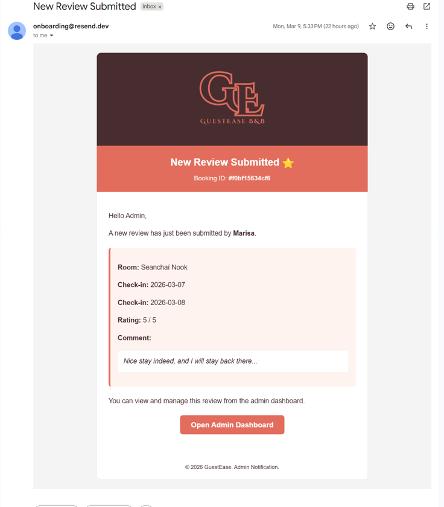

### Source attirbutions

- https://reactrouter.com/api/hooks/useParams
- https://mui.com/system/grid/#css-grid-layout
- https://mui.com/material-ui/react-snackbar/

## Admin Booking page

If the user has their 'role' in the Supabase 'profiles' table and the auth.users section set to 'admin', they will have access to the below link in the **userDrawerProfile.tsx** file:

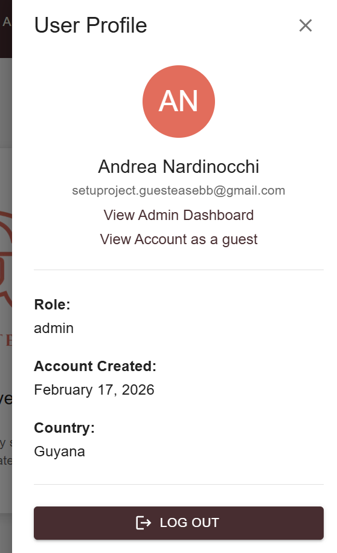

```
   {profile?.role === "admin" && (
          <MuiLink
            component={Link}
            to="/admin/bookings"
            underline="hover"
            sx={{ mt: 1, color: "#472d30;", fontWeight: 500 }}
            onClick={onClose}
          >
            View Admin Dashboard
          </MuiLink>
        )}

```

However, prior to jumping on the Admin Bookings page, we need to take a step back and understand how the 'admin' role was set up in Supabase in the 'profiles' table.

The 'admin' role in the system is implemented using a combination of a role column in the profiles table and Row Level Security (RLS) policies in PostgreSQL. The profiles table stores additional user information linked to auth.users, and it includes a role field that defaults to 'guest' when a new user signs up:

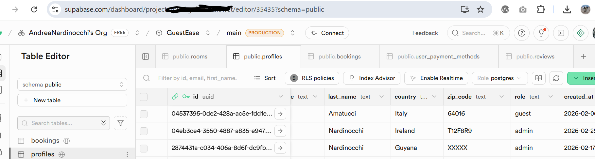

```sql
-- Profiles table
--
-- This stores additional user information not included in auth.users.
-- Supabase docs: https://supabase.com/docs/guides/auth/managing-user-data
--
-- The id references auth.users(id) so each profile belongs to a user.
-- Supabase docs (referencing auth.users):
-- https://supabase.com/docs/guides/database/tables#referencing-authusers
--
-- ON DELETE CASCADE ensures profiles are removed when users are deleted.
CREATE TABLE IF NOT EXISTS public.profiles (
    id uuid PRIMARY KEY REFERENCES auth.users(id) ON DELETE CASCADE,
    email text NOT NULL UNIQUE,
    first_name text NOT NULL,
    last_name text NOT NULL,
    country text NOT NULL,
    zip_code text NOT NULL,
    role text DEFAULT 'guest',
    created_at timestamptz DEFAULT now()
);

```

To securely determine whether a user is an administrator, a helper function called is_admin() is created. This function checks the profiles table to see if the user’s role is 'admin' and returns a boolean value. It uses SECURITY DEFINER, meaning it runs with the permissions of the function owner so it can access the table even when RLS is active.

```sql
-------------------------------------------------------------------------
-- ADMIN role Function
-- This function checks whether a given user (uid) is an admin.
-- It is used inside RLS policies to safely determine admin privileges.
-- https://www.postgresql.org/docs/current/ddl-rowsecurity.html
-- https://www.postgresql.org/docs/current/sql-createfunction.html#SQL-CREATEFUNCTION-SECURITY
-------------------------------------------------------------------------------
CREATE OR REPLACE FUNCTION public.is_admin(uid uuid)
RETURNS boolean   -- The function returns TRUE or FALSE
LANGUAGE sql          -- This is a simple SQL function
SECURITY DEFINER       -- The function runs with the privileges of the function owner, not the logged‑in user.
                       --Therefore, it can read public.profiles without being restricted by RLS.
AS $$
  SELECT role = 'admin'              -- Returns TRUE if the role equals 'admin'
  FROM public.profiles
  WHERE id = uid;
$$;

```

This function is then used inside RLS policies to grant administrators elevated permissions. For example, the following policy allows administrators to read all user profiles, rather than only their own.

```sql
-- ADMINS: SELECT ALL
DROP POLICY IF EXISTS "Admins can select all profiles" ON public.profiles;
CREATE POLICY "Admins can select all profiles"
ON public.profiles
FOR SELECT
USING (public.is_admin(auth.uid()));  -- Admin can read all rows

```

Additional policies allow administrators to update or delete any profile, or read all users' reviews on the Room Details page:

```sql
-- ADMINS: DELETE ANY
DROP POLICY IF EXISTS "Admins can delete any profile" ON public.profiles;
CREATE POLICY "Admins can delete any profile"
ON public.profiles
FOR DELETE
USING (public.is_admin(auth.uid()));  -- Admin can delete any row


-- ADMINS: UPDATE ANY
DROP POLICY IF EXISTS "Admins can update any profile" ON public.profiles;
CREATE POLICY "Admins can update any profile"
ON public.profiles
FOR UPDATE
USING (public.is_admin(auth.uid()))   -- Admin can update any row
WITH CHECK (public.is_admin(auth.uid()));  -- WITH CHECK OPTION prevents us from updating or inserting rows that are not visible through the UI https://www.mysqltutorial.org/mysql-views/mysql-view-with-check-option/.

-- This policy allows all users to read other users' names on
-- the roomDetailsPage 'Reviews' section
create policy "Allow read of profiles"
on profiles
for select
to authenticated
using (true);

```

Because these policies use the 'is_admin()' function, only users whose profile role is 'admin' can access all rows in the profiles table and perform admin-level actions on profiles.

While the frontend **adminRoute.tsx** component allows admins to access the dashboard and manage rooms or bookings, the backend tables like bookings or rooms do not currently enforce RLS for admin actions, so these frontend checks are the main restriction to non-admin roles:

```ts

import React, { useContext, type JSX } from "react";
import { Navigate } from "react-router-dom";
import { useQuery } from "@tanstack/react-query";
import { supabase } from "../supabase/supabaseClient";
import { AuthContext } from "../contexts/authContext";
import { Box, CircularProgress, Container } from "@mui/material";

/**
 * Props for protecting admin‑only routes.
 * 'JSX.Element' is the return type of a React component
 * https://blog.logrocket.com/react-children-prop-typescript/
 */
interface AdminRouteProps {
  children: JSX.Element;
}

const AdminRoute: React.FC<AdminRouteProps> = ({ children }) => {
  // We retrieve the user auth.users from supabase
  // https://react.dev/reference/react/useContext
  const auth = useContext(AuthContext);

  // If AuthContext is not initialized yet, redirect
  if (!auth) {
    return <Navigate to="/" replace />;
  }

  // Wait for Supabase session restoration to complete
  // https://supabase.com/docs/reference/javascript/auth-getsession
  if (auth.loading) {
    return (
      <Container sx={{ mt: 10, textAlign: "center" }}>
        <Box display="flex" justifyContent="center" mt={10}>
          <CircularProgress />
        </Box>
      </Container>
    );
  }

  // If user is not logged in, redirect to home
  if (!auth.user) {
    return <Navigate to="/" replace />;
  }

  /**
   * Fetch the role from the 'profiles' table.
   * This is necessary because Supabase does not store custom roles
   * inside 'auth.user.user_metadata'.
   * React Query is a data-fetching and caching library that simplifies working with
   * asynchronous data in React applications. Instead of manually managing loading states,
   * errors, caching, refetching, and background updates, React Query handles all of this
   * automatically. This results in cleaner components, fewer bugs, and a much smoother UX.
   * React Query v5 is the latest, actively maintained version of TanStack Query.
   * It introduces a simpler, more consistent API using a single options object:
   *
   *    useQuery({ queryKey: [...], queryFn: ... })
   *
   * https://tanstack.com/query/latest/docs/framework/react/reference/useQuery
   * https://tanstack.com/query/latest/docs/framework/react/quick-start
   */
  const { data: profile, isLoading } = useQuery({
    // 'profile-role' is just a label
    queryKey: ["profile-role", auth.user.id],
    queryFn: async () => {
      const { data, error } = await supabase
        .from("profiles")
        .select("role")
        .eq("id", auth.user?.id)
        .single(); // Fetch exactly one row

      if (error) throw error;
      return data;
    },
  });

  // While the role is being fetched, show loading
  if (isLoading) {
    return <div>Loading...</div>;
  }

  // If user is not an admin, redirect to home
  if (!profile || profile.role !== "admin") {
    return <Navigate to="/" replace />;
  }

  // User is authenticated AND an admin → allow access
  return children;
};

export default AdminRoute;

```

Regular users with the role 'guest' are limited by RLS policies to only read, update, or delete their own profile data.

```
-- USERS: SELECT
-- https://www.postgresql.org/docs/current/ddl-rowsecurity.html
DROP POLICY IF EXISTS "Users can select their own profile" ON public.profiles;
CREATE POLICY "Users can select their own profile"
ON public.profiles
FOR SELECT
USING (auth.uid() = id);  -- User can read only their own row


-- USERS: UPDATE
DROP POLICY IF EXISTS "Users can update their own profile" ON public.profiles;
CREATE POLICY "Users can update their own profile"
ON public.profiles
FOR UPDATE
USING (auth.uid() = id)   -- User can UPDATE only their own row
WITH CHECK (auth.uid() = id);  -- WITH CHECK OPTION prevents us from updating or inserting rows that are not visible through the UI https://www.mysqltutorial.org/mysql-views/mysql-view-with-check-option/.


-- USERS: DELETE
DROP POLICY IF EXISTS "Users can delete their own profile" ON public.profiles;
CREATE POLICY "Users can delete their own profile"
ON public.profiles
FOR DELETE
USING (auth.uid() = id);  -- User can delete only their own row

```

Going back to the **adminBookingsPage.tsx**,

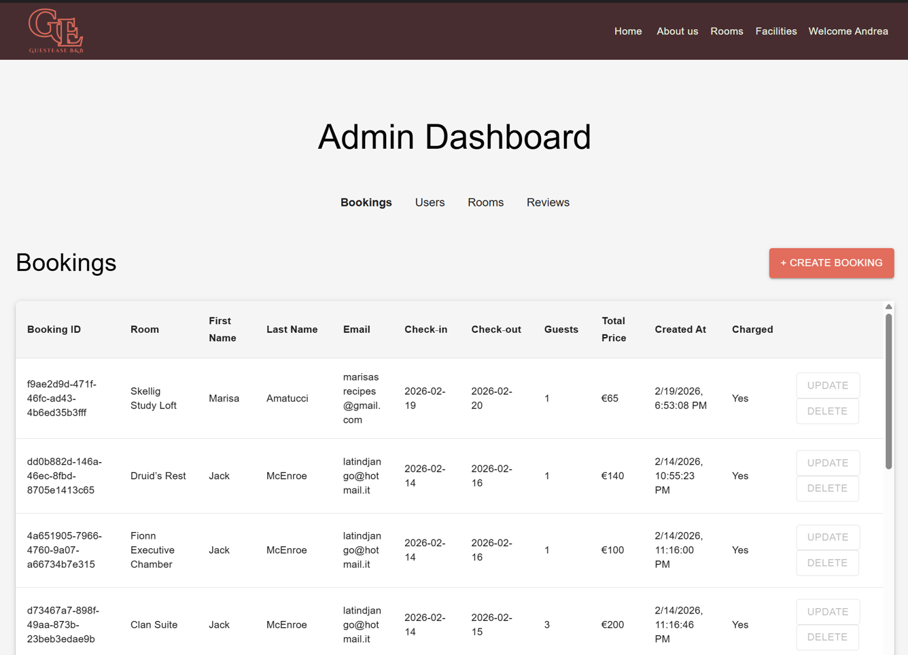

the page is responsible for displaying and managing all bookings within the GuestEase admin dashboard. It allows administrators to view, create, update, and delete bookings (CRUD) through a structured interface built with React and Material UI.

The page manages several pieces of state using `useState`, which control elements such as modals, confirmation dialogs, Stripe payment data, snackbar notifications, and booking filters.

```
const AdminBookingsPage: React.FC = () => {
  // Controls visibility of the booking modal
  const [openBookingModal, setOpenBookingModal] = useState(false);
  // Holds the booking currently being edited (null = create mode)
  const [editingBooking, setEditingBooking] = useState<BookingWithUser | null>(
    null,
  );
  // React Query client used for cache invalidation after mutations
  const queryClient = useQueryClient();
  // Controls visibility of the success snackbar
  const [snackbarOpen, setSnackbarOpen] = useState(false);

  // Stores the text that will appear inside the Snackbar
  const [snackbarMessage, setSnackbarMessage] = useState("");

  // Controls whether the delete‑confirmation dialog is visible
  const [deleteDialogOpen, setDeleteDialogOpen] = useState(false);

  // Holds the ID of the booking the user intends to delete
  const [bookingToDelete, setBookingToDelete] = useState<string | null>(null);

  // This state controls the payment dialog
  const [paymentDialogOpen, setPaymentDialogOpen] = useState(false);

  // This state will control and set the Stripe customer id
  const [customerId, setCustomerId] = useState<string | null>(null);

  // This state handles the paymentMethodId
  const [paymentMethodId, setPaymentMethodId] = useState<string | null>(null);

  // We set a useState for the filters and leave the fields as empty
  const [filters, setFilters] = useState({
    search: "",
    room: "",
    first_name: "",
    last_name: "",
    email: "",
    check_in: "",
    check_out: "",
    created_at: "",
    guests: "",
  });

```

Data for bookings and rooms is retrieved using React Query’s 'useQuery()' hook. This simplifies asynchronous data fetching by handling loading states, caching, and background refetching automatically.

```
 const {
    data: bookings,
    isLoading: bookingsLoading,
    error: bookingsError,
  } = useQuery({
    queryKey: ["bookings"],
    queryFn: getAllBookings,
    // This will ensure React Query will refetch data, to avoid stale data
    // so that new bookigs are always synced
    refetchOnMount: "always",
  });

  const {
    data: rooms,
    isLoading: roomsLoading,
    error: roomsError,
  } = useQuery({
    queryKey: ["rooms"],
    queryFn: getRooms,
  });


```

The 'getAllBookings' and 'getRooms' API functions in **guestease-api.ts** retrieve the required data from the backend.

```
 /**
 * React Query Fetchers
 * We fetach all bookings through the rpc 'get_all_bookings' which is a function
 * that joind the bookings table with the auth.users so that the admin will be
 * able to see all the users' bookings.
 * */
export const getAllBookings = async (): Promise<BookingWithUser[]> => {
  const { data, error } = await supabase.rpc("get_all_bookings");
  if (error) throw error;
  return data || [];
};


....

/**
 * Fetch all rooms from the Supabase "rooms" table.
 * It uses the Supabase client to query the "rooms" table.
 * `.select("*")` retrieves every column for each room.
 *
 * https://supabase.com/docs/reference/javascript/select
 */
export const getRooms = async () => {
  const { data, error } = await supabase.from("rooms").select("*");

  // If Supabase returns an error, we throw a descriptive exception
  if (error) {
    throw new Error(`Unable to fetch rooms: ${error.message}`);
  }
  return data;
};

```

Let's take a close look at the 'getAllBookings()' function now.

The 'bookings' table in Supabase is built out through the below SQL script:

```
-- Drops the bookings table if it already exists.
DROP TABLE IF EXISTS public.bookings;

-- ==========================================
-- 1. Create bookings table
-- ==========================================
CREATE TABLE IF NOT EXISTS public.bookings (
  -- https://www.postgresql.org/docs/current/functions-uuid.html
  id uuid DEFAULT gen_random_uuid() PRIMARY KEY,
  room_id uuid NOT NULL,
  user_id uuid NOT NULL,
  check_in date NOT NULL,
  check_out date NOT NULL,
  guests integer NOT NULL,
  -- Automatically generated daterange used for overlap detection
  -- '[)' = inclusive lower bound, exclusive upper bound
  -- https://www.postgresql.org/docs/current/rangetypes.html
  period daterange GENERATED ALWAYS AS (daterange(check_in, check_out, '[)')) STORED,
  total_price numeric,
  created_at timestamptz DEFAULT now()
);
```

As observed, we do not have the user first name, last name, and email, but only their id. Therefore, we needed to create a PostgreSQL function that combined all 'bookings' table elements with some of the 'auth.users'.
Hence, we first created the 'BookingWithUser' interface, which will help render the joined bookings and auth.users table,

```
/**
* This interface is used in adminBookingsPage to render the joined
* Bookings and auth.users table as per rpc function 'get_all_bookings'
*/
export interface BookingWithUser {
 id: string;
 room_id: string;
 user_id: string;
 user_email: string;
 first_name: string;
 last_name: string;
 check_in: string;
 check_out: string;
 guests: number;
 total_price: number;
 created_at: string;
 charged: boolean;
 nights: string;
}

```

then, the below PostgreSQL function will fetch all bookings and return a table with user first name, last name and email

```
-- Drop old function if it exists
drop function if exists public.get_all_bookings();

-- Create new function
create function public.get_all_bookings()
returns table (
  id uuid,
  room_id text,
  user_id uuid,
  user_email text,
  first_name text,
  last_name text,
  check_in date,
  check_out date,
  guests int,
  total_price numeric,
  created_at timestamptz,
  charged boolean
)
language sql
security definer
as $$
  select
    b.id,
    b.room_id,
    b.user_id,
    u.email as user_email,
    u.raw_user_meta_data->>'first_name' as first_name,
    u.raw_user_meta_data->>'last_name' as last_name,
    b.check_in,
    b.check_out,
    b.guests,
    b.total_price,
    b.created_at,
    b.charged
  from public.bookings b
  left join auth.users u
  on b.user_id = u.id;
$$;


```

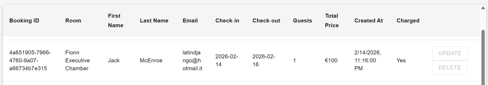

When a booking is created, updated, or deleted, the React Query cache is invalidated using 'queryClient.invalidateQueries', which ensures that the latest data is fetched and displayed without requiring a page refresh.
Ex.

```
    // This clears out the cache and alloes us to see the created booking without having to refresh the page
      // https://tanstack.com/query/v4/docs/framework/react/guides/query-invalidation
      queryClient.invalidateQueries({ queryKey: ["bookings"] });

```

Administrators can create or edit bookings through the 'AdminBookingModal, which opens either in create mode or update mode depending on whether a booking is currently selected.

```

  // Opens the modal in 'create' mode
  const handleOpenCreateBooking = () => {
    setEditingBooking(null);
    setOpenBookingModal(true);
  };

  ...

   // Opens the modal in 'update' mode
  const handleOpenUpdateBooking = (b: BookingWithUser) => {
    setEditingBooking(b);
    setOpenBookingModal(true);
  };

  ...
  /**
   * This handles the payment dialog pop up passing in the booking object
   */
  const handleOpenPaymentDialog = async (booking: any) => {
    try {
      // We retrieve the user by email as this is the field the admin will be
      // filling in the admin modal form
      const profile = await getUserByEmail(booking.user_email);

      if (!profile?.stripe_customer_id) {
        setSnackbarMessage("This user does not have a Stripe customer ID yet.");
        setSnackbarOpen(true);
        return;
      }

      // We then set the stripe customer id
      setCustomerId(profile.stripe_customer_id);

      /**
       * Store the booking we are about to charge for.
       * This works for both create and update flows.
       */
      setEditingBooking(booking);
      setPaymentDialogOpen(true);
    } catch (err) {
      setSnackbarMessage("Could not load user profile.");
      setSnackbarOpen(true);
    }
  };

  ...
   <AdminBookingModal
          open={openBookingModal}
          onClose={() => setOpenBookingModal(false)}
          onSave={(booking: any) => {
            /**
             * If editingBooking exists and has an id, then 'update' mode
             * otherwise 'create' mode
             */
            if (editingBooking && editingBooking.id) {
              handleUpdateBooking(booking, paymentMethodId ?? undefined);
            } else {
              handleCreateBooking(booking, paymentMethodId ?? undefined);
            }
          }}
          rooms={rooms ?? []}
          editingBooking={editingBooking}
          onOpenPaymentDialog={handleOpenPaymentDialog}
        />
```

To open the payment dialog, the 'profile' or user must have a 'stripe_customer_id' attached, hence, we use the 'getUserByEmail()' API function in **guestease-api.ts**

```
/**
 * Fetch the user by email
 */
export const getUserByEmail = async (email: string) => {
  const { data, error } = await supabase
    .from("profiles")
    .select("*")
    .eq("email", email)
    .single();

  if (error) throw new Error(error.message);
  return data;
};

```

The 'handleCreateBooking' function is responsible for creating a new booking through the admin interface. It receives the booking data from the form and optionally a paymentMethodId if a Stripe payment method was selected.

```
 // Handles creating a new booking through the admin API
  const handleCreateBooking = async (
    booking: any,
    paymentMethodId?: string,
  ) => {
    try {
      const newBooking = {
        room_id: booking.room_id,
        user_email: booking.user_email,
        check_in: booking.check_in,
        check_out: booking.check_out,
        guests: Number(booking.guests),
        payment_method_id: paymentMethodId,
      };
```

A new booking object is constructed with the required fields such as room_id, user_email, check-in and check-out dates, number of guests, and the payment method ID. This object is then sent to the backend using the 'adminCreateBookingApi' function.

```
// Sends booking object to the backend
      await adminCreateBookingApi(newBooking);
```

If the request succeeds, React Query invalidates the "bookings" query cache using queryClient.invalidateQueries,

```
   // This clears out the cache and alloes us to see the created booking without having to refresh the page
      // https://tanstack.com/query/v4/docs/framework/react/guides/query-invalidation
      queryClient.invalidateQueries({ queryKey: ["bookings"] });

```

which triggers a refetch so the newly created booking appears immediately in the table without refreshing the page.

A snackbar message is also displayed to confirm the successful creation, and the booking modal is closed.

```
    // Message to confirm the booking has beeen created
      setSnackbarMessage("Booking created successfully!");
      setSnackbarOpen(true);
      setOpenBookingModal(false);
    } catch (err: any) {
      setSnackbarMessage(err.message || "Something went wrong");
      setSnackbarOpen(true);
    }
  };

```

Let's now have a close-up of the 'adminCreateBookingApi()' function in **admin-bookings-api.ts** where we receive the new booking object to be sent off to the backend route to finally create the booking.

```
/**
 * Create Booking (Admin)
 * Sends a POST request to the admin backend to create a booking.
 */
export const adminCreateBookingApi = async (bookingData: {
  room_id: string;
  user_email: string;
  check_in: string;
  check_out: string;
  guests: number;
}) => {
  const res = await fetch(`${backendUrl}/admin/create-booking`, {
    method: "POST",
    headers: { "Content-Type": "application/json" },
    body: JSON.stringify(bookingData),
  });

  const data = await res.json();

  if (!res.ok) {
    throw new Error(data.error || "Failed to create booking");
  }

  return data;
};

```

The backend route in **adminCreateBookings.js** will complete the booking flow.
In it, we first validate all required booking fields, and we, then, ensure that the checkout date set is at least 1 day after the checkin date.

```
// ADMIN Create Booking
router.post("/admin/create-booking", async (req, res) => {
  const { room_id, user_email, check_in, check_out, guests } = req.body;

  if (!room_id || !user_email || !check_in || !check_out || !guests) {
    return res.status(400).json({ error: "Missing fields" });
  }

  // Validation
  const checkInDate = new Date(check_in);
  const checkOutDate = new Date(check_out);
  if (checkOutDate <= checkInDate) {
    return res
      .status(400)
      .json({ error: "Check-out must be at least 1 day after check-in" });
  }

```

At that point, we are ready to 'insert' the new booking into the 'bookings' table in Supabase.

```
  /**
     * Insert the booking into the database.
     * Supabase insert reference:
     * https://supabase.com/docs/reference/javascript/insert
     **/
    const { data: insertedBookings, error } = await supabase
      .from("bookings")
      .insert([
        { room_id, user_id: user.id, check_in, check_out, guests, total_price },
      ])
      .select();

    if (error) {
      return res.status(400).json({ error: error.message });
    }

```

Data from the 'profiles' table and the 'assets' storage is retrieved to populate the email notification template in the **emailTemplate.js** file.

```js
 const profile = user;
    // Extrapolating the booking id to be used in the confirmation email
    const booking_id = insertedBookings[0].id;
    // Fetching the GuestEase logo from Supabase storage
    const logoUrl = getPublicUrl("assets", "GuestEaseLogo.png");

    // Generate email HTML and passing through all needed parameters
    const html = bookingCreatedByAdminTemplate({
      profile,
      room,
      guests,
      check_in,
      check_out,
      total_price,
      logoUrl,
      booking_id,
      total_nights,
    });

    // Send email vua emailUtil.js
    await fetch(`${backendUrl}/send_email`, {
      method: "POST",
      headers: { "Content-Type": "application/json" },
      body: JSON.stringify({
        email: profile.email,
        subject: `Your Booking for ${room.name} at GuestEase has been created by the Admin 😊`,
        body: html,
      }),
    });

    return res.json({ success: true, booking: insertedBookings[0] });
  } catch (err) {
    return res.status(500).json({ error: err.message });
  }
});

```

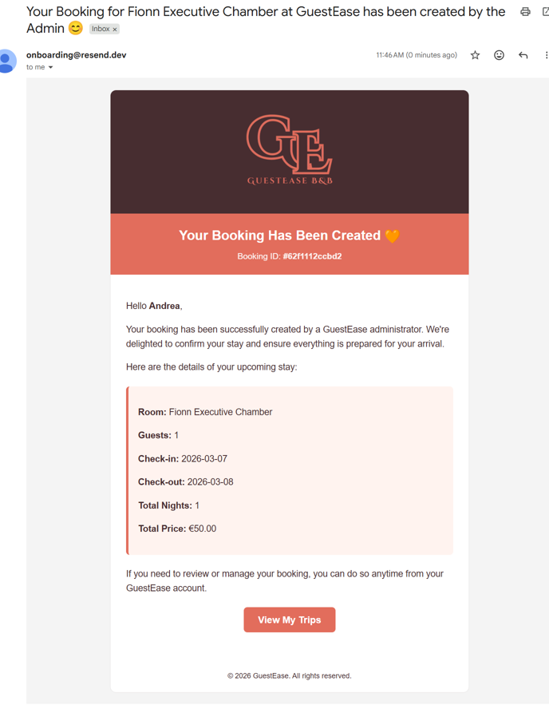

The 'handleUpdateBooking' function updates an existing booking and optionally processes a payment if a Stripe payment method is provided, and if the stay is extended.

First, the function receives the 'booking object' and an optional 'paymentMethodId' returned by the Stripe checkout component.

```ts
const handleUpdateBooking = async (
  booking: any,
  paymentMethodId?: string,
) => {
```

Next, the updated booking data is sent to the backend using the adminUpdateBookingApi' function in **admin-bookings-api.ts** file. Along with the booking details (room, dates, guests), the function also sends the optional 'payment_method_id'. If Stripe was used, this ID allows the backend to charge the customer.

```ts
await adminUpdateBookingApi({
  booking_id: booking.id,
  room_id: booking.room_id,
  check_in: booking.check_in,
  check_out: booking.check_out,
  guests: Number(booking.guests),
  payment_method_id: paymentMethodId,
});
```

Below we see the 'adminUpdateBookingApi()' function

```ts
/**
 * Update Booking (Admin)
 */
export const adminUpdateBookingApi = async (updateData: {
  booking_id: string;
  room_id: string;
  check_in: string;
  check_out: string;
  guests: number;
  payment_method_id?: string;
}) => {
  const res = await fetch(`${backendUrl}/admin/update-booking`, {
    method: "POST",
    headers: { "Content-Type": "application/json" },
    body: JSON.stringify(updateData),
  });

  const data = await res.json();

  if (!res.ok) {
    throw new Error(data.error || "Failed to update booking");
  }

  return data;
};
```

The backend route **adminUpdateBookings.js** will handle the booking update in Supabase. Just like for the create booking function, we first validate all required booking fields, and we, then, ensure that the checkout date set is at least 1 day after the checkin date.

```js
// ADMIN update Booking
router.post("/admin/update-booking", async (req, res) => {
  // Extract the fields sent from the frontend.
  // These are the only values required to update a booking.
  const { booking_id, room_id, check_in, check_out, guests } = req.body;

  if (!booking_id || !room_id || !check_in || !check_out || !guests) {
    return res.status(400).json({ error: "Missing bookingId or updates" });
  }

  // Validation
  const checkInDate = new Date(check_in);
  const checkOutDate = new Date(check_out);
  // console.log("CheckInOut: ", check_in, check_out);
  if (checkOutDate <= checkInDate) {
    return res
      .status(400)
      .json({ error: "Check-out must be at least 1 day after check-in" });
  }

```

At that point, we use the Supabase function update() to proceed with updating the booking

```js
// Update the booking in the database.
// Also return the updated booking along with the user's email via the foreign key join.
const { data, error } = await supabase
  .from("bookings")
  .update({ room_id, check_in, check_out, guests, total_price })
  .eq("id", booking_id)
  // PostgREST adds a special syntax for joins
  // https://postgrest.org/en/stable/references/api/resource_embedding.html#foreign-key-joins
  .select("*, profiles!bookings_user_id_fkey(email, first_name)");

if (error) {
  return res.status(500).json({ error: error.message });
}
```

The foreign key fetches the user’s email and first name so the backend can send a personalized email when the admin updates a booking. Without it, the backend would need a separate query just to get the user’s contact info.

```js
 const profile = data[0].profiles;
    // console.log(profile.email);
    // console.log(profile.first_name);

    // Fetching the GuestEase logo from Supabase storage
    const logoUrl = getPublicUrl("assets", "GuestEaseLogo.png");

    // Generate email HTML and passing through all needed parameters
    const html = bookingUpdatedByAdminTemplate({
      profile,
      roomData,
      guests,
      check_in,
      check_out,
      total_price,
      logoUrl,
      booking_id,
      total_nights,
    });

    // Send email vua emailUtil.js
    await fetch(`${backendUrl}/send_email`, {
      method: "POST",
      headers: { "Content-Type": "application/json" },
      body: JSON.stringify({
        email: profile.email,
        subject: `Your Booking for ${roomData.name} at GuestEase has been updated by the Admin ✨`,
        body: html,
      }),
    });

    return res.json({ message: "Booking updated successfully", data });
  } catch (err) {
    return res.status(500).json({ error: err.message });
  }
});


```

Going back to the **adminUpdateBookings.tsx** file, after the update succeeds, React Query invalidates the 'bookings' cache so the table refreshes automatically and displays the updated booking without requiring a page reload.

```ts
queryClient.invalidateQueries({ queryKey: ["bookings"] });
```

Finally, a success message is shown to the user and the booking modal is closed.

```ts
setSnackbarMessage("Booking updated successfully!");
setSnackbarOpen(true);
setOpenBookingModal(false);
```

The email, then, is triggered:

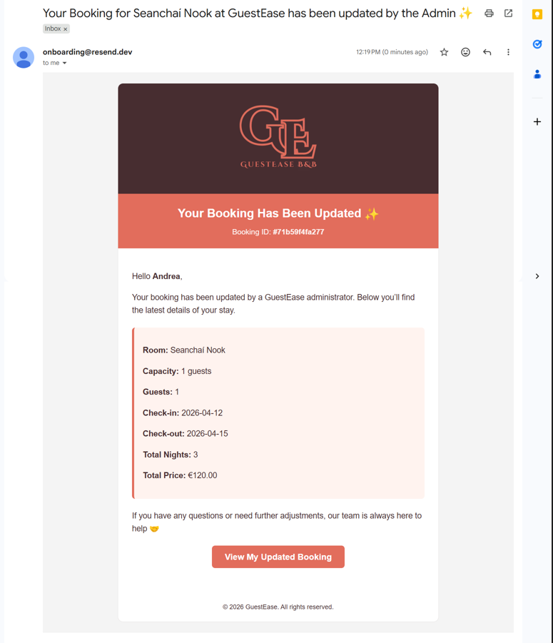

The admin delete booking flow starts in the table where each booking row has a Delete button. When the admin clicks it, the booking ID is stored in state and a confirmation dialog is opened.

```ts
<Button
  variant="outlined"
  color="error"
  disabled={checkoutIsTodayOrPast}
  onClick={() => {
    setBookingToDelete(b.id);
    setDeleteDialogOpen(true);
  }}
>
  Delete
</Button>
```

This opens the confirmation component **cancelBookingCinfirm.tsx**. If the admin confirms, the dialog calls the delete handler with the stored booking ID.

```ts
<AlertDialogSlide
  open={deleteDialogOpen}
  onClose={() => setDeleteDialogOpen(false)}
  onConfirm={() => handleDeleteBooking(bookingToDelete ?? "")}
/>

```

The 'handleDeleteBooking()' function then sends a request to the backend API to cancel the booking.

```ts
await adminCancelBookingApi(booking_id);
```

The above function is in the **admin-bookings-api.ts** file

```ts
/**
 * Delete / Cancel Booking (Admin)
 */
export const adminCancelBookingApi = async (booking_id: string) => {
  const res = await fetch(`${backendUrl}/admin/cancel-booking`, {
    method: "POST",
    headers: { "Content-Type": "application/json" },
    body: JSON.stringify({ booking_id }),
  });

  const data = await res.json();

  if (!res.ok) {
    throw new Error(data.error || "Failed to cancel booking");
  }

  return data;
};
```

and sends a POST request to the backend route **adminCancelBooking.js**.

First, the route receives the 'booking_id' from the request body and validates that it exists.

```js
const { booking_id } = req.body;

if (!booking_id) {
  return res.status(400).json({ error: "Missing bookingId" });
}
```

Next, it fetches the booking from Supabase, including the user profile through the foreign key join. This gives access to the guest’s email so the system can notify them later.

```js
const { data: booking } = await supabase
  .from("bookings")
  .select(
    "id, profiles!bookings_user_id_fkey(*), charged, payment_intent_id, room_id, check_in, check_out",
  )
  .eq("id", booking_id)
  .single();
```

Then, it fetches the room details, mainly to access the room price and name for refund calculations and the email template.

```js
const { data: room } = await supabase
  .from("rooms")
  .select("*")
  .eq("id", booking.room_id)
  .single();
```

If the booking was already charged, the system calculates how many nights are still refundable. The refund starts from tomorrow, so the guest doesn’t get money back for the current night.

```js
const checkOut = new Date(booking.check_out);
const today = new Date();

// If today bigger than check-out, it means the check-out is in
// the past. No refund posible.
if (today >= checkOut) {
  return res
    .status(400)
    .json({ error: "Refund not possible after checkout date" });
}
// Refund starts tomorrow
const refundStart = new Date(today);
// We add 1 day so that the refund starts from 1 night after
// the cancellation date
// https://stackoverflow.com/questions/4868241/javascript-date-1#4868270
refundStart.setDate(refundStart.getDate() + 1);
const msPerNight = 1000 * 60 * 60 * 24;
// Nights eligible for refund, rounding to the nearest integer and picking out the max value
// https://www.w3schools.com/jsref/jsref_ceil.asp
refundableNights = Math.max(
  Math.ceil((checkOut - refundStart) / msPerNight),
  0,
);
// Stripe requires cents, hence, calculating the refund accordingly
amountToRefund = refundableNights * room.price * 100;
```

If there is money to refund, a 'Stripe refund' is created using the stored 'payment_intent_id'.

```js
await stripe.refunds.create({
  payment_intent: booking.payment_intent_id,
  amount: amountToRefund,
});
```

After handling the refund (or if the booking was never charged), the booking is deleted from the database.

```js
await supabase.from("bookings").delete().eq("id", booking_id);
```

Finally, the system generates an email using the cancellation template and sends it to the guest so they know their booking was cancelled and whether a refund was issued.

```js
const html = adminCancelledBookingTemplate({
  profile,
  booking,
  logoUrl,
  refundableNights,
  amountToRefund,
  room,
});
```

In short: the admin cancels a booking → the backend checks if it was paid → calculates a partial refund if needed → processes the Stripe refund → deletes the booking → sends the guest a cancellation email.

After the backend deletes the booking from the database, React Query invalidates the bookings cache in the **adminBookingsPage.tsx**, so the table refreshes automatically and the deleted booking disappears.

```ts
// It will handle the booking delete
const handleDeleteBooking = async (booking_id: string) => {
  if (!bookingToDelete) return;
  try {
    // The booking to delete will sent off to the backend
    await adminCancelBookingApi(booking_id);
    queryClient.invalidateQueries({ queryKey: ["bookings"] });
    setSnackbarMessage("Booking deleted successfully!");
    setSnackbarOpen(true);
  } catch (err: any) {
    setSnackbarMessage(err.message || "Something went wrong");
    setSnackbarOpen(true);
  } finally {
    // https://developer.mozilla.org/en-US/docs/Web/JavaScript/Reference/Statements/try...catch#syntax
    setDeleteDialogOpen(false);
    setBookingToDelete(null);
  }
};
```

The below two functions prevent admins from modifying bookings that have already started or finished by disabling the 'Delete' and 'Update' buttons.

Both functions first create a 'today' date and reset its time to midnight so the comparison is based only on the date, not the hour.

```ts
const today = new Date();
// Resetting today to midnight
// https://codetofun.com/js/date-sethours/
today.setHours(0, 0, 0, 0);
```

Then the booking date (check-in or check-out) is converted to a 'Date' object and also reset to midnight.

```ts
// Setting check-out date and hours
const co = new Date(checkOut);
co.setHours(0, 0, 0, 0);
```

Finally, the function compares the timestamps. If the booking date is today or earlier, it returns 'true'.

```ts
// Returning the subtraction between checkout and today's time and whether true or false
// 'True' if the check-out date is today or in the past, and 'False' if in the future
return co.getTime() <= today.getTime();
```

or, for the check-in

```ts
function isCheckInTodayOrPast(checkIn: string | Date): boolean {
  const today = new Date();
  // Resetting today to midnight
  // https://codetofun.com/js/date-sethours/
  today.setHours(0, 0, 0, 0);

  // Setting check-in date and hours
  const ci = new Date(checkIn);
  ci.setHours(0, 0, 0, 0);

  // Returning the subtraction between checkin and today's time and whether true or false
  // 'True' if the check-in date is today or in the past, and 'False' if in the future
  return ci.getTime() <= today.getTime();
}
```

So in practice:

- 'isCheckoutTodayOrPast()' → disables 'Delete' if the stay already ended or ends today.
- 'isCheckInTodayOrPast()' → disables 'Update' if the stay has already started or started today.

```ts
 <Button
                        variant="outlined"
                        sx={{ mr: 1 }}
                        disabled={checkInIsTodayOrPast}
                        onClick={() => handleOpenUpdateBooking(b)}
                      >
                        Update
                      </Button>

                      <Button
                        variant="outlined"
                        color="error"
                        disabled={checkoutIsTodayOrPast}
                        onClick={() => {
                          setBookingToDelete(b.id);
                          setDeleteDialogOpen(true);
                        }}
                      >
                        Delete
                      </Button>
```

Bookings are displayed in a Material UI table showing guest details, booking dates, room information, and payment status. Additional filtering functionality allows administrators to search and narrow down bookings based on various criteria such as guest name, email, room, or dates.

Last but not least, the 'payment dialog' in this page is used when an admin create or update a booking to collect a guest’s card using Stripe while creating or updating a booking.

The function retrieves the user profile using the email\*\* entered in the booking form. This is necessary because the Stripe customer ID is stored in the user profile.

```ts
const profile = await getUserByEmail(booking.user_email);
```

If the customer exists, the Stripe customer ID is saved and the payment dialog is opened.

```ts
// We then set the stripe customer id
setCustomerId(profile.stripe_customer_id);
/**
 * Store the booking we are about to charge for.
 * This works for both create and update flows.
 */
setEditingBooking(booking);
setPaymentDialogOpen(true);
```

The 'PaymentDialog' component is then rendered. It handles the Stripe checkout process and returns a payment method ID when the card is successfully entered.

```ts
  {customerId && (
          <PaymentDialog
            open={paymentDialogOpen}
            onClose={() => setPaymentDialogOpen(false)}
            // customerId={customerId}
            onSuccess={(paymentMethodId) => {
```

When Stripe returns the payment method, the system checks whether the admin was editing an existing booking or creating a new one. Based on that, it calls the correct function and sends the 'paymentMethodId' to the backend.

```ts
/**
               * After Stripe returns a payment method,
               * we check if the stored booking has an id.
               * If yes, we update the booking, otherwise we will create it.
               */
              if (editingBooking && editingBooking.id) {
                handleUpdateBooking(editingBooking, paymentMethodId);
              } else {
                handleCreateBooking(editingBooking, paymentMethodId);
              }
              setPaymentDialogOpen(false);
            }}
          />
        )}
```

In short, the payment dialog collects the card details via Stripe, returns a payment method ID, and then the booking is created or updated with that payment information so the backend can charge the customer.

### Source attributions

- https://tanstack.com/query/latest/docs/framework/react/reference/useQuery
- https://tanstack.com/query/latest/docs/framework/react/quick-start
- https://tanstack.com/query/v4/docs/framework/react/guides/query-invalidation
- https://developer.mozilla.org/en-US/docs/Web/JavaScript/Reference/Statements/try...catch#syntax
- https://codetofun.com/js/date-sethours/
- https://mui.com/material-ui/react-paper/
- https://developer.mozilla.org/en-US/docs/Web/CSS/overflow-x
- https://mui.com/material-ui/react-snackbar/

## Admin Users page

This page shows all GuestEase users whose role is either 'guest' or 'admin'.

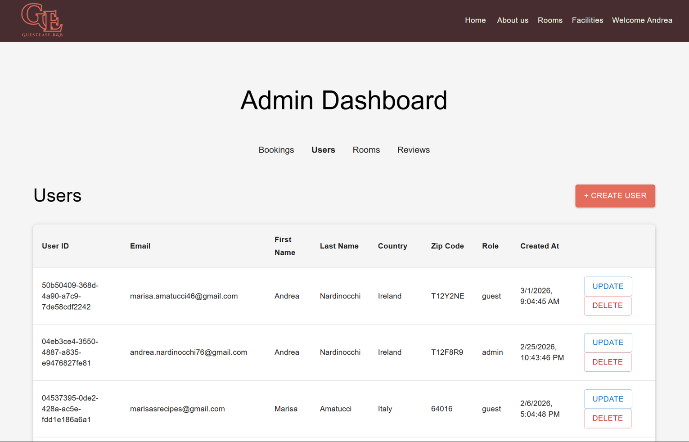

The file renders an admin page for managing users. The component stores multiple pieces of state that control modals, forms, filters, and notifications.

It begins several 'useState' hooks. For example, the modal used to create or edit a user is controlled like this:

```ts
const AdminUsersPage: React.FC = () => {
  const [openUserModal, setOpenUserModal] = useState(false);
  const [editingUser, setEditingUser] = useState<User | null>(null);

  // Controls whether the delete‑confirmation dialog is visible
  const [deleteDialogOpen, setDeleteDialogOpen] = useState(false);

  // Holds the ID of the user the user intends to delete
  // const [userToDelete, setUserToDelete] = useState<string | null>(null);
  const [userToDelete, setUserToDelete] = useState<{
    id: string;
    role: string | null;
  } | null>(null);

  // React Query client used for cache invalidation after mutations
  const queryClient = useQueryClient();
  // Controls visibility of the success snackbar
  const [snackbarOpen, setSnackbarOpen] = useState(false);

  // Stores the text that will appear inside the Snackbar
  const [snackbarMessage, setSnackbarMessage] = useState("");

  // We set a useState for the filters and leave the fields as empty
  const [filters, setFilters] = useState({
    search: "",
    email: "",
    first_name: "",
    last_name: "",
    country: "",
    role: "",
    created_at: "",
  });

  const [userForm, setUserForm] = useState({
    first_name: "",
    last_name: "",
    country: "",
    zip_code: "",
    email: "",
    role: "guest",
  });

```

The form used in the modal is also stored in state.

```ts
const [userForm, setUserForm] = useState({
  first_name: "",
  last_name: "",
  country: "",
  zip_code: "",
  email: "",
  role: "guest",
});
```

Whenever the admin types in the modal form, these values update.

Next, the component fetches users using React Query

```ts
const {
  data: profiles,
  isLoading,
  isError,
  error,
} = useQuery({
  queryKey: ["users"],
  queryFn: getUsers,
});
```

'profiles' contains the user list returned by the API getUsers in the **guestease-api.ts**, while 'isLoading' and 'isError' indicate the request status.

```ts
/**
 * Fetch all users from the Supabase "profles" table.
 * It uses the Supabase client to query the "profiles" table.
 * `.select("*")` retrieves every column for each profile.
 *
 * https://supabase.com/docs/reference/javascript/select
 */
export const getUsers = async () => {
  const { data, error } = await supabase.from("profiles").select("*");

  // If Supabase returns an error, we throw a descriptive exception
  if (error) {
    throw new Error(`Unable to fetch users: ${error.message}`);
  }
  return data;
};
```

When the admin wants to create a user, the modal is opened and the form is cleared.

```ts
const handleOpenCreateUser = () => {
  setEditingUser(null);
  setUserForm({
    first_name: "",
    last_name: "",
    email: "",
    role: "",
    country: "",
    zip_code: "",
  });
  setOpenUserModal(true);
};
```

Creating a user builds a new object from the form data and sends it to the backend.

```ts
const newUser = {
  first_name: userForm.first_name,
  last_name: userForm.last_name,
  email: userForm.email,
  role: userForm.role?.toLowerCase().trim(),
  country: userForm.country,
  zip_code: userForm.zip_code,
};
```

The API call 'adminCreateUserApi()' in **admin-users-api.ts** is then executed.

```ts
await adminCreateUserApi(newUser);
```

```ts
/**
 * Create User (Admin)
 * Sends a POST request to the admin backend to create a user.
 */
export const adminCreateUserApi = async (userForm: {
  first_name: string;
  last_name: string;
  email: string;
  role: string;
  country: string;
  zip_code: string;
}) => {
  const res = await fetch(`${backendUrl}/admin/create-user`, {
    method: "POST",
    headers: { "Content-Type": "application/json" },
    body: JSON.stringify(userForm),
  });

  const data = await res.json();
  if (!res.ok) {
    // alert(data.error || "Failed to save user");
    // We needed to throw an error to prevent the snackbar from popping up even
    // when the user being created was using an existing email and would fail
    throw new Error(data.error || "Failed to save user");
    // return;
  }

  return data;
};
```

The above API function calls the backend route **adminCreateUsers.js**. Let's now dive into how the backend works.

The request body is destructured to extract the fields required to create a user.

```js
const { first_name, last_name, email, role, country, zip_code } = req.body;
```

These values are expected to be sent from the frontend when an admin submits the 'create user' form.

The first validation step ensures all required fields exist.

The route then retrieves all users from Supabase Authentication.

```ts
// Fetch all users from Supabase Auth
// https://supabase.com/docs/reference/javascript/auth-admin-listusers
const { data: list, error: authError } = await supabase.auth.admin.listUsers();
```

This call queries Supabase’s authentication system and returns all registered users.

Next, the code checks if the email already exists.

```ts
// Find the user in the Auth list by matching email
const user = list.users.find((u) => u.email === email);

// If no user with this email exists in Auth, return an error
// If a user with this email already exists, return a conflict error
if (user) {
  return res.status(409).json({ error: "User with this email already exists" });
}
```

This searches through the Supabase user list for a matching email address.

If a match is found, the request stops with a conflict error, otherwise, the user creation process then begins inside a try block.

```ts
 try {
    // Generate a temporary password for the new user
    const password = Math.random().toString(36).slice(-10);

    /**
     * Create Supabase Auth user (admin-level)
     * This creates the authentication identity for the user.
     * https://supabase.com/docs/reference/javascript/auth-admin-createuser
     * */
    const { data, error } = await supabase.auth.admin.createUser({
      email,
      password,
      email_confirm: true,
      user_metadata: {
        role,
        first_name,
        last_name,
        country,
        zip_code,
      },
    });

```

A temporary password is generated using a random string. This password is only temporary because the user will later set their own password through a reset link.

The user is then created in Supabase Authentication. This creates the authentication identity, and the user_metadata object stores additional user details associated with the account.

We will later explain in a dedicated chapetr how the above information will get synchronized ith the 'profiles' table.

After the account is created, the user object is extracted, and a Stripe customer is created for the user.

```ts
const authUser = data.user;
/**
 * Create Stripe Customer
 * This returns a Stripe customer is which we store in the profile.
 * */
const stripeCustomerId = await createStripeCustomer(
  authUser.email,
  authUser.id,
);
```

This utility function calls the Stripe API and returns a customer ID, which will be linked to the user profile.

The system then stores user data in the profiles table.

```ts
/**
 * Upsert into 'profiles' table
 * Ensures the user column stripe_customer_id does have a value
 * https://supabase.com/docs/reference/javascript/upsert
 */
const { error: profileError } = await supabase.from("profiles").upsert({
  id: authUser.id,
  email: authUser.email,
  stripe_customer_id: stripeCustomerId,
  role: role,
});
```

'upsert' inserts the record if it does not exist, or updates it if it already does. This ensures the profile always contains a Stripe customer ID.

Next, the backend generates a password recovery link.

```ts
// This Supabase function will generate a link to generate a tokenized link
// baked into the 'Welcometo GuestEase' email that will be sent off.
// Basically, it is a CTA link which will land the user on the
// '/update-password/' page
const { data: reset } = await supabase.auth.admin.generateLink({
  type: "recovery",
  email,
  options: { redirectTo: `${frontendUrl}/update-password` },
});

// Fetching the tokenizedLink
const tokenizedLink = reset.properties.action_link;
```

This creates a secure tokenized link that allows the user to set their password. After clicking it, they are redirected to the frontend /update-password page.

The system then retrieves other data needed for the email taht will sent off to the new user

```ts
// Fetching the GuestEase logo from the Supabase storage
const logoUrl = getPublicUrl("assets", "GuestEaseLogo.png");

// Generate the full HTML for the booking confirmation email using the template
// and pass the below values
const html = userCreatedTemplate({
  authUser,
  logoUrl,
  tokenizedLink,
});

// Send confirmation email to the user that their account has been created
await fetch(`${backendUrl}/send_email`, {
  method: "POST",
  headers: { "Content-Type": "application/json" },
  body: JSON.stringify({
    email: authUser.email,
    subject: `Welcome to GuestEase ${authUser.user_metadata.first_name} 🎉`,
    body: html,
  }),
});
```

This function returns the full HTML markup for the welcome email, including the logo and password setup link.

This sends the welcome email containing the password setup link to the user.

If everything succeeds, the server returns a success response.

```js
// Success returns the user and temporary password
return res.status(201).json({
  success: true,
  user: data.user,
  tempPassword: password,
});
```

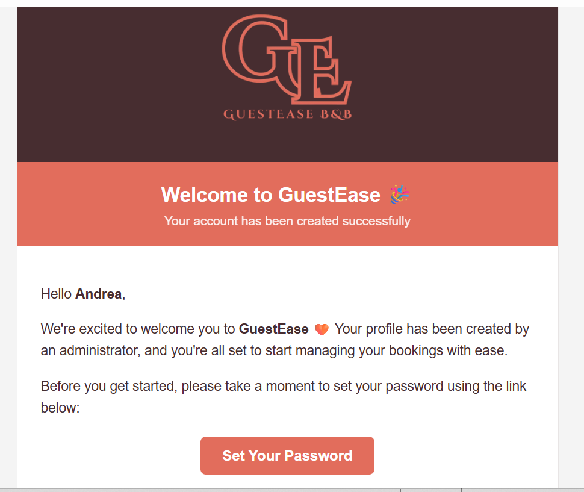

Going back to the **adminUsersPage.tsx**, after the user is created, React Query refreshes the cached data.

```ts
   await adminCreateUserApi(newUser);
      // This clears out the cache and allow us to see the created user without having to refresh the page
      // https://tanstack.com/query/v4/docs/framework/react/guides/query-invalidation
      queryClient.invalidateQueries({ queryKey: ["users"] });
      // Message to confirm the user has beeen created
      setSnackbarMessage("User created successfully!");
      setSnackbarOpen(true);
      setOpenUserModal(false);
    } catch (err: any) {
      setSnackbarMessage(err.message || "Something went wrong");
      setSnackbarOpen(true);
    }
  };
```

This triggers a refetch so the new user appears in the table immediately.

Updating a user works similarly but pre-fills the form with the selected user’s data.

```ts
// This time the form is filled as we are updating an existing user
const handleOpenUpdateUser = (u: User) => {
  setEditingUser(u);
  setUserForm({
    first_name: u.first_name ?? "",
    last_name: u.last_name ?? "",
    email: u.email ?? "",
    role: u.role?.toLowerCase().trim() || "guest",
    country: u.country ?? "",
    zip_code: u.zip_code ?? "",
  });
  setOpenUserModal(true);
};
```

The below function then will update the user by opening the modal and leveraging the API call 'adminUpdateUserApi()' in \*\*admin-users-api

```ts
const handleUpdateUser = async () => {
  try {
    const updatedUser = {
      first_name: userForm.first_name,
      last_name: userForm.last_name,
      email: userForm.email,
      role: userForm.role?.toLowerCase().trim(),
      country: userForm.country,
      zip_code: userForm.zip_code,
    };
    await adminUpdateUserApi(updatedUser);
    // This clears out the cache and allow us to see the updated user without having to refresh the page
    // https://tanstack.com/query/v4/docs/framework/react/guides/query-invalidation
    queryClient.invalidateQueries({ queryKey: ["users"] });
    // Message to confirm the user has been updated
    setSnackbarMessage("User updated successfully!");
    setSnackbarOpen(true);
    setOpenUserModal(false);
  } catch (err: any) {
    setSnackbarOpen(err.message || "Something went wrong");
    setOpenUserModal(false);
  }
};
```

We can take a look athe API call below

```ts
/**
 * Update User (Admin)
 */
export const adminUpdateUserApi = async (userForm: {
  first_name: string;
  last_name: string;
  email: string;
  role: string;
  country: string;
  zip_code: string;
}) => {
  const res = await fetch(`${backendUrl}/admin/update-user`, {
    method: "POST",
    headers: { "Content-Type": "application/json" },
    body: JSON.stringify(userForm),
  });

  const data = await res.json();

  if (!res.ok) {
    throw new Error(data.error || "Failed to update user");
  }

  return data;
};
```

It receives the user object to be updated and POST a request to the backend **adminUpdateUsers.js**.

We will now focus on this file.

When the frontend calls this route, the backend receives the updated user data in the request body, and the email is used as the unique identifier to find the correct user.
If no email is provided, the request stops immediately.

```js

// ADMIN Update user
router.post("/admin/update-user", async (req, res) => {
  try {
    // Extract all fields sent from the frontend
    const updates = req.body;
    // We use email as the unique identifier for updating users
    const email = updates.email;

    // If no email is provided, we cannot identify the user
    if (!email) {
      return res.status(400).json({ error: "Missing email" });
    }


```

The server then fetches all users from Supabase Authentication.

```js
// Fetch all users from Supabase Auth
// https://supabase.com/docs/reference/javascript/auth-admin-listusers
const { data: list, error: authError } = await supabase.auth.admin.listUsers();

// If Supabase Auth fails, return an error
if (authError) {
  return res.status(404).json({ error: "Auth user not found" });
}
```

Next, the code searches the authentication list for a user with the matching email.

If no user is found, the request stops.

```js
// Find the user in the Auth list by matching email
const user = list.users.find((u) => u.email === email);

// If no user with this email exists in Auth, return an error
if (!user) {
  return res.status(404).json({ error: "Auth user not found" });
}
```

Once the user is found, their Supabase Auth ID is extracted, and the user’s metadata in Supabase Auth is then updated.

```js
// Extract the Supabase Auth user ID
const authUserId = user.id;

// Update the user's metadata in Supabase Auth
// https://supabase.com/docs/reference/javascript/auth-admin-updateuserbyid
const { error: authUpdateError } = await supabase.auth.admin.updateUserById(
  authUserId,
  {
    user_metadata: {
      first_name: updates.first_name,
      last_name: updates.last_name,
      role: updates.role,
      country: updates.country,
      zip_code: updates.zip_code,
    },
  },
);
```

The role is also updated in the profiles table to ensure that it is in sync with auth.users:

```js
// Update role in the public.profiles table
const { error: profileError } = await supabase
  .from("profiles")
  .update({ role: updates.role })
  .eq("email", updates.email);

if (profileError) {
  return res.status(400).json({ error: profileError.message });
}

// Everything succeeded — return the updated user
return res.json({
  message: "User updated successfully",
  // data,
});
```

Once the user is updated, the query will be invalidate to get the cache cleared out and show the updated user data immediately on the dashboard.

Deleting a user starts by opening the confirmation dialog.

```ts
// This handles the delete confirmation modal
const handleOpenDeleteUser = (id: string, role: string | null) => {
  setUserToDelete({ id, role });
  setDeleteDialogOpen(true);
};
```

Then, the below function will handle the delete user flow

```ts
// This handles the delete user logic
const handleDeleteUser = async (id: string, role: string | null) => {
  // if no user to delete, stop
  if (!userToDelete) return;
  try {
    await adminDeleteUserApi(id, role);
    // This clears out the cache and allows us to remove instantly the user on the UI
    // https://tanstack.com/query/v4/docs/framework/react/guides/query-invalidation
    queryClient.invalidateQueries({ queryKey: ["users"] });
    // Message to confirm the user has beeen deleted
    setSnackbarMessage("User deleted successfully!");
    setSnackbarOpen(true);
    setOpenUserModal(false);
  } catch (err: any) {
    setSnackbarMessage(err.message || "Something went wrong");
    setSnackbarOpen(true);
  } finally {
    // https://developer.mozilla.org/en-US/docs/Web/JavaScript/Reference/Statements/try...catch#syntax
    setDeleteDialogOpen(false);
    setUserToDelete(null);
  }
};
```

leveraging the 'adminDeleteUserApi()' function in **admin-users-api.ts**

```ts
/**
 * Delete User (Admin)
 */
export const adminDeleteUserApi = async (id: string, role: string | null) => {
  const res = await fetch(`${backendUrl}/admin/delete-user`, {
    method: "POST",
    headers: { "Content-Type": "application/json" },
    body: JSON.stringify({ userId: id }),
  });

  const data = await res.json();

  if (!res.ok) {
    throw new Error(data.error || "Failed to delete user");
  }

  return data;
};
```

The backend route **adminDeleteUsers.js** is a pretty straightforward file

```js
import express from "express";
import { supabase } from "../supabaseClientBackend.js";

/**
 * express.Router is a way to organize related routes together. This will allow us to apply
 * middleware for different parts of our app.
 *
 * https://www.geeksforgeeks.org/web-tech/express-js-express-router-function/
 */
const router = express.Router();

// ADMIN Delete user
router.post("/admin/delete-user", async (req, res) => {
  // Retrieving the user id from the body
  const { userId, role } = req.body;

  /**
   * To be able to show a message stating that the user cannot be deleted
   * as long as they have upcoming bookings, we first check if they have any by
   * fetching them from Supabase
   */
  const { data: bookings, error: bookingsError } = await supabase
    .from("bookings")
    .select("id, check_out")
    .eq("user_id", userId);
  if (bookingsError) {
    return res.status(500).json({ error: "Error checking user bookings." });
  }

  const today = new Date();

  /**
   * We create an array of bookings which are upcoming ones
   * The check_out date must be bigger than today's date
   */
  const upcomingBookings = (bookings ?? []).filter((b) => {
    const checkout = new Date(b.check_out);
    return checkout >= today;
  });

  // If there upcoming bookings, we will show the below error message for a better UI experience
  if (upcomingBookings.length > 0) {
    return res.status(400).json({
      error: "User cannot be deleted because they still have active bookings.",
    });
  }

  /**
   * Delete the user from Supabase Auth
   * This removes the authentication identity (email/password, login access).
   * If this fails, we stop immediately and return an error.
   * https://supabase.com/docs/reference/javascript/auth-admin-deleteuser
   * */
  const { error: authError } = await supabase.auth.admin.deleteUser(userId);

  if (authError) return res.status(400).json({ error: authError.message });

  // Otherwise, return a success response to the client.
  res.json({ success: true });
});

export default router;
```

In a nutshell, we first need to check that the user does not have any upcoming boookings (active) and we do that by iterating through the bookings, creating a check_out date with the Date() constructor and then comparing them with today's date.

Once confirmed, the API call deletes the user and the query cache is invalidated again in the parent file so the UI updates.

Every row shows the user’s information and includes Update and Delete buttons.

```ts
<Button onClick={() => handleOpenUpdateUser(u)}>Update</Button>
<Button onClick={() => handleOpenDeleteUser(u.id, u.role)}>Delete</Button>
```

At the bottom, the component renders the modal used for creating or editing users, a snackbar for feedback messages, and the alert dialog slide for the user deletion.

```ts
<AdminUserModal
          open={openUserModal}
          onClose={() => setOpenUserModal(false)}
          // If editing the user than handle update user, otherwise create it
          onSave={editingUser ? handleUpdateUser : handleCreateUser}
          countries={countries ?? []}
          editingUser={editingUser}
          userForm={userForm}
          setUserForm={setUserForm}
        />
        {/* https://mui.com/material-ui/react-snackbar/ */}
        <Snackbar
          open={snackbarOpen}
          autoHideDuration={3000}
          onClose={() => setSnackbarOpen(false)}
          message={snackbarMessage}
        />
        <AlertDialogSlide
          open={deleteDialogOpen}
          onClose={() => setDeleteDialogOpen(false)}
          onConfirm={async () => {
            // We state that these 2 values are not null via the non‑null assertion operator
            // https://learntypescript.dev/07/l2-non-null-assertion-operator
            handleDeleteUser(userToDelete!.id, userToDelete!.role);
          }}
        />
```

Overall, the component acts as a complete admin CRUD interface that fetches users, displays them in a table, allows filtering, and performs create, update, and delete operations while keeping the UI synchronized with the backend.

### Source attributions

- https://tanstack.com/query/latest/docs/framework/react/reference/useQuery
- https://tanstack.com/query/latest/docs/framework/react/quick-start
- https://tanstack.com/query/v4/docs/framework/react/guides/query-invalidation
- https://developer.mozilla.org/en-US/docs/Web/JavaScript/Reference/Statements/try...catch#syntax
- https://developer.mozilla.org/en-US/docs/Web/CSS/overflow-x
- https://mui.com/material-ui/react-snackbar/
- https://learntypescript.dev/07/l2-non-null-assertion-operator

## Admin Rooms page

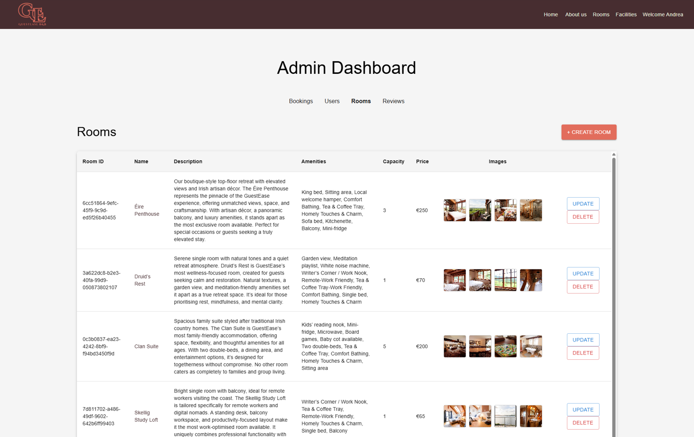

This page enables the admin to create, read, update, and delete rooms (CRUD).

Rooms are fetched using React Query.

```ts
const {
  data: rooms,
  isLoading,
  isError,
  refetch,
} = useQuery({
  queryKey: ["rooms"],
  queryFn: getRooms,
});
```

The 'getRooms()' in **guestease-api.ts** runs and returns the list of rooms fetched straight from Supabase (no sensitive data is shown, therefore, the function can run client-side).

```ts
/**
 * Fetch all rooms from the Supabase "rooms" table.
 * It uses the Supabase client to query the "rooms" table.
 * `.select("*")` retrieves every column for each room.
 *
 * https://supabase.com/docs/reference/javascript/select
 */
export const getRooms = async () => {
  const { data, error } = await supabase.from("rooms").select("*");

  // If Supabase returns an error, we throw a descriptive exception
  if (error) {
    throw new Error(`Unable to fetch rooms: ${error.message}`);
  }
  return data;
};
```

The component stores UI state using `useState`.

```tsx
const [openRoomModal, setOpenRoomModal] = useState(false);
```

Controls whether the create/update modal is visible.

```tsx
const [selectedFiles, setSelectedFiles] = useState<File[]>([]);
```

Stores images chosen by the admin before uploading.

```tsx
const [editingRoom, setEditingRoom] = useState<Room | null>(null);
```

If this has a room value, the modal is in **update mode**.

```tsx
const [existingImages, setExistingImages] = useState<string[]>([]);
```

Keeps images already stored in the database.

---

Snackbar state shows success messages.

```tsx
const [snackbarOpen, setSnackbarOpen] = useState(false);
const [snackbarMessage, setSnackbarMessage] = useState("");
```

Example:

```tsx
setSnackbarMessage("Room created successfully!");
setSnackbarOpen(true);
```

---

Delete dialog state tracks confirmation before deleting.

```tsx
const [deleteDialogOpen, setDeleteDialogOpen] = useState(false);
const [roomToDelete, setRoomToDelete] = useState<string | null>(null);
```

Example:

```tsx
setRoomToDelete(r.id);
setDeleteDialogOpen(true);
```

Form data for creating or editing a room.

```tsx
const [roomForm, setRoomForm] = useState({
  name: "",
  description: "",
  amenities: "",
  capacity: "",
  price: "",
});
```

The room creation is handled by the below function Opening the **create modal** clears the form.
where the form fields are empty as we open the modal (setEditingRoom mustbe null as we are creating and not updating).

```tsx
const handleOpenCreateRoom = () => {
  setEditingRoom(null);
  setRoomForm({
    name: "",
    description: "",
    amenities: "",
    capacity: "",
    price: "",
  });
  setOpenRoomModal(true);
};
```

At this point, we create the variable 'createRoom' which will leverage the 'useAdminCreateRoom()' hook in **useAdminCreateRoom.ts**.

However, to use the below hook, we first need to create the roomPayload (normalized) through the handleSaveRoom function

```ts
/**
   * Create Room handler which builds a room payload,
   * then triggers the React Query mutation.
   * https://tanstack.com/query/latest/docs/framework/react/reference/useMutation
   * */
  const handleSaveRoom = async () => {
    try {
      // Normalize and prepare data for Supabase
      const roomPayload = {
        name: roomForm.name.trim(),
        // trim(): https://developer.mozilla.org/en-US/docs/Web/JavaScript/Reference/Global_Objects/String/trim
        description: roomForm.description.trim(),
        amenities: roomForm.amenities
          .split(",")
          // Amenities are an array of strings
          .map((a) => a.trim())
          // .filter(Boolean) removes empty or falsy values from the array after splitting.
          // https://www.geeksforgeeks.org/javascript/how-to-remove-falsy-values-from-an-array-in-javascript/
          .filter(Boolean),
        capacity: Number(roomForm.capacity),
        price: Number(roomForm.price),
      };

```

We then send the 'roomPayload' to the useAdminCreateRoom() hook and 'mutate' it through the React Query mutation

```ts
// Create the room first
const result = await createRoom.mutateAsync(roomPayload);
```

```ts
import { useMutation, useQueryClient } from "@tanstack/react-query";
import { supabase } from "../supabase/supabaseClient";

interface RoomPayload {
  name: string;
  description: string;
  amenities: string[];
  capacity: number;
  price: number;
}

/**
 * React Query’s useMutation creates the room, then invalidates the
 * cached "rooms" query so fresh data is refetched.
 * Local form state mirrors the room data, and useEffect keeps it synced
 * whenever the room query returns new values from Supabase.
 * https://tanstack.com/query/v4/docs/framework/react/guides/mutations
 * https://tanstack.com/query/v4/docs/framework/react/guides/query-invalidation
 */
export function useAdminCreateRoom() {
  const queryClient = useQueryClient();

  // This will insert the room in the supabase 'rooms' table
  return useMutation({
    mutationFn: async (payload: RoomPayload) => {
      const { data, error } = await supabase
        .from("rooms")
        .insert([payload])
        .select("id")
        .single();
      if (error) throw error;
      return data;
    },

    onSuccess: () => {
      // Refresh rooms list
      queryClient.invalidateQueries({ queryKey: ["rooms"] });
    },
  });
}
```

In it, we pass the RoomPayload, essentially created by the user when filleg the above-mentioned form. At that point, we use React Query's useMutation to insert the room into the Supabase 'rooms' table, and get the room list refreshed by invalidating the query.

The database then returns the room object created and we fetch its id.

```ts
const roomId = result.id;
```

Next the code prepares to upload images through an array of file paths of uploaded images, which are uploaded only if the admin has selecetd them:

```ts
// Upload images
      let uploadedImages: string[] = [];
      if (selectedFiles.length > 0) {
        uploadedImages = await uploadRoomImages(roomId, selectedFiles);
      }
/**
 * Examples [
  "rooms/a77ddc44/image1.jpg",
  "rooms/a77ddc44/image2.jpg"

  These are Supabase storage paths as per https://supabase.com/dashboard/project/xxxxxxxxxxxxxxxxxxxxx/storage/files/buckets/assets
]

Ex.
selectedFiles = [
  File("room1.jpg"),
  File("room2.jpg")
]
```

The 'uploadRoomImages()' helper is in the **util/uploadedImages.ts**:

```ts
import { supabase } from "../supabase/supabaseClient";

/**
 * This utility uploads an array of File objects to Supabase Storage.
 * Each file is placed under: rooms/<roomId>/<timestamp>-<sanitizedName>
 * https://supabase.com/docs/guides/storage
 * https://developer.mozilla.org/en-US/docs/Web/API/File/name
 */
export const uploadRoomImages = async (roomId: string, files: File[]) => {
  // This creates a List variable to which we will be pushing the uploaded images
  const uploadedPaths: string[] = [];

  // Sequential Reading Function
  // https://kanhaji.medium.com/read-files-in-javascript-like-a-hero-you-are-with-async-await-16841814ea41
  for (const file of files) {
    // Replace unsafe characters in filenames to avoid storage path issues.
    // https://developer.mozilla.org/en-US/docs/Web/JavaScript/Guide/Regular_expressions
    const safeImageName = file.name.replace(/[^a-zA-Z0-9.\-_]/g, "_");
    /**
     * Prefix with folder + timestamp to avoid collisions.
     * https://developer.mozilla.org/en-US/docs/Web/JavaScript/Reference/Global_Objects/Date/now
     * */
    const filePath = `rooms/${roomId}/${Date.now()}-${safeImageName}`;

    // Upload to Supabase Storage bucket named 'assets'.
    // https://supabase.com/docs/reference/javascript/storage-from-upload
    const { data, error } = await supabase.storage
      .from("assets")
      .upload(filePath, file);

    if (!error && data) {
      // We then 'push' the filePath to the uploadedPaths list
      uploadedPaths.push(filePath);
    }
  }

  return uploadedPaths;
};
```

Finally, we save the image paths into Supabase (uploadedImages = uploadedPaths) and complete the room creation.

```ts

 // Save image paths into the room
      if (uploadedImages.length > 0) {
        const { error: imgError } = await supabase
          .from("rooms")
          .update({ images: uploadedImages })
          .eq("id", roomId);

        if (imgError) throw imgError;
      }
      setSnackbarMessage("Room created successfully!");
      setSnackbarOpen(true);
      // Refresh rooms list
      // https://tanstack.com/query/v4/docs/framework/react/reference/useQuery
      refetch();
      setOpenRoomModal(false);
      setSelectedFiles([]);
    } catch (err) {
      console.error("Error saving room:", err);
    }
  };

```

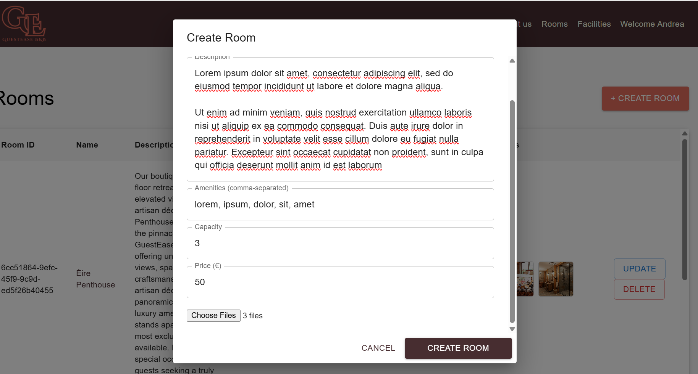

The update function allows the admin to modify an existing room and update its images. When the admin clicks 'Update', the selected room is stored in 'editingRoom'.

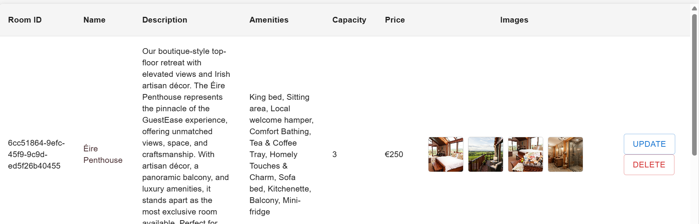

The 'handleOpenUpdateRoom' function prepares the update modal with the data of the selected room so the admin can edit it.

First, the function receives a room object 'r and extracts its existing images. These are stored in state so the modal can display the current images and allow the admin to keep or remove them.

```ts
const imgs = r.images;
setExistingImages(imgs);
```

Next, the selected room is stored in the 'editingRoom' state. This lets the application know that the modal is in 'edit mode' rather than create mode.

```ts
setEditingRoom(r);
```

The form fields are then pre-filled with the room’s current data so the admin can see and modify it. Some values are converted into formats suitable for form inputs. For example, the amenities array is converted into a comma-separated string, and numeric values are converted to strings.

```ts
setRoomForm({
  name: r.name,
  description: r.description ?? "",
  amenities: (r.amenities ?? []).join(", "),
  capacity: String(r.capacity ?? ""),
  price: String(r.price ?? ""),
});
```

The selected files state is cleared to ensure that previously uploaded files are not reused unintentionally. Finally, the modal is opened so the admin can edit the room details.

```ts
setSelectedFiles([]);
setOpenRoomModal(true);
```

The 'handleUpdateRoom' function first checks that a room is currently being edited before continuing.

```ts
if (!editingRoom) return;
```

If the admin selects new images, they are uploaded to Supabase Storage using the 'uploadRoomImages()' utility in **utils/uploadRoomImages.ts**. The returned paths are stored in 'newUploadedImages' list variable.

```ts
// We create a variable string for new uploaded images
let newUploadedImages: string[] = [];
// If any image file is selected...
if (selectedFiles.length > 0) {
  // ... then we upload via the uploadRoomImages, which will push them to the newUploadedImages list
  newUploadedImages = await uploadRoomImages(editingRoom.id, selectedFiles);
}
```

Next, the system merges the existing images with the newly uploaded ones using the spread operator. This ensures previously stored images are preserved when new ones are added.

```ts
// We finally create an overarching finalImages list encompassing the below lists through the spread operator
const finalImages = [...existingImages, ...newUploadedImages];
```

The room data is then updated using a React Query mutation. This sends the updated fields and the full image list to the database.

```ts
.....
const updateRoom = useAdminUpdateRoom();

......

// Update room details with images included now
await updateRoom.mutateAsync({
  id: editingRoom.id,
  name: roomForm.name,
  description: roomForm.description,
  amenities: roomForm.amenities
    .split(",")
    // Amenities are an array of strings
    .map((a) => a.trim())
    // .filter(Boolean) removes empty or falsy values from the array after splitting.
    // https://www.geeksforgeeks.org/javascript/how-to-remove-falsy-values-from-an-array-in-javascript/
    .filter(Boolean),
  capacity: Number(roomForm.capacity),
  price: Number(roomForm.price),
  images: finalImages,
});
```

The useAdminUpdateRoom() hook can be observed in **hooks/useAdminUpdateRoom.ts**

```ts
import { useMutation, useQueryClient } from "@tanstack/react-query";
import { supabase } from "../supabase/supabaseClient";

interface RoomPayload {
  id: string;
  name: string;
  description: string;
  amenities: string[];
  capacity: number;
  price: number;
  images: string[];
}

/**
 * React Query’s useMutation updates the room,  then invalidates the
 * cached "rooms" query so fresh data is refetched.
 * Local form state mirrors the room data, and useEffect keeps it synced
 * whenever the room query returns new values from Supabase.
 * https://tanstack.com/query/v4/docs/framework/react/guides/mutations
 * https://tanstack.com/query/v4/docs/framework/react/guides/query-invalidation
 */
export function useAdminUpdateRoom() {
  const queryClient = useQueryClient();

  // This will insert the room in the supabase 'rooms' table
  return useMutation({
    mutationFn: async (payload: RoomPayload) => {
      const { id, ...restOfRoomData } = payload;
      const { data, error } = await supabase
        .from("rooms")
        .update(restOfRoomData)
        .eq("id", id)
        .select("id")
        .single();
      if (error) throw error;
      return data;
    },

    // As we now have 2 args, we need to add a dummy one
    // for the second query invalidation (_)
    onSuccess: (_, payload) => {
      // Refresh rooms list
      queryClient.invalidateQueries({ queryKey: ["rooms"] });
      queryClient.invalidateQueries({ queryKey: ["rooms", payload.id] });
    },
  });
}
```

To be noticed that we are invalidating 2 different queries:

- ["rooms"] refreshes the rooms list used in the admin dashboard.
- ["rooms", payload.id] refreshes the single-room query used in room detail views.

After the update is successful, the UI is refreshed so the updated data appears immediately in the table.

```ts
// Refresh rooms list
// https://tanstack.com/query/v4/docs/framework/react/reference/useQuery
refetch();
```

In summary, the update function uploads any new images, merges them with the existing ones, updates the room record through a React Query mutation, and then refreshes the rooms list so the changes appear in the admin dashboard.

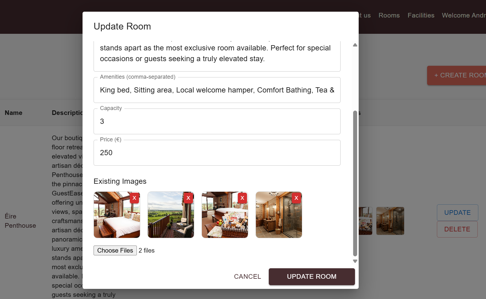

The delete follows a 'confirmation-first pattern' as in the rest of the delete flows across the pages. Instead of immediately deleting a room when the user clicks the delete button, the UI first stores the selected room ID and opens a confirmation dialog.

```ts
// Holds the ID of the room the user intends to delete
const [roomToDelete, setRoomToDelete] = useState<string | null>(null);
```

Only after the admin confirms the action does the actual deletion mutation run.

When the rooms are rendered in the table, each row includes a 'Delete button'.

Clicking this button does not delete the room directly. Instead, it sets two pieces of state: the ID of the room that should potentially be deleted and a boolean that opens the confirmation dialog.

```tsx
<Button
  variant="outlined"
  color="error"
  onClick={() => {
    setRoomToDelete(r.id);
    setDeleteDialogOpen(true);
  }}
>
  Delete
</Button>
```

Here, 'setRoomToDelete(r.id)' stores the selected room’s ID in state, while 'setDeleteDialogOpen(true)' opens the confirmation modal. This ensures the application knows which room is targeted before the admin confirms the action.

The confirmation dialog itself is rendered through the 'AlertDialogSlide' component. It receives three props: the open state, a close handler, and a confirm handler. The confirm handler calls the delete function with the stored room ID.

```tsx
<AlertDialogSlide
  open={deleteDialogOpen}
  onClose={() => setDeleteDialogOpen(false)}
  onConfirm={() => handleDeleteRoom(roomToDelete ?? "")}
/>
```

Once the admin confirms the deletion in the dialog, the 'handleDeleteRoom' function is executed. This function triggers a React Query mutation using the custom 'useAdminDeleteRoom()' hook in **useAdminDeleteRoom.ts**.

```ts
import { useMutation, useQueryClient } from "@tanstack/react-query";
import { supabase } from "../supabase/supabaseClient";

interface RoomToDelete {
  id: string;
}

/**
 * React Query’s useMutation updates the room,  then invalidates the
 * cached "rooms" query so fresh data is refetched.
 * Local form state mirrors the room data, and useEffect keeps it synced
 * whenever the room query returns new values from Supabase.
 * https://tanstack.com/query/v4/docs/framework/react/guides/mutations
 * https://tanstack.com/query/v4/docs/framework/react/guides/query-invalidation
 */
export function useAdminDeleteRoom() {
  const queryClient = useQueryClient();

  // This will insert the room in the supabase 'rooms' table
  return useMutation({
    mutationFn: async (room: RoomToDelete) => {
      // const { id, ...restOfRoomData } = payload;
      const { data, error } = await supabase
        .from("rooms")
        .delete()
        .eq("id", room.id);
      if (error) throw error;
      return data;
    },

    onSuccess: () => {
      // Refresh rooms list
      queryClient.invalidateQueries({ queryKey: ["rooms"] });
    },
  });
}
```

The function first guards against accidental execution by checking whether 'roomToDelete' exists. It then calls 'deleteRoom.mutateAsync({ id })', which sends the deletion request to the hook where the deletion occurs straight into the Supabase 'rooms' table:

```tsx
const deleteRoom = useAdminDeleteRoom();

const handleDeleteRoom = async (id: string) => {
  if (!roomToDelete) return;

  await deleteRoom.mutateAsync({ id });
  setSnackbarMessage("Room deleted successfully!");
  setSnackbarOpen(true);
  // https://developer.mozilla.org/en-US/docs/Web/JavaScript/Reference/Statements/try...catch#syntax
  setDeleteDialogOpen(false);
  setRoomToDelete(null);
  // Refresh rooms list
  // https://tanstack.com/query/v4/docs/framework/react/reference/useQuery
  refetch();
};
```

After the mutation succeeds, the UI updates to reflect the change.

A snackbar message is shown to notify the admin that the room was deleted, the dialog is closed, and the stored room ID is cleared. Finally, 'refetch()' is called to reload the rooms list using React Query so the deleted room disappears from the table.

Finally, a close look is worth taking at the image path whose explanation can be checked in the below comment:

```ts

 {images.map((img: any) => {
                          // This reflects the image path we have in supabase storage
                          // const fullPath = `rooms/${r.id}/${img}`;
                          const fullPath = img;
                          // console.log("IMG VALUE:", img);

                          return (
                            
                          );
                        })}

```

Overall, the flow works like this: clicking delete sets the target room and opens a confirmation dialog, confirming triggers a mutation that deletes the room from the database, and the UI refreshes to show the updated data while displaying a success notification. This pattern prevents accidental deletions and keeps the interface synchronized with the backend state.

### Source attributions

- https://tanstack.com/query/latest/docs/framework/react/reference/useQuery
- https://tanstack.com/query/latest/docs/framework/react/quick-start
- https://tanstack.com/query/latest/docs/framework/react/reference/useMutation
- https://tanstack.com/query/v4/docs/framework/react/reference/useQuery
- https://developer.mozilla.org/en-US/docs/Web/API/File
- https://developer.mozilla.org/en-US/docs/Web/JavaScript/Reference/Global_Objects/String/trim
- https://www.geeksforgeeks.org/javascript/how-to-remove-falsy-values-from-an-array-in-javascript/
- https://developer.mozilla.org/en-US/docs/Web/JavaScript/Reference/Statements/try...catch
- https://developer.mozilla.org/en-US/docs/Web/CSS/overflow-x
- https://mui.com/material-ui/react-snackbar/

## Admin Reviews Page

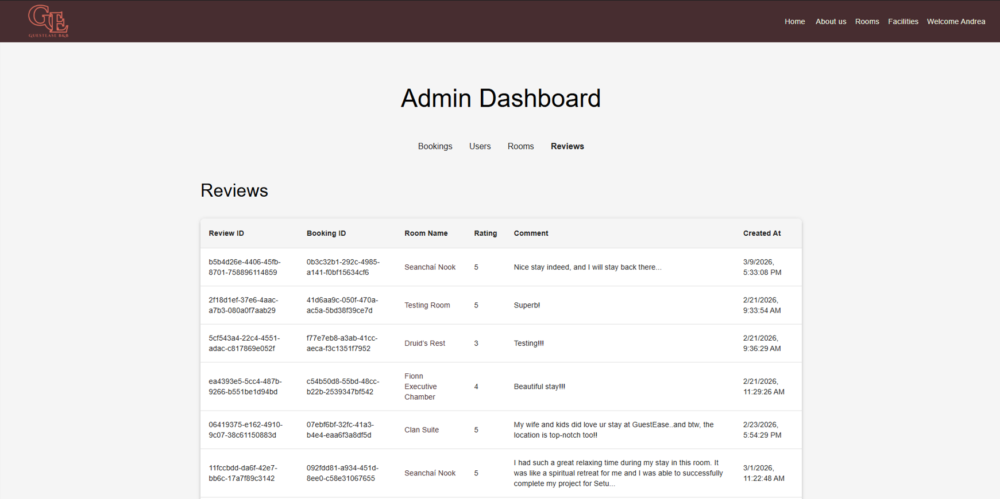

This page defines an admin dashboard that displays guest reviews.

First and foremost, it fetches data by using React Query by leveraging the 'useAdminFetchingReviews()' and the 'useAdminFetchingRooms()' hooks:

```ts
const { data: reviews, isLoading, error } = useAdminFetchingReviews();
const { data: rooms } = useAdminFetchingRooms();
```

**hooks/useAdminFetchingReviews.ts**

```ts
import { useQuery } from "@tanstack/react-query";
import { getReviews } from "../api/guestease-api";

export const useAdminFetchingReviews = () => {
  return useQuery({
    queryKey: ["reviews"],
    queryFn: () => getReviews(),
  });
};
```

**hooks/useAdminFetchingRooms.ts**

```ts
import { useQuery } from "@tanstack/react-query";
import { getRooms } from "../api/guestease-api";

export const useAdminFetchingRooms = () => {
  return useQuery({
    queryKey: ["rooms"],
    queryFn: () => getRooms(),
  });
};
```

which they, in turn, call in the API functions 'getReviews()' and 'getRooms()' in the **api/guestease-api.ts**

```ts

/**
 * Fetch all reviews from the Supabase "reviews" table.
 * It uses the Supabase client to query the "reviews" table.
 * `.select("*")` retrieves every column for each profile.
 *
 * https://supabase.com/docs/reference/javascript/select
 */
export const getReviews = async () => {
  const { data, error } = await supabase.from("reviews").select("*");

  // If Supabase returns an error, we throw a descriptive exception
  if (error) {
    throw new Error(`Unable to fetch reviews: ${error.message}`);
  }
  return data;
};

...

/**
 * Fetch all rooms from the Supabase "rooms" table.
 * It uses the Supabase client to query the "rooms" table.
 * `.select("*")` retrieves every column for each room.
 *
 * https://supabase.com/docs/reference/javascript/select
 */
export const getRooms = async () => {
  const { data, error } = await supabase.from("rooms").select("*");

  // If Supabase returns an error, we throw a descriptive exception
  if (error) {
    throw new Error(`Unable to fetch rooms: ${error.message}`);
  }
  return data;
};


```

Each row displays the review information such as the review ID, booking ID, rating, and comment.

```ts
<TableCell>{r.id}</TableCell>
<TableCell>{r.booking_id}</TableCell>
<TableCell>{r.rating}</TableCell>
<TableCell>{r.comment}</TableCell>
```

The room name is rendered as a clickable link that navigates to the room page using React Router.

```ts
<Box component={Link} to={`/room/${r.room_id}`}>
  {getRoomName(r.room_id, rooms)}
</Box>
```

The helper function 'getRoomName' in **utils/getRoomNames.ts** converts the room ID from the review into a readable room name using the rooms data.

```ts
/**
 * Safely returns the room name for a given roomId.
 * If the room is not found, returns a readable fallback.
 */
export const getRoomName = (
  roomId: string,
  rooms: { id: string; name: string }[] | undefined,
): string => {
  return (
    rooms?.find((r) => r.id === roomId)?.name || `Unknown room (${roomId})`
  );
};
```

Overall, the component separates concerns effectively: data fetching is handled by custom hooks using TanStack Query, filtering logic is encapsulated in another hook, and the component itself focuses on rendering the user interface using Material UI components.

### Source attributions

- https://tanstack.com/query/latest/docs/framework/react/reference/useQuery
- https://tanstack.com/query/latest/docs/framework/react/quick-start
- https://developer.mozilla.org/en-US/docs/Web/CSS/overflow-x

## Admin dashboard filters

In the admin dashboard, the Admin Bookings, Admin Rooms, and Admin Users pages all use the same filtering approach.

Each page stores filter inputs in useState() and passes them to a filtering function or custom hook that returns the filtered dataset. To avoid repetition, the explanation below focuses only on the Admin Bookings filtering logic, but the same pattern is used across the other admin pages.

The filter state is created with 'useState'. Each field represents a possible filter the admin can apply.

```ts
// We set a useState for the filters and leave the fields as empty
const [filters, setFilters] = useState({
  search: "",
  room: "",
  first_name: "",
  last_name: "",
  email: "",
  check_in: "",
  check_out: "",
  created_at: "",
  guests: "",
});
```

This object stores all filter inputs. Initially everything is empty, meaning no filtering is applied. As the admin types or selects values in the filter UI, the values inside this object are updated.

The UI that updates these filters is a separate component in **components/bookingFiltersUI.tsx**.

```tsx
<BookingFilterUI
  filters={filters}
  setFilters={setFilters}
  rooms={rooms ?? []}
/>
```

This component receives the filter state and the setter function as per its props:

```ts
/**
 * Props for the BookingFilterUI component.
 */
interface BookingFilterUIProps {
  filters: any;
  setFilters: (filters: any) => void;
  rooms: { id: string; name: string }[];
}
```

When the admin types in a field or selects a room, the component updates the corresponding property in the 'filters' object using 'setFilters'.

Example after the admin interacts with the UI:

```ts
filters = {
  search: "smith",
  room: "Clan Suite",
  first_name: "",
  last_name: "",
  email: "",
  check_in: "",
  check_out: "",
  created_at: "",
  guests: "",
};
```

The actual filtering happens through the function 'useFilteredBookings()' in a custom hook called **useFilteredBookings.tsx**. The page calls the hook and passes the original bookings data, the rooms data, and the filters object.

```ts
const filteredBookings = useFilteredBookings(bookings, rooms, filters);
```

**useFilteredBookings.tsx**

```ts
import { getRoomName } from "../utils/getRoomName";

export function useFilteredBookings(
  bookings: any[] | undefined,
  rooms: any[] | undefined,
  filters: any,
) {
  const list = bookings ?? [];
  const roomList = rooms ?? [];

  return list.filter((b: any) => {
    // Creating search variable
    const search = filters.search.toLowerCase();

    // Filtered data
    // https://www.kindacode.com/article/how-to-create-a-filter-search-list-in-react
    // https://www.cybrosys.com/blog/how-to-build-a-search-bar-to-filter-data-in-react
    // https://developer.mozilla.org/en-US/docs/Web/JavaScript/Reference/Global_Objects/Array/includes
    const searchString = [
      b.id,
      b.first_name,
      b.last_name,
      b.user_email,
      getRoomName(b.room_id, roomList),
      b.check_in,
      b.check_out,
      b.guests,
      b.total_price,
      new Date(b.created_at).toLocaleString(),
      b.charged,
    ]
      // We combine all the booking fields to be able to search anything that is included in the rows
      .join(" ")
      .toLowerCase();

    // Check if the global search text appears anywhere in the combined search string
    const matchesSearch = searchString.includes(search);

    // Match room by exact room_id (empty filter means "match all")
    const matchesRoom = filters.room
      ? String(b.room_id) === String(filters.room)
      : true;

...

// A read out here would be: 'Check if the booking matches the first name filter.
// If a first name filter exists, then verify that the booking’s first name contains
// the filter text (ignoring case). If no filter is provided, return true so the booking is not excluded'

...
    // Match first name (case‑insensitive)
    const matchesFirst = filters.first_name
      ? b.first_name?.toLowerCase().includes(filters.first_name.toLowerCase())
      : true;

    // Match last name (case‑insensitive)
    const matchesLast = filters.last_name
      ? b.last_name?.toLowerCase().includes(filters.last_name.toLowerCase())
      : true;

    // Match email (case‑insensitive)
    const matchesEmail = filters.email
      ? b.user_email?.toLowerCase().includes(filters.email.toLowerCase())
      : true;

    // Match number of guests (string → number)
    const matchesGuests = filters.guests
      ? b.guests === Number(filters.guests)
      : true;

    // Match check‑in date (compare only the date portion)
    const matchesCheckIn = filters.check_in
      ? new Date(b.check_in).toDateString() ===
        new Date(filters.check_in).toDateString()
      : true;

    // Match check‑out date
    const matchesCheckOut = filters.check_out
      ? new Date(b.check_out).toDateString() ===
        new Date(filters.check_out).toDateString()
      : true;

    // Match created_at date
    const matchesCreatedAt = filters.created_at
      ? new Date(b.created_at).toDateString() ===
        new Date(filters.created_at).toDateString()
      : true;

    // Match charged status ("Yes" means true, "No" means false)
    let matchesCharged = true;

    // If the user selected "Yes", then the booking must have charged === true
    if (filters.charged === "Yes") {
      matchesCharged = b.charged === true;
      // If the user selected "No", then the booking must have charged === false
    } else if (filters.charged === "No") {
      matchesCharged = b.charged === false;
      // If the user selected nothing (""), we leave matchesCharged = true
      // Meaning: do not filter by charged status
    }

    // Booking passes only if all filters match
    return (
      matchesSearch &&
      matchesRoom &&
      matchesFirst &&
      matchesLast &&
      matchesEmail &&
      matchesGuests &&
      matchesCheckIn &&
      matchesCheckOut &&
      matchesCreatedAt &&
      matchesCharged
    );
  });
}

```

The hook receives the full list of bookings returned by React Query:

```ts
const { data: bookings } = useQuery({
  queryKey: ["bookings"],
  queryFn: getAllBookings,
});
```

Instead of rendering 'bookings', the page renders 'filteredBookings'.

```tsx
{filteredBookings?.map((b) => (
  <TableRow key={b.id}>
```

This means the hook acts like a processing layer between the raw data and the UI.

The flow of the filter system looks like this:

Admin types in filter fields => BookingFilterUI updates the filters state => filters object changes => useFilteredBookings(bookings, rooms, filters) runs again => hook returns a filtered list => filteredBookings is rendered in the table.

For example, if the admin types 'smith' in the search field, the filters object changes.

```ts
filters.search = "smith";
```

The hook will check each booking and keep only the ones that match the filter. The returned array might look like this:

```ts
filteredBookings = [
  { first_name: "John", last_name: "Smith", room_id: "123" },
  { first_name: "Anna", last_name: "Smith", room_id: "456" },
];
```

The table then displays only those rows.

The same logic applies to other fields such as room, check-in date, guests, or email. The filters object simply collects all filter conditions in one place, and the hook applies them to the dataset before rendering.

In summary, the filtering system follows three steps. The filter inputs update a 'filters' state object. That object is passed into a custom hook that filters the bookings dataset.

The component then renders the filtered results instead of the original list.

### Booking Filter UI

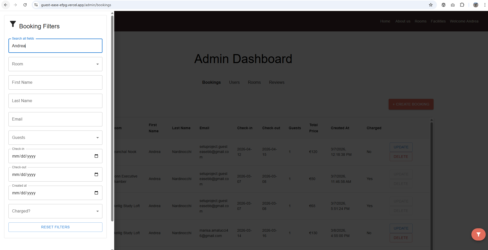

This component is responsible for displaying the booking filters UI in the admin bookings page.

It does not perform the filtering itself.

Instead, it provides the interface for the admin to open the filters panel and change filter values, which are then used elsewhere to filter the bookings list.

The component receives three props from the parent page: the current filter values, the function to update them, and the list of rooms.

```ts
interface BookingFilterUIProps {
  filters: any;
  setFilters: (filters: any) => void;
  rooms: { id: string; name: string }[];
}
```

'filters' contains the current filter state, 'setFilters' allows updating that state, and 'rooms' provides the list of rooms used in the room filter dropdown.

Inside the component there is a local piece of state that controls whether the filter drawer is open or closed.

```ts
const [drawerOpen, setDrawerOpen] = useState(false);
```

This state is purely for UI behavior. When 'drawerOpen' is 'true', the filter drawer appears on the screen. When it is 'false', the drawer is hidden.

The component renders a floating action button (FAB). This button appears fixed on the screen and is used to open the filter panel.

```tsx
<Fab variant="extended" onClick={() => setDrawerOpen(true)}>
  <FilterAltIcon />
</Fab>
```

When the admin clicks the button, the 'setDrawerOpen(true)' function runs, which changes the state and opens the drawer.

The filters themselves appear inside a Material UI 'Drawer' component.

```tsx
<Drawer
  anchor="left"
  open={drawerOpen}
  onClose={() => setDrawerOpen(false)}
>
```

The drawer slides in from the left side of the screen.
The 'open' property is controlled by 'drawerOpen', so the drawer only appears when the state is 'true'.
If the user closes the drawer, the state is set back to 'false'.

Inside this container the component renders 'FilterBookingsCard'.

```tsx
<FilterBookingsCard filters={filters} setFilters={setFilters} rooms={rooms} />
```

This component contains the actual filter inputs such as text fields, date fields, or dropdowns. When the admin changes a filter value, 'setFilters' updates the filter state in the parent page.

In summary, this component acts as a 'UI controller for the booking filters'. It displays a floating button that opens a side drawer, and inside that drawer it renders the filter form that updates the filtering state used by the admin bookings table.

### Booking Filtered Card

This component renders the filter form used in the admin bookings page. It displays a Material UI card containing several inputs that allow the admin to filter bookings by different fields such as room, guest name, email, dates, number of guests, and payment status.

The component receives three props:

```ts
const FilterBookingsCard: React.FC<FilterBookingsCardProps> = ({
  filters,
  setFilters,
  rooms,
}) => {
  /**
   * Generic handler for updating any filter field.
   */
  const handleChange = (field: string, value: string) => {
    setFilters({ ...filters, [field]: value });
  };

```

'filters' stores the current filter values, 'setFilters updates those values, and 'rooms' is used to populate the room dropdown.

The component defines a generic function 'handleChange()' to update any filter field.

```ts
const handleChange = (field: string, value: string) => {
  setFilters({ ...filters, [field]: value });
};
```

It copies the existing filters and updates only the field that changed.

Example:

```ts
handleChange("first_name", "John");
```

This updates the filter state to include `"John"` as the first name filter.

The component also provides a function to 'reset all filters'.

```ts
/** Reset all filters to default empty values */
const resetFilters = () => {
  setFilters({
    search: "",
    room: "",
    first_name: "",
    last_name: "",
    email: "",
    guests: "",
    check_in: "",
    check_out: "",
    created_at: "",
    charged: "",
  });
};
```

When the reset button is clicked, all filter values are cleared.

Inside the 'Card', several inputs are rendered. For example, the 'global search field'

```tsx
{
  /* Global search across all fields */
}
<TextField
  label="Search all fields"
  value={filters.search}
  onChange={(e) => handleChange("search", e.target.value)}
  slotProps={{
    root: { sx: styles.formControl },
  }}
/>;
```

which updates 'filters.search'.

The 'room filter' uses the 'rooms' array to populate a dropdown:

```tsx
{
  /* Room filter */
}
<FormControl sx={styles.formControl}>
  <InputLabel>Room</InputLabel>
  <Select
    label="Room"
    value={filters.room}
    onChange={(e) => handleChange("room", e.target.value)}
  >
    <MenuItem value="">All Rooms</MenuItem>
    {rooms.map((r) => (
      <MenuItem key={r.id} value={r.id}>
        {r.name}
      </MenuItem>
    ))}
  </Select>
</FormControl>;
```

Other fields allow filtering by 'first name, last name, email, guests, check-in, check-out, created date, and charged status.

Finally, the 'Reset Filters' button clears all filters:

```tsx
{
  /* Reset Button */
}
<Button variant="outlined" fullWidth sx={{ mt: 2 }} onClick={resetFilters}>
  Reset Filters
</Button>;
```

Overall, this component only handles the filter UI and state updates. The actual filtering logic is handled separately by the **components/useFilteredBookings.tsx** hook, which uses these filter values to determine which bookings should be displayed.

# Supabase tables and functions

## Rooms table

Supabadse uses SQL and PostgreSQL.

The below snippet shows the SQL database schema degfinition to create the 'public.rooms' table:

```sql
DROP TABLE IF EXISTS public.rooms;

-- create rooms table with images field
CREATE TABLE IF NOT EXISTS public.rooms (
  -- We ensure that each room has its own id
  id uuid DEFAULT gen_random_uuid() PRIMARY KEY,
  name text NOT NULL,
  description text,
  capacity integer NOT NULL, -- number of guests (max)
  price numeric(10,2) NOT NULL,
  amenities jsonb, -- These will be tags that I can filter off of the Search Results page
  images jsonb,
  created_at timestamptz DEFAULT now()
);
```

'amenities jsonb'
Stores room features (like balcony, tea tray, etc.) as a JSON array using PostgreSQL’s binary JSON format.

Example structure:

```sql
["Tea & Coffee Tray", "Balcony", "King bed"]
```

`images jsonb`
Stores image filenames as a JSON array so multiple images can be attached to one room.

Example:

```sql
["room1.png", "room2.png", "room3.png"]
```

Basically, 'JSONB' stores JSON data in a binary format which allows indexing, faster queries, and flexible data structures compared to plain text.

Example query filtering by amenity:

```sql
SELECT *
FROM public.rooms
WHERE amenities @> '["Balcony"]'; -- @> is a PostgreSQL containment operator used mainly with JSONB and array
```

At that point, once the table was created, we simply inserted the data of the 8 rooms for our app. Ex.:

```sql
-- Insert updated Irish-themed boutique guesthouse rooms WITH amenities and images
INSERT INTO public.rooms (name, description, capacity, price, amenities, images)
VALUES
(
  'Seanchaí Nook',
  'Charming compact single ideal for quiet stays or writing retreats. The Seanchaí Nook is purpose-built for solitude, creativity, and deep focus. With sound-insulated walls, a dedicated writing desk, and Celtic-inspired décor, it stands apart as the most intimate and distraction-free room in the house. Ideal for writers, thinkers, or guests seeking quiet over luxury.',
  1,
  40.00,
  '[
    "Writer’s Corner / Work Nook",
    "Remote‑Work Friendly",
    "Tea & Coffee Tray",
    "Homely Touches & Charm",
    "Single bed"
  ]',
  '["brigidshaven1.png","brigidshaven2.png","brigidshaven3.png","brigidshaven4.png"]'
),
...

```

Each row inserted represents one boutique guesthouse room with its metadata stored in structured columns and flexible JSON arrays for amenities and images.

### Source attributions

- https://www.postgresql.org/docs/current/datatype-json.html
- https://www.postgresql.org/docs/current/functions-json.html
- https://www.tigerdata.com/learn/how-to-query-jsonb-in-postgresql
- https://www.geeksforgeeks.org/postgresql/what-is-jsonb-in-postgresql/

## Bookings table

The 'bookings' table was originally created through the below create database schema definition:

```sql
-- Drops the bookings table if it already exists.
DROP TABLE IF EXISTS public.bookings;

-- ==========================================
-- 1. Create bookings table
-- ==========================================
CREATE TABLE IF NOT EXISTS public.bookings (
  -- https://www.postgresql.org/docs/current/functions-uuid.html
  id uuid DEFAULT gen_random_uuid() PRIMARY KEY,
  room_id uuid NOT NULL,
  user_id uuid NOT NULL,
  check_in date NOT NULL,
  check_out date NOT NULL,
  guests integer NOT NULL,
  -- Automatically generated daterange used for overlap detection
  -- '[)' = inclusive lower bound, exclusive upper bound
  -- https://www.postgresql.org/docs/current/rangetypes.html
  period daterange GENERATED ALWAYS AS (daterange(check_in, check_out, '[)')) STORED,
  total_price numeric,
  created_at timestamptz DEFAULT now()
);


```

'period daterange GENERATED ALWAYS AS (...) STORED' is the most intersting column as it creates a 'computed column' that converts the 'check_in' and 'check_out' dates into a PostgreSQL 'daterange'. The `[)` syntax means the start date is included and the end date is excluded. This column is automatically generated and stored so it can be used efficiently for overlap checks when validating bookings.

Without the above column, we would not be able to safely ensure that no overlaps occur in our booking system.

Foreign key constraints link bookings to other tables.
For instance, 'bookings_user_id_fkey' ensures every booking references a valid user in 'public.profiles'. Initially it used 'ON DELETE RESTRICT' so a user could not be deleted while bookings existed.

```sql
-- ==========================================
-- 2. Foreign key to profiles (user accounts)
-- ==========================================
-- Ensures bookings always belong to an existing profile.
-- ON DELETE RESTRICT prevents deleting a user who still has bookings.
-- https://www.postgresql.org/docs/current/ddl-constraints.html#DDL-CONSTRAINTS-FK
ALTER TABLE public.bookings
ADD CONSTRAINT bookings_user_id_fkey
FOREIGN KEY (user_id)
REFERENCES public.profiles (id)
ON DELETE RESTRICT;
```

'bookings_room_id_fkey' ensures 'room_id' corresponds to an existing room in 'public.rooms', preventing invalid room references. Also, we want to ensure that a room cannot be cancelled if there still are bookings associated with it.

```sql
-- Ensures room_id corresponds to an existing room.
-- ON DELETE RESTRICT removes bookings if a room is deleted.
-- https://www.postgresql.org/docs/current/ddl-constraints.html#DDL-CONSTRAINTS-FK
-- https://stackoverflow.com/questions/9471348/alter-table-to-give-foreign-key-constraint#9489665
ALTER TABLE public.bookings
ADD CONSTRAINT bookings_room_id_fkey
FOREIGN KEY (room_id)
REFERENCES public.rooms (id)
ON DELETE RESTRICT;
```

'GRANT SELECT, INSERT, UPDATE, DELETE ON public.bookings TO public;' gives base CRUD permissions to the public role. In Supabase this works together with 'Row Level Security (RLS)' for fine-grained access control.

'ALTER TABLE public.bookings ENABLE ROW LEVEL SECURITY;' activates RLS so policies can control which rows a user can access.

'CREATE POLICY "Users can view their own bookings" defines a rule allowing users to read only bookings where 'user_id = auth.uid()', meaning they can only see their own reservations.

The schema is later modified to allow user deletion without breaking bookings. 'ALTER COLUMN user_id DROP NOT NULL' allows the field to become 'NULL'. The original foreign key is dropped and recreated with 'ON DELETE SET NULL', meaning if a user account is deleted the booking remains but the 'user_id' becomes 'NULL'.

```sql
ALTER TABLE public.bookings
DROP CONSTRAINT bookings_user_id_fkey;

-- And establishing a new one which can be NULL on deleting a user
ALTER TABLE public.bookings
ADD CONSTRAINT bookings_user_id_fkey
FOREIGN KEY (user_id)
REFERENCES public.profiles (id)
ON DELETE SET NULL;
```

A trigger function 'prevent_user_deletion_if_active_bookings()' is created using PL/pgSQL. It checks whether the user being deleted still has bookings where 'check_out >= CURRENT_DATE'. If such bookings exist, it raises an exception and blocks the deletion. This prevents removing users who still have active or future reservations.

```sql
-- The function prevent_user_deletion_if_active_bookings() first check all existing
-- bookings and compare the check_out date with the CURRENT_DATE.
-- If check_out >= CURRENT_DATE, the user cannot be deleted
-- https://www.postgresql.org/docs/current/plpgsql-errors-and-messages.html
--
CREATE OR REPLACE FUNCTION prevent_user_deletion_if_active_bookings()
RETURNS trigger AS $$
BEGIN
  IF EXISTS (
    SELECT 1 FROM public.bookings
    WHERE user_id = OLD.id
      AND check_out >= CURRENT_DATE
  ) THEN
    RAISE EXCEPTION 'Cannot delete user with active bookings';
  END IF; -- closes the IF block

  RETURN OLD; -- Give back the original row and do not apply any changes
END;
$$ LANGUAGE plpgsql;

```

'CREATE TRIGGER block_user_delete' attaches this function to the 'profiles' table so it runs before a user is deleted, enforcing the active-booking rule automatically.

```sql
-- This is the trigger for the prevent_user_deletion_if_active_bookings() function
-- https://supabase.com/docs/guides/auth/managing-user-data#using-triggers
CREATE TRIGGER block_user_delete
BEFORE DELETE ON public.profiles
FOR EACH ROW
EXECUTE FUNCTION prevent_user_deletion_if_active_bookings();
```

Additional columns extend the booking system for payments.
'charged boolean DEFAULT false' tracks whether a booking has been charged. An external scheduled job (cron) updates it within 24 hours of check-in running a cron every 10 minutes fro check-in detections:

```sql
-- This adds the 'charged' column which will change to true within 24h
-- from the check-in thanks to the function 'charge-upcoming-bookings'
-- and the cron in https://console.cron-job.org/dashboard that runs every 2 hours,
alter table bookings
add column charged boolean default false;
```

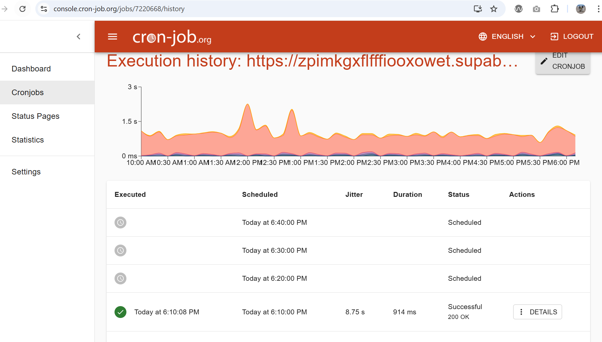

'payment_intent_id text' stores the Stripe payment identifier used to process the transaction.

'amount numeric' stores the charged amount so refunds and cancellations can reliably reference the original payment data.

```sql
-- Stores the Stripe payment details needed for refunds and cancellations.
-- Because earlier versions of the system didn’t retain the actual charged
-- amount or the payment method, refunds were unreliable.
-- Adding payment_method_id and amount ensures each booking permanently keeps the
-- Stripe data required for refunds on cancellations.
ALTER TABLE bookings
ADD COLUMN payment_intent_id text;

ALTER TABLE bookings
ADD COLUMN amount numeric;
```

Overall, this schema manages reservations, enforces referential integrity with users and rooms, applies row-level security for user access, prevents deletion of users with active bookings, and stores payment information required for Stripe-based transactions.

### Source attributions

- https://www.postgresql.org/docs/current/functions-uuid.html
- https://www.postgresql.org/docs/current/rangetypes.html
- https://supabase.com/docs/guides/auth/managing-user-data#managing-user-data
- https://www.postgresql.org/docs/current/ddl-constraints.html#DDL-CONSTRAINTS-FK
- https://stackoverflow.com/questions/9471348/alter-table-to-give-foreign-key-constraint#9489665
- https://supabase.com/docs/guides/auth/row-level-security
- https://supabase.com/docs/guides/database/postgres/row-level-security
- https://www.postgresql.org/docs/current/plpgsql-errors-and-messages.html
- https://supabase.com/docs/guides/auth/managing-user-data#using-triggers
- https://console.cron-job.org/dashboard

## Get Available Rooms function

The 'get_available_rooms' function is used to find all rooms that are available for booking for a given date range and number of guests.

It ensures that rooms returned can accommodate the requested number of guests and do not have existing bookings that overlap the requested dates, optionally ignoring a specific booking when updating an existing reservation.

The first step is to create the 'btree_gist' extension

```sql
-- =========================================================
-- 1. Enable required extension for exclusion constraints
-- btree_gist teaches PostgreSQL how to compare normal values inside a GiST index.
-- GiST is the toolbox that lets PostgreSQL index almost anything — including ranges,
-- geometric shapes, text search, and custom data types
-- https://dev.to/jhonoryza/sql-index-types-b-tree-hash-gist-gist-brin-and-gin-44g0
-- https://www.postgresql.org/docs/current/btree-gist.html
-- https://neon.com/blog/btree_gist
-- https://www.postgresql.org/docs/current/sql-createextension.html
-- ============================================================

CREATE EXTENSION IF NOT EXISTS btree_gist;

```

This allows PostgreSQL’s GiST indexes to handle normal data types like 'uuid' or integers.

GiST indexes are flexible and required here to enforce exclusion constraints on columns that aren’t naturally geometric or range types.

```sql
-- ============================================================
-- 2. Add exclusion constraint to prevent overlapping bookings
-- ============================================================
-- This ensures that a room cannot have two bookings whose date ranges overlap.
-- Even if two inserts happen at the same time, PostgreSQL will reject the second one.
-- https://stackoverflow.com/questions/61501301/partial-constraint-exclude-using-gist#61503531
-- https://www.postgresql.org/docs/current/sql-createtable.html#SQL-CREATETABLE-EXCLUDE

ALTER TABLE bookings
DROP CONSTRAINT IF EXISTS no_overlapping_bookings;

ALTER TABLE bookings
ADD CONSTRAINT no_overlapping_bookings
EXCLUDE USING gist (
  room_id WITH =,
  period WITH &&
);

```

The exclusion constraint ensures that no two bookings for the same room can have overlapping periods.

'room_id WITH =' checks that the room is the same, while 'period WITH &&' uses the range overlap operator to detect if the date ranges conflict. GiST indexes efficiently enforce this even for concurrent inserts, so we cannot accidentally double-book a room.

The 'get_available_rooms' function queries all rooms that can fit the requested number of guests and are not already booked during the requested date range.
The '&&' operator checks for overlaps between existing bookings 'b.period' and the requested dates 'daterange($1,$2,'[)')'.

The 'exclude_booking_id' allows the function to ignore a specific booking, useful when updating a booking so it doesn’t conflict with itself, as explained in the 'User Booking page' chapter.

'SECURITY DEFINER' ensures the function runs with the owner’s privileges, allowing controlled access to data even if Row Level Security is enabled.

```sql
CREATE OR REPLACE FUNCTION public.get_available_rooms(
  check_in date,
  check_out date,
  guests int,
  exclude_booking_id uuid
)
RETURNS TABLE (
  id uuid,
  name text,
  description text,
  capacity int,
  price numeric,
  amenities jsonb,
  images jsonb,
  created_at timestamptz
)
LANGUAGE sql
SECURITY DEFINER
SET search_path = public
AS $$
SELECT
  r.id,
  r.name,
  r.description,
  r.capacity,
  r.price,
  r.amenities,
  r.images,
  r.created_at
FROM public.rooms AS r
WHERE
  r.capacity >= guests
  AND NOT EXISTS (
    SELECT 1
    FROM public.bookings AS b
    WHERE b.room_id::uuid = r.id
      AND (exclude_booking_id IS NULL OR b.id != exclude_booking_id)
      AND b.period && daterange($1, $2, '[)')
  );
$$;
```

Together, the 'exclusion constraint' prevents overlapping bookings at the database level, and the 'get_avaialble_rooms' function provides a safe way to query which rooms are free for a given date range.

### Source attributions

- https://dev.to/jhonoryza/sql-index-types-b-tree-hash-gist-gist-brin-and-gin-44g0
- https://www.postgresql.org/docs/current/btree-gist.html
- https://neon.com/blog/btree_gist
- https://www.postgresql.org/docs/current/sql-createextension.html
- https://stackoverflow.com/questions/61501301/partial-constraint-exclude-using-gist#61503531
- https://www.postgresql.org/docs/current/sql-createtable.html#SQL-CREATETABLE-EXCLUDE
- https://supabase.com/docs/guides/database/functions
- https://www.postgresql.org/docs/current/functions-range.html

## Profiles table

In Supabase, the built-in 'auth.users' table stores only basic authentication information, such as 'id', 'email', and password hashes. It does not include additional user information an app may need, like first name, last name, country, zip code, role, or Stripe customer ID.

For this reason, it’s best practice to create a separate 'profiles' table that references 'auth.users' (https://supabase.com/docs/guides/auth/managing-user-data#storing-additional-user-information).

Each profile row corresponds to one user and can store all app-specific fields.

```sql
CREATE TABLE IF NOT EXISTS public.profiles (
    id uuid PRIMARY KEY REFERENCES auth.users(id) ON DELETE CASCADE,
    email text NOT NULL UNIQUE,
    first_name text NOT NULL,
    last_name text NOT NULL,
    country text NOT NULL,
    zip_code text NOT NULL,
    role text DEFAULT 'guest',
    created_at timestamptz DEFAULT now()
);
```

The foreign key 'REFERENCES auth.users(id) ON DELETE CASCADE' ensures that when a user is deleted from 'auth.users', the corresponding profile is automatically removed, preventing orphaned rows.

Supabase recommends using 'triggers' to automatically populate the 'profiles' table when new users sign up.

This avoids manual insertion and ensures data consistency:

```sql
CREATE OR REPLACE FUNCTION public.handle_new_user()
RETURNS trigger AS $$
BEGIN
    INSERT INTO public.profiles (
        id,
        email,
        first_name,
        last_name,
        country,
        zip_code
    )
    VALUES (
        NEW.id,
        NEW.email,
        NEW.raw_user_meta_data->>'first_name',
        NEW.raw_user_meta_data->>'last_name',
        NEW.raw_user_meta_data->>'country',
        NEW.raw_user_meta_data->>'zip_code'
    )
    ON CONFLICT (id) DO NOTHING;

    RETURN NEW;
END;
$$ LANGUAGE plpgsql SECURITY DEFINER;

DROP TRIGGER IF EXISTS on_auth_user_created ON auth.users;

CREATE TRIGGER on_auth_user_created
AFTER INSERT ON auth.users
FOR EACH ROW
EXECUTE FUNCTION public.handle_new_user();
```

Row Level Security (RLS) policies are then applied to ensure users can only access or modify their own profile:

```sql
ALTER TABLE public.profiles ENABLE ROW LEVEL SECURITY;

CREATE POLICY "Users can select their own profile"
ON public.profiles
FOR SELECT
USING (auth.uid() = id);

CREATE POLICY "Users can update their own profile"
ON public.profiles
FOR UPDATE
USING (auth.uid() = id)
WITH CHECK (auth.uid() = id);

CREATE POLICY "Users can delete their own profile"
ON public.profiles
FOR DELETE
USING (auth.uid() = id);
```

Additionally, functions and triggers keep'auth.users' and 'profiles' synchronized whenever either is updated:

```sql
CREATE OR REPLACE FUNCTION public.sync_user_profile()
RETURNS trigger AS $$
BEGIN
  UPDATE public.profiles
  SET
    email = NEW.email,
    first_name = NEW.raw_user_meta_data->>'first_name',
    last_name = NEW.raw_user_meta_data->>'last_name',
    country = NEW.raw_user_meta_data->>'country',
    zip_code = NEW.raw_user_meta_data->>'zip_code'
  WHERE id = NEW.id;

  RETURN NEW;
END;
$$ LANGUAGE plpgsql SECURITY DEFINER;

CREATE OR REPLACE TRIGGER on_auth_user_updated
AFTER UPDATE ON auth.users
FOR EACH ROW
WHEN (OLD IS DISTINCT FROM NEW)
EXECUTE FUNCTION public.sync_user_profile();

CREATE OR REPLACE FUNCTION public.sync_profile_to_auth()
RETURNS trigger AS $$
BEGIN
  UPDATE auth.users
  SET
    email = NEW.email,
    raw_user_meta_data = jsonb_build_object(
      'first_name', NEW.first_name,
      'last_name', NEW.last_name,
      'country', NEW.country,
      'zip_code', NEW.zip_code
    )
  WHERE id = NEW.id;

  RETURN NEW;
END;
$$ LANGUAGE plpgsql SECURITY DEFINER;

CREATE OR REPLACE TRIGGER on_profile_updated
AFTER UPDATE ON public.profiles
FOR EACH ROW
WHEN (OLD IS DISTINCT FROM NEW)
EXECUTE FUNCTION public.sync_profile_to_auth();
```

Additional column 'stripe_customer_id' was added later when Stripe payments were integrated:

```sql
ALTER TABLE profiles
ADD COLUMN stripe_customer_id text;
```

Admin and user policies were implemented to grant different access levels:

```sql
CREATE OR REPLACE FUNCTION public.is_admin(uid uuid)
RETURNS boolean
LANGUAGE sql
SECURITY DEFINER
AS $$
  SELECT role = 'admin'
  FROM public.profiles
  WHERE id = uid;
$$;

CREATE POLICY "Admins can select all profiles"
ON public.profiles
FOR SELECT
USING (public.is_admin(auth.uid()));

CREATE POLICY "Admins can delete any profile"
ON public.profiles
FOR DELETE
USING (public.is_admin(auth.uid()));

CREATE POLICY "Admins can update any profile"
ON public.profiles
FOR UPDATE
USING (public.is_admin(auth.uid()))
WITH CHECK (public.is_admin(auth.uid()));
```

This approach ensures secure, scalable, and maintainable user management, separating authentication from app-specific profile data.

This method enables triggers, RLS policies, and admin/user distinctions, while keeping 'auth.users' untouched and fully compatible with Supabase’s auth system.

### Source attributions

- https://supabase.com/docs/guides/auth/managing-user-data
- https://supabase.com/docs/guides/database/tables#referencing-authusers
- https://supabase.com/docs/guides/auth/managing-user-data#using-triggers
- https://supabase.com/docs/guides/auth/row-level-security
- https://supabase.com/docs/guides/auth/row-level-security#policies
- https://www.postgresql.org/docs/current/ddl-rowsecurity.html
- https://www.postgresql.org/docs/current/plpgsql-trigger.html
- https://www.postgresql.org/docs/current/functions-json.html
- https://www.mysqltutorial.org/mysql-views/mysql-view-with-check-option/
- https://www.postgresql.org/docs/current/sql-createfunction.-html#SQL-CREATEFUNCTION-SECURITY
